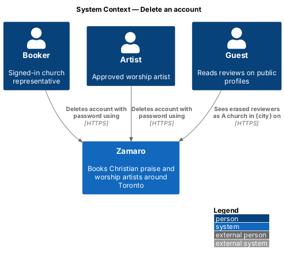
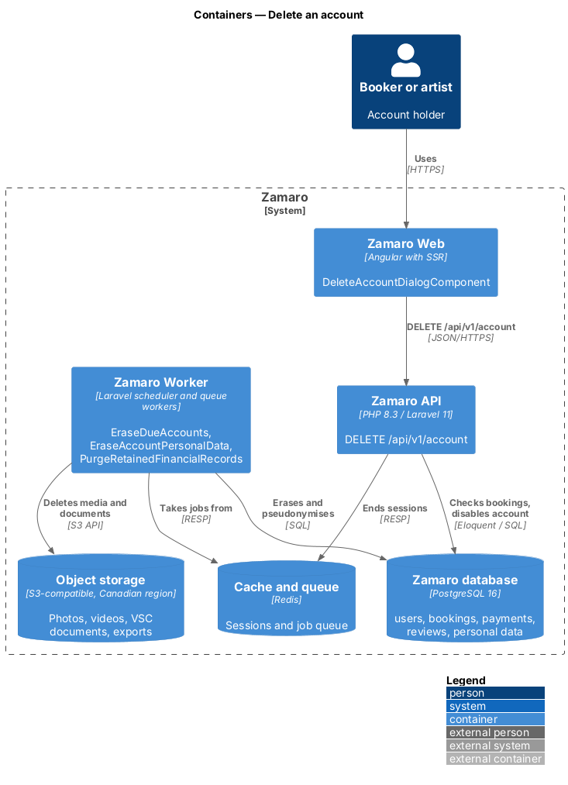
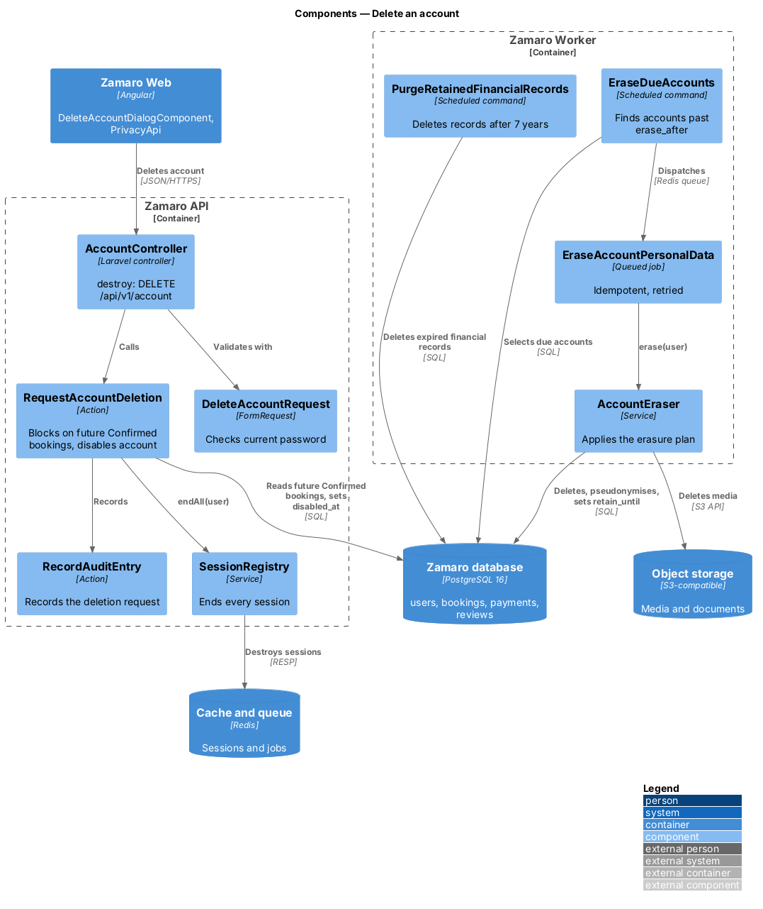
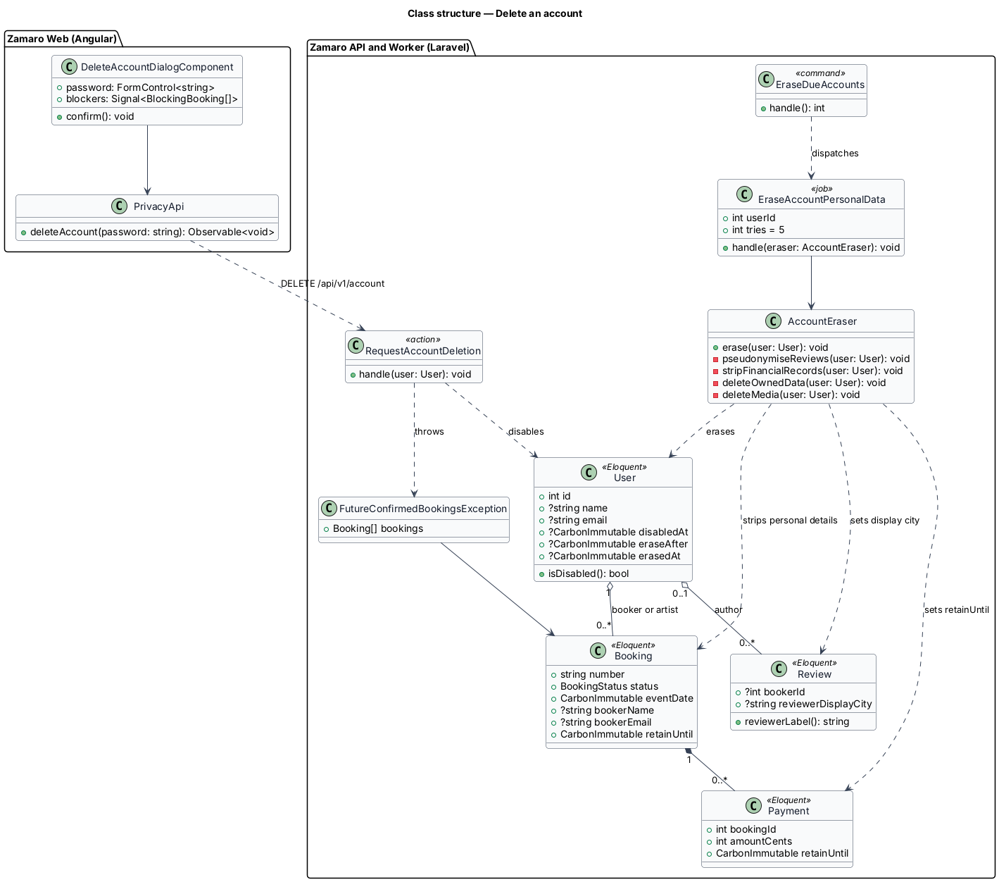
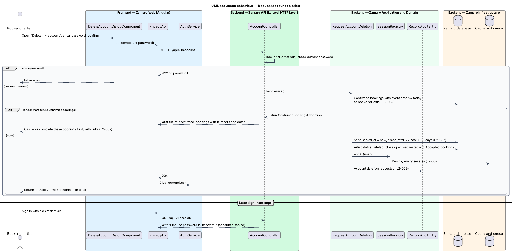
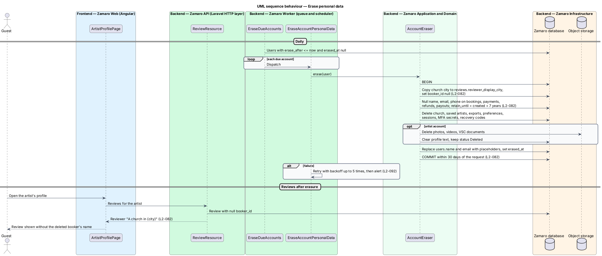

# Delete an account

## Overview

People who no longer use Zamaro may close their account and have their personal data
removed. Canadian privacy law expects this, and Canadian tax law expects financial
records to be kept. This feature reconciles the two: sign-in stops at once, personal
data is erased within 30 days, and booking and payment records stay for 7 years with
the person's name and contact details removed.

The slice runs from the "Delete my account" action in the account settings page
(`accounts/manage-account-settings`) to an API action that disables the account, and
a scheduled job in the Zamaro Worker that performs the erasure. It ends sessions
through the `SessionRegistry` from `accounts/sign-in-and-recover-access`. A booker or
artist with a Confirmed booking still to come is sent to cancel or complete it first;
cancellation is owned by the bookings subsystem. A person who wants a copy of their
data first uses `privacy/export-personal-data`.

Terms used in this design:

- **deletion request** — confirmed, password-checked instruction from a booker or artist to close their account
- **disabled account** — account whose sign-in is refused and whose sessions are ended, pending erasure
- **erasure** — removal or irreversible replacement of a person's personal data
- **erasure deadline** — time by which erasure has run, 30 days after the deletion request
- **retained financial record** — booking, payment, refund or payout row kept for 7 years for tax purposes, with personal details removed
- **pseudonymised reviewer** — review author shown as "A church in {city}" once the booker's account is erased
- **future Confirmed booking** — booking in status `Confirmed` whose event date is today or later

Deletion is refused while any future Confirmed booking exists, because erasing a
party would leave the other side of a paid event without a contact (L2-082).

## Description

**Frontend (Zamaro Web, `features/account`)**

- **`DeleteAccountDialogComponent`** — design-system dialog opened from the privacy
  section of `AccountSettingsPage`. It explains what is erased and what is kept,
  asks for the current password, and has a destructive "Delete my account" button.
  Focus is trapped while open and returns to the trigger when closed (L2-101).
- **`DeletionBlockedComponent`** — content shown in the dialog when the API reports
  future Confirmed bookings. It lists each booking number and date with a link to
  `/bookings/:number`, and asks the person to cancel or complete them first
  (L2-082).
- **`PrivacyApi`** — `deleteAccount(password)` for `DELETE /api/v1/account`.
- **`AuthService`** — clears `currentUser` after a successful deletion, and the router
  returns to `/` with a confirmation toast. The toast copy is `<TO SUPPLY>`.

**Backend (Zamaro API)**

- **`AccountController@destroy`** — `DELETE /api/v1/account`, for the `Booker` and
  `Artist` roles.
- **`DeleteAccountRequest`** — FormRequest that checks `current_password` against the
  stored hash.
- **`RequestAccountDeletion`** — action run inside `DB::transaction`. It looks for
  future Confirmed bookings where the user is the booker or the artist. If any exist
  it raises a `409` problem detail of type `future-confirmed-bookings` with their
  numbers and dates, and changes nothing. Otherwise it sets `users.disabled_at` and
  `users.erase_after` (now plus a grace period no longer than 30 days), sets an
  artist's status to `Deleted` so the profile leaves search and its slug returns
  the same 404 as a missing artist (L2-021), withdraws or declines open `Requested` and `Accepted` bookings
  through the booking state machine, ends every session through
  `SessionRegistry::endAll`, and writes an audit entry (L2-069).
- **`EnsureAccountActive`** — check inside `AttemptSignIn` that refuses sign-in for a
  disabled account with the generic invalid-credentials message, so the response
  does not reveal the account state (L2-023, L2-082).

**Backend (Zamaro Worker)**

- **`EraseDueAccounts`** — scheduled command, run daily, that dispatches
  `EraseAccountPersonalData` for each account whose `erase_after` has passed. Missed
  runs catch up on the next run (L2-092).
- **`EraseAccountPersonalData`** — idempotent queued job that calls `AccountEraser`.
- **`AccountEraser`** — service that applies the erasure plan in one transaction per
  account:
  - writes `reviews.reviewer_display_city` from the booker's church city, then
    detaches reviews from the user so they render as "A church in {city}"
    (L2-082);
  - removes name and contact details (name, email, phone) from bookings, payments,
    refunds and payouts, and marks them `retain_until` = creation plus 7 years
    (L2-082);
  - deletes the church, saved artists, consent records beyond the retention
    `<TO SUPPLY>`, data exports, notification preferences, sessions, MFA secrets and
    recovery codes;
  - for an artist, deletes photos, videos and Vulnerable Sector Check documents from
    object storage and clears profile text;
  - replaces `users.name` and `users.email` with non-identifying placeholders and
    sets `erased_at`, keeping the row so retained records keep a valid foreign key.
- **`PurgeRetainedFinancialRecords`** — scheduled command that deletes retained
  financial records once `retain_until` has passed.
- **`ReviewResource`** — shows the reviewer as "A church in {city}" when the review
  has no linked user, and otherwise follows `privacy/minimise-public-exposure`.

**Data**

- `users` — `disabled_at`, `erase_after`, `erased_at`.
- `reviews` — `reviewer_display_city`, nullable `booker_id`.
- `bookings`, `payments`, `refunds`, `payouts` — `retain_until`; booker-name and
  contact snapshot columns are nulled by erasure.

The grace period before erasure (any value up to 30 days), whether message bodies
in retained bookings are erased or kept, and the treatment of the church address
snapshot on retained bookings are `<TO SUPPLY>`. Erased data leaves backups as the
14-day point-in-time recovery window rolls forward (L2-091).

## Requirements

The feature realises the following level-2 (L2) requirement, quoted from
`docs/specs/L2.md`.

| L2 ID | Refines (L1) | Requirement |
|-------|--------------|-------------|
| `L2-082` | `L1-017` | **Account deletion.** Acceptance criteria: 1. Given a booker or artist with no Confirmed bookings in the future, when they confirm "Delete my account" with their password, then sign-in is disabled immediately and personal data is erased within 30 days. 2. Given a user with future Confirmed bookings, when they request deletion, then they are asked to cancel or complete those bookings first. 3. Given financial records for a deleted account, when deletion runs, then booking and payment records are kept for 7 years for tax purposes with the person's name and contact details removed. 4. Given reviews by a deleted booker, when they are shown, then the reviewer reads "A church in {city}". |

## Diagrams

### System context

A booker or artist asks Zamaro to delete their account, and guests later see an
erased booker's reviews attributed to "A church in {city}". No external system takes
part.

### Containers

The Zamaro API disables the account and ends its sessions in Redis. The Zamaro Worker
later erases personal data in the database and deletes media from object storage.

### Components

`RequestAccountDeletion` checks for future Confirmed bookings and disables the
account. `EraseDueAccounts` and `AccountEraser` carry out the erasure plan, and
`PurgeRetainedFinancialRecords` ends retention after 7 years.

### Class structure

A `User` moves from active to disabled to erased. Retained `Booking` and `Payment`
rows keep a `retainUntil` date, and a `Review` keeps a display city after its author
is erased.

### Behaviour — request deletion

The password is confirmed first. Future Confirmed bookings block the request with a
list to resolve; otherwise sign-in is disabled and every session ends immediately.

### Behaviour — erase personal data

A daily job erases accounts whose erasure date has arrived. Financial records stay
with personal details removed, and reviews switch to "A church in {city}".

