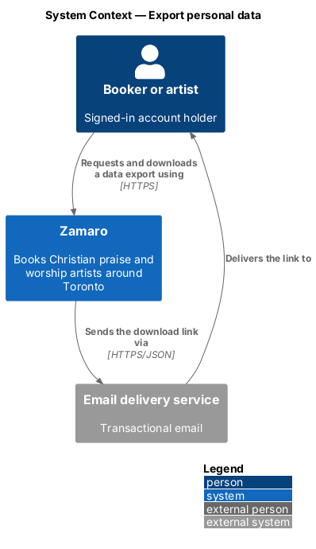
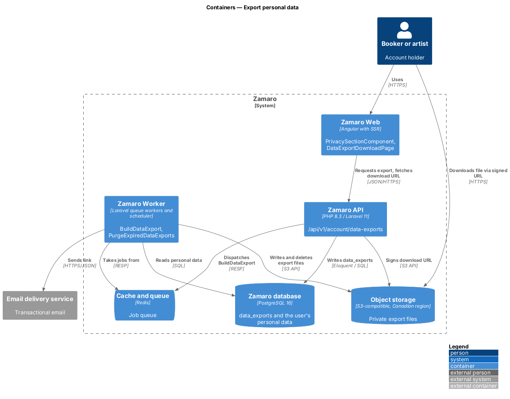
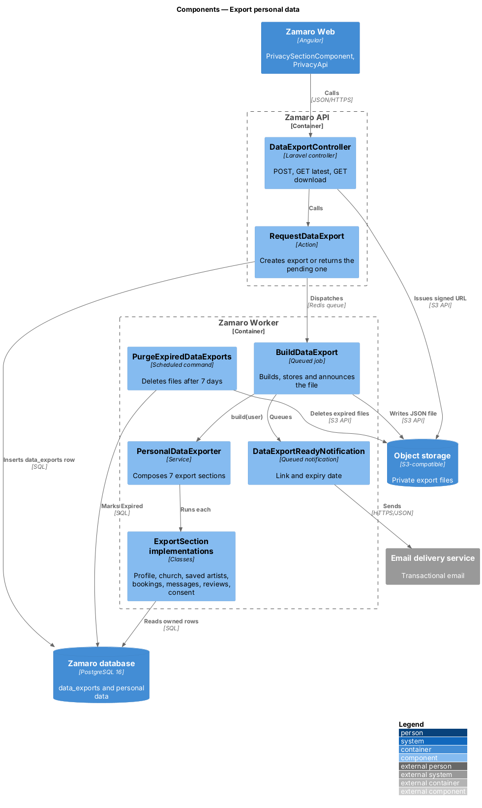
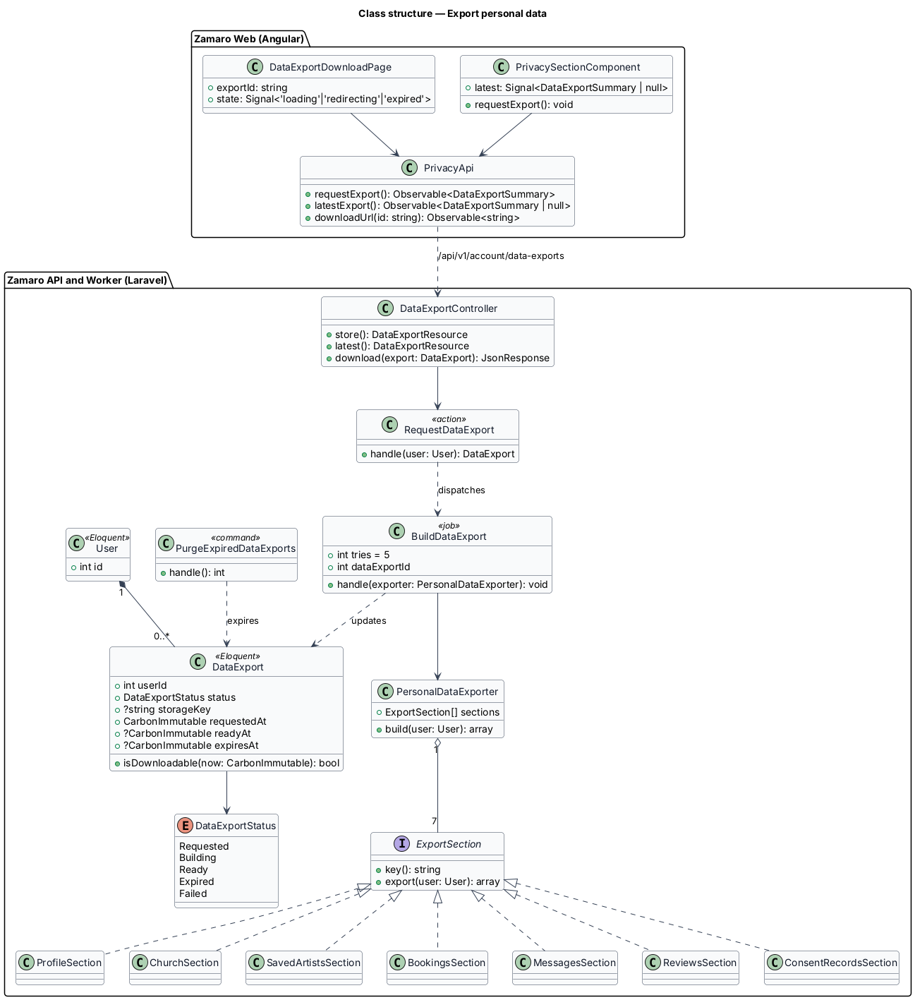
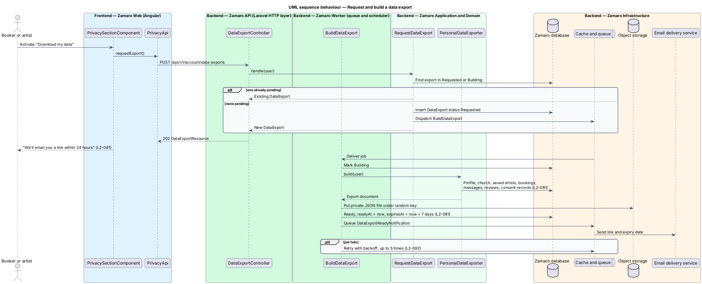
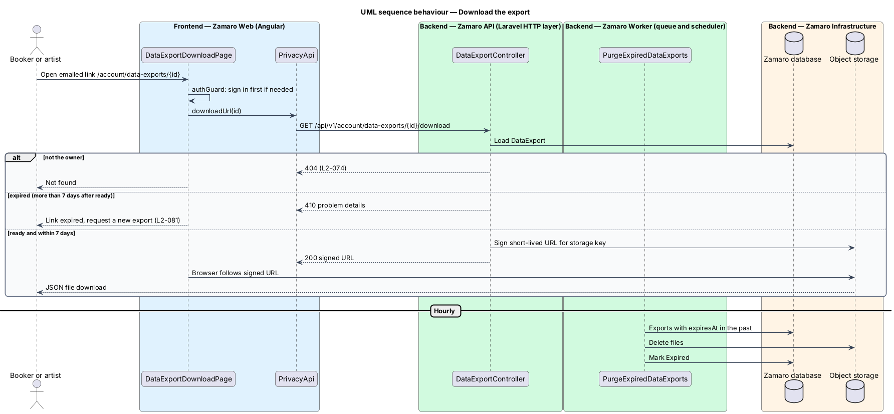

# Export personal data

## Overview

Canadian privacy law gives people the right to see the personal information an
organisation holds about them. Zamaro answers that right with a self-service
"Download my data" action: a signed-in user asks for an export, and within 24 hours
receives an email with a link to one JSON file of everything held about them.

The slice runs from the privacy section of the account settings page
(`accounts/manage-account-settings`) through a queued job in the Zamaro Worker to
object storage and the email delivery service. It reads data written by other
slices, including consent records from `privacy/record-consent`. Account deletion is
a sibling slice (`privacy/delete-account`).

Terms used in this design:

- **data export** — one request by one user for a copy of their personal data, with its status and file
- **export file** — JSON document that holds the user's profile, church, saved artists, bookings, messages, reviews and consent records
- **download link** — link in the email that leads to the export file through a signed-in, owner-only endpoint, valid for 7 days
- **export section** — part of the export file produced by one exporter class for one kind of data
- **signed storage URL** — time-limited URL issued by object storage for one object

The export is built asynchronously so a large booking history does not hold an HTTP
request open. The file is private: only its owner, signed in, can fetch it, and it is
deleted when the link expires.

## Description

**Frontend (Zamaro Web, `features/account`)**

- **`PrivacySectionComponent`** — section of `AccountSettingsPage` with the "Download
  my data" button. It shows the state of the latest export: requested (with "We'll
  email you a link within 24 hours"), ready (with a download link and expiry date),
  or expired. While an export is pending, the button is disabled.
- **`DataExportDownloadPage`** — routed page for `/account/data-exports/:id`, the
  target of the emailed link. Behind `authGuard`, it calls the download endpoint and
  hands the browser to the signed storage URL, or shows that the link has expired.
- **`PrivacyApi`** — typed client for `POST /api/v1/account/data-exports`,
  `GET /api/v1/account/data-exports/latest` and
  `GET /api/v1/account/data-exports/{id}/download`.

**Backend (Zamaro API and Zamaro Worker)**

- **`DataExportController`** — `store`, `latest` and `download`. The download action
  returns 404 to anyone but the owner (L2-074) and 410 after expiry.
- **`RequestDataExport`** — action that creates a `DataExport` in status `Requested`
  and dispatches `BuildDataExport`. When an export is already `Requested` or
  `Building`, it returns that one instead of starting another.
- **`BuildDataExport`** — queued job, idempotent and retried with backoff up to 5
  times (L2-092). It marks the export `Building`, asks `PersonalDataExporter` for the
  document, writes it to object storage under a random key, sets `readyAt` and
  `expiresAt` (ready time plus 7 days), marks it `Ready`, and queues
  `DataExportReadyNotification` (L2-081).
- **`PersonalDataExporter`** — composes the export file from one `ExportSection` per
  kind of data: `ProfileSection` (user, and artist profile for artists),
  `ChurchSection`, `SavedArtistsSection`, `BookingsSection` (including payments with
  card brand and last 4 only), `MessagesSection`, `ReviewsSection` and
  `ConsentRecordsSection`. Each section reads only rows the user owns or takes part
  in.
- **`DataExportReadyNotification`** — queued email with the download link and its
  expiry date, plain-text and HTML parts (L2-063).
- **`PurgeExpiredDataExports`** — scheduled command, run hourly, that deletes export
  files past `expiresAt` and marks those exports `Expired`.
- **`DataExportDeadlineMonitor`** — scheduled check that alerts through error
  tracking when any export is still not `Ready` after an alert threshold below 24
  hours (threshold `<TO SUPPLY>`), so the 24-hour promise is not missed silently.

**Data and storage**

- `data_exports` — `user_id`, `status` (`DataExportStatus`: `Requested`, `Building`,
  `Ready`, `Expired`, `Failed`), `storage_key`, `requested_at`, `ready_at`,
  `expires_at`, `attempts`.
- Object storage — private bucket in a Canadian region (L2-084), encrypted at rest
  (L2-079). The download endpoint issues a signed storage URL with a lifetime of a
  few minutes (exact value `<TO SUPPLY>`); the 7-day validity is enforced by
  `expiresAt`.

The JSON schema of the export file and the request limit per user (for example one
per day) are `<TO SUPPLY>`. Whether message bodies from the other party in a booking
thread are included in full is `<TO SUPPLY>`.

## Requirements

The feature realises the following level-2 (L2) requirement, quoted from
`docs/specs/L2.md`.

| L2 ID | Refines (L1) | Requirement |
|-------|--------------|-------------|
| `L2-081` | `L1-017` | **Personal data export.** Acceptance criteria: 1. Given a signed-in user, when they request "Download my data", then within 24 hours they are emailed a link to a JSON file of their profile, church, saved artists, bookings, messages, reviews and consent records, valid for 7 days. |

## Diagrams

### System context

A booker or artist requests a data export from Zamaro and receives the download link
from the email delivery service.

### Containers

The Zamaro API records the request and queues a job. The Zamaro Worker reads the
database, writes the file to object storage and queues the email.

### Components

`RequestDataExport` dispatches `BuildDataExport`, which runs `PersonalDataExporter`
over 7 export sections. `PurgeExpiredDataExports` removes files after 7 days.

### Class structure

A `User` has zero or more `DataExport` records. `PersonalDataExporter` holds an ordered list of
`ExportSection` implementations, one per kind of data.

### Behaviour — request and build an export

The request returns at once. The worker builds the file, stores it privately and
emails the link, all within 24 hours of the request.

### Behaviour — download the export

The emailed link leads to an owner-only endpoint that issues a short-lived storage
URL. After 7 days the link reports that the export has expired.

