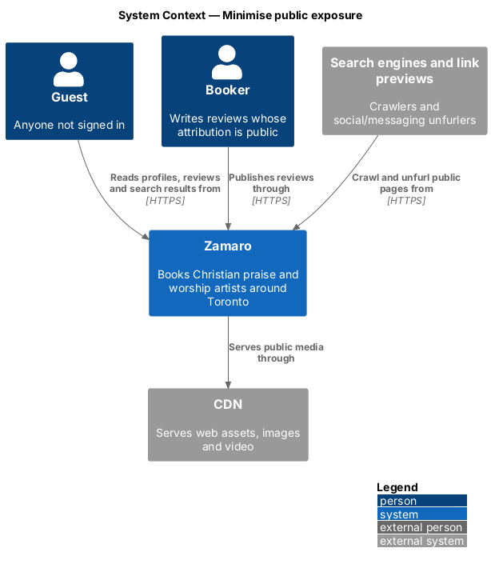
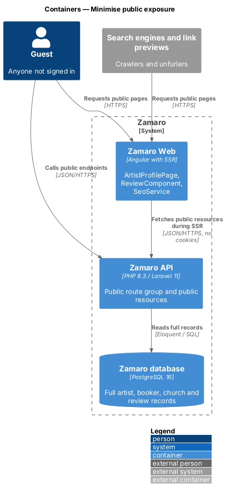
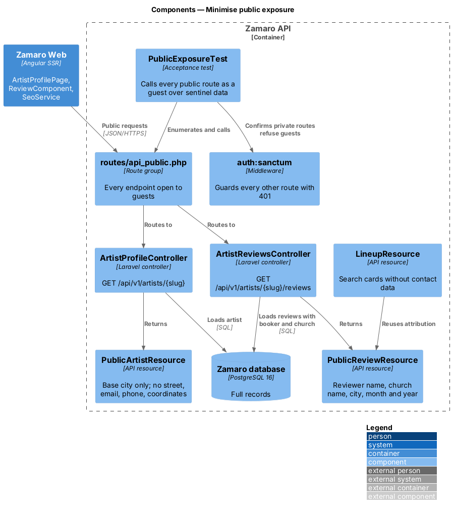
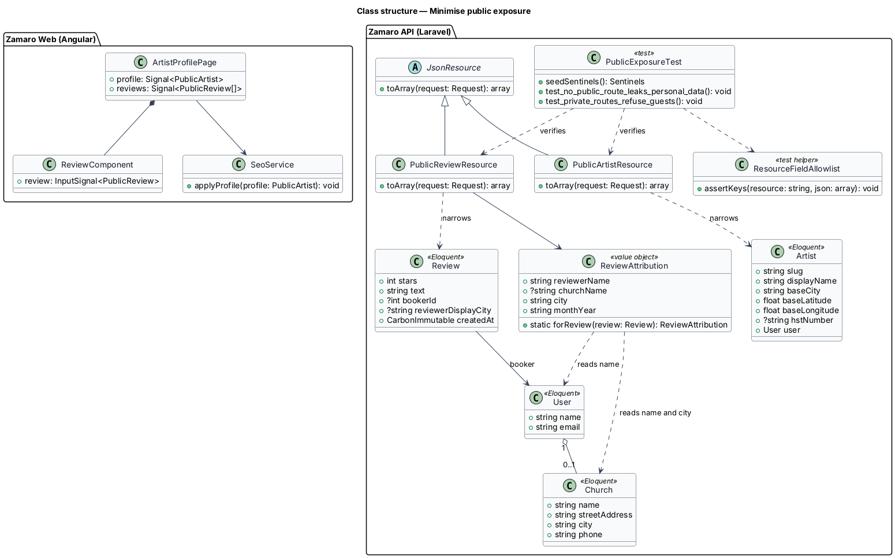
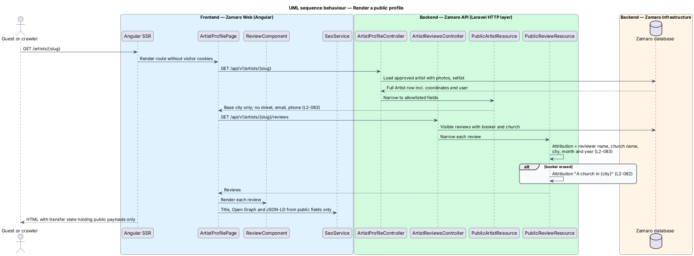
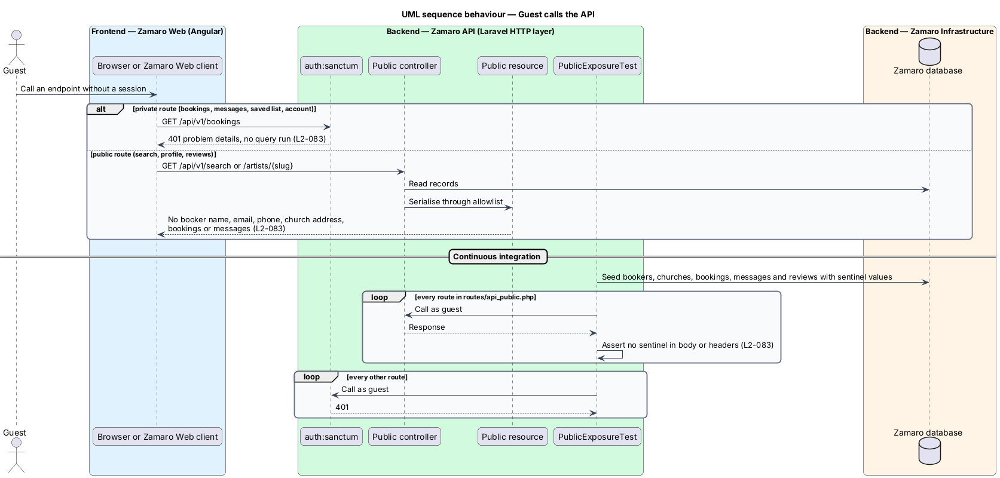

# Minimise public exposure

## Overview

Most of Zamaro is public on purpose. Artist profiles, reviews and search results are
open to guests, search engines and link previews so churches can find artists. That
openness makes it easy to publish more than intended: an artist's home street, a
booker's email in a review payload, or a phone number in a JSON field the page never
shows. This feature is the set of rules and guards that keep public output to the
minimum each view needs.

The slice is cross-cutting rather than a single page. It defines how every endpoint
reachable without sign-in shapes its output, and how that guarantee is tested. It
governs the public profile (`artist-profile` routes in Zamaro Web), the reviews shown
on it, the search results from `discovery/search-available-artists`, and the
server-rendered HTML and structured data built from them. Erased reviewers from
`privacy/delete-account` follow the same review rules.

Terms used in this design:

- **public endpoint** — API route that answers without a session, such as search, artist profile and reviews
- **public resource** — API resource class used only by public endpoints, listing every field it emits by name
- **booker personal data** — any information about an identifiable booker: name, email, phone, church address, church contact, bookings and messages
- **review attribution** — the reviewer name, church name, city, and month and year shown with a review
- **exposure test** — automated test that calls every public endpoint as a guest over seeded data and fails if any sentinel personal value appears in a response

The design applies three rules (L2-083). A public profile names the artist's base city
and never a street address, email or phone. A review carries only its attribution. A
guest receives no booker personal data from any endpoint.

## Description

**Frontend (Zamaro Web)**

- **`ArtistProfilePage`** — renders the base city in the header and About section.
  It has no template slot for street address, email or phone, so a stray field in a
  response would still not render.
- **`ReviewComponent`** — design-system review that renders the review attribution
  only: reviewer name, church name, city, and month and year formatted through
  `FormatService` (for example "November 2025"; L2-110).
- **`SeoService`** — builds the page title, meta description, Open Graph tags and
  JSON-LD for profiles (L2-112, L2-113) from the same public resource, so the
  server-rendered HTML exposes nothing beyond the page.
- **Angular SSR transfer state** — carries only the public resource payloads into
  the HTML, never session or account data, because public routes render without the
  visitor's cookies.

**Backend (Zamaro API)**

- **`PublicArtistResource`** — profile output for guests: slug, display name, act
  type, styles, headline, bio, base city, maximum driving distance, from price,
  rating and review count, photo and video URLs, setlist and upcoming free dates. It
  omits `baseLatitude`, `baseLongitude`, the user's email, any phone number, the HST
  number and payout data (L2-083).
- **`PublicReviewResource`** — `stars`, `text`, `reply`, and an `attribution` object
  with `reviewerName`, `churchName`, `city` and `monthYear` (L2-083). It omits the
  booking number, the event date, the booker's email and any identifier of the
  booker's account. After erasure it emits "A church in {city}" (L2-082).
- **`LineupResource`** — search output reviewed against the same rules: base city
  and distance, never coordinates or contact details. Headliner quotes use
  `PublicReviewResource` attribution.
- **Route grouping** — every public endpoint is declared in one
  `routes/api_public.php` group, and every other route sits behind
  `auth:sanctum`. A guest calling a private route receives `401`, and no resource
  is built.
- **`ResourceFieldAllowlist`** — test helper that records the exact JSON keys each
  public resource may emit. A new key fails the build until it is added to the
  allowlist in code review.
- **`PublicExposureTest`** — acceptance test that seeds bookers, churches, bookings,
  messages and reviews with sentinel values (unique names, emails, phones and street
  addresses), enumerates every route in the public group, calls each as a guest, and
  asserts that no sentinel appears in any response body or header (L2-083). It runs in
  continuous integration alongside the authorisation suite of L2-074.
- **`ArtistBaseLocation`** — model cast that keeps base coordinates server-side for
  distance calculations; they are never serialised by a public resource.

The search response shows distance, not the artist's coordinates. Whether exact
distances could still be combined to estimate a base location, and whether coordinates
are coarsened before storage, are `<TO SUPPLY>`. Whether the reviewer name is shown
in full or as given name and initial is `<TO SUPPLY>`.

## Requirements

The feature realises the following level-2 (L2) requirement, quoted from
`docs/specs/L2.md`.

| L2 ID | Refines (L1) | Requirement |
|-------|--------------|-------------|
| `L2-083` | `L1-017` | **Minimal public exposure.** Acceptance criteria: 1. Given a public profile, when it renders, then it shows the artist's base city only, never a street address, email or phone. 2. Given a review, when it renders, then it shows only reviewer name, church name, city and month and year. 3. Given a guest, when they call any API, then no booker personal data is returned. |

## Diagrams

### System context

Guests, search engines and link previews read public pages and endpoints from
Zamaro. Each receives only the fields the public views need.

### Containers

Zamaro Web renders public pages on the server from public API responses. The Zamaro
API reads full records from the database and narrows them through public resources.

### Components

Public controllers return only `PublicArtistResource`, `PublicReviewResource` and
`LineupResource`. `PublicExposureTest` checks every public route against seeded
sentinel data.

### Class structure

Each public resource wraps a full Eloquent model and emits an allowlisted subset of
its fields. `ReviewAttribution` holds the four parts a review may show.

### Behaviour — render a public profile

A guest request for a profile is rendered on the server from public resources. The
page shows the base city and review attributions, and nothing more.

### Behaviour — guest calls the API

A guest call to a private route is refused before any data is read. A guest call to a
public route is answered from a public resource, and the exposure test proves no
booker personal data appears.

