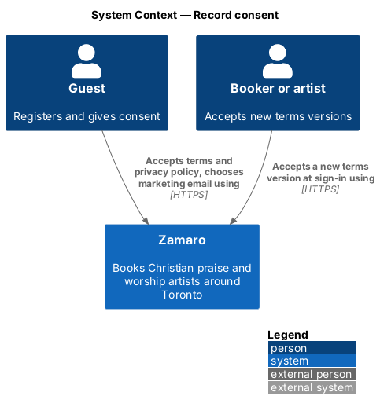
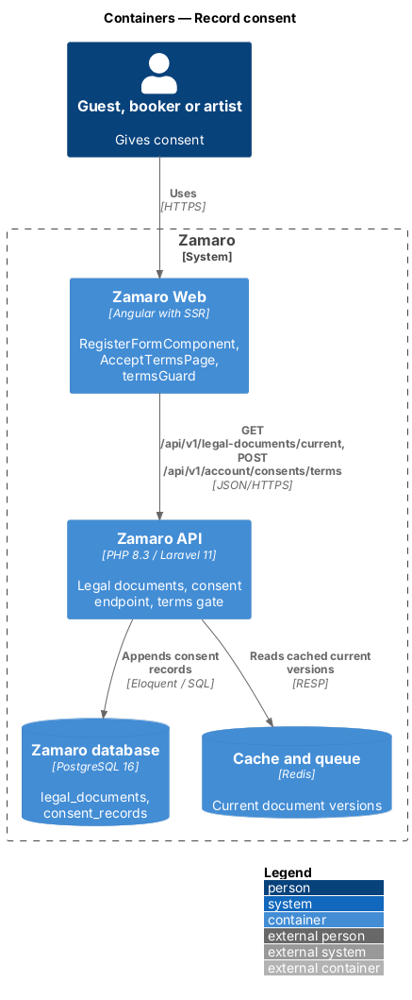
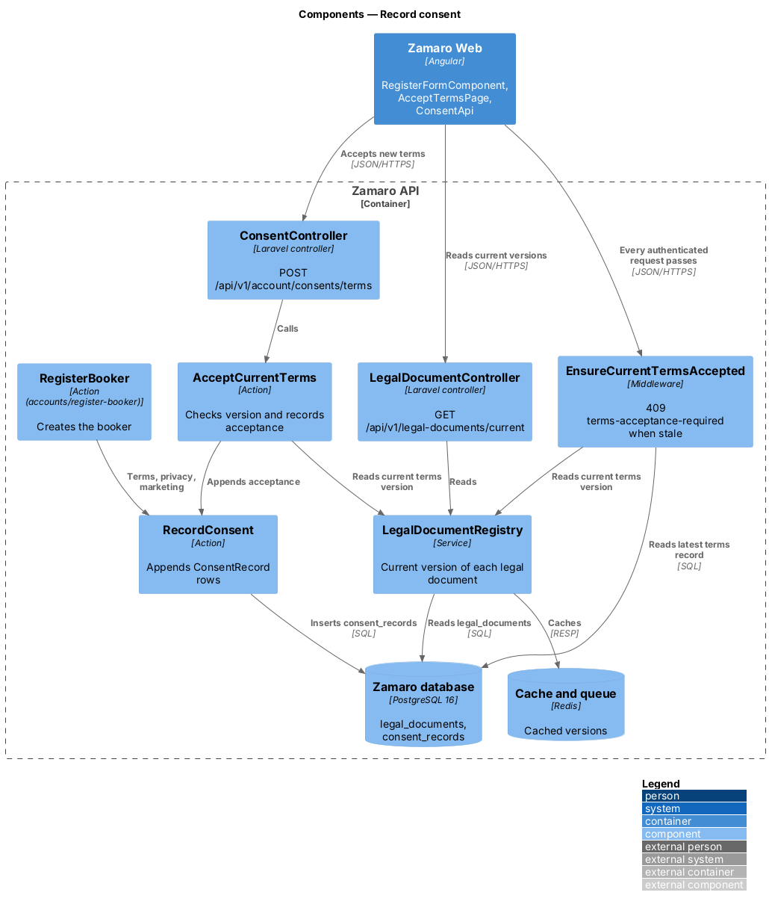
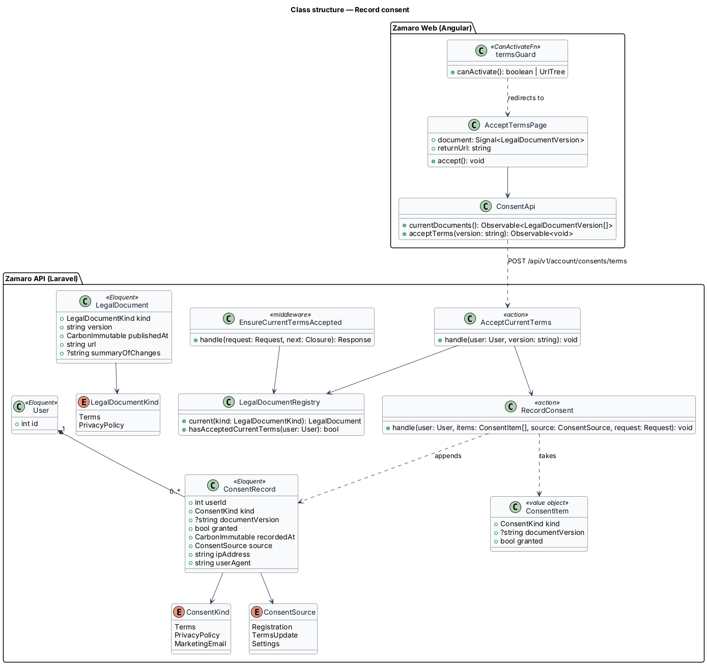
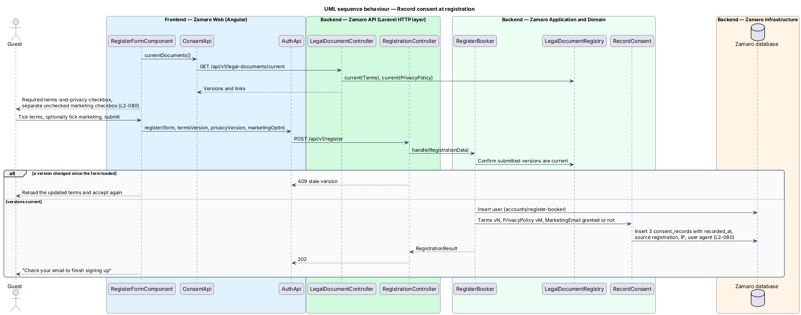
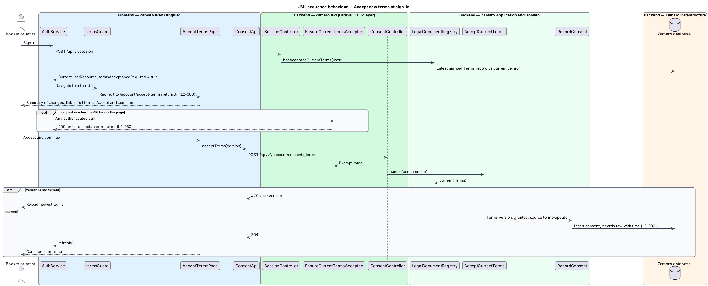

# Record consent

## Overview

Zamaro collects personal information from church representatives and artists, and it
may send marketing email. Canadian privacy law expects a record of what each person
agreed to, and Canada's Anti-Spam Legislation (CASL) expects proof of express consent
before any commercial electronic message is sent. This feature keeps that evidence.

The slice records three things: the versions of the terms of service and privacy
policy a person accepted at registration, a separate marketing email choice, and
acceptance of each new terms version at the person's next sign-in. Registration
itself is `accounts/register-booker`, which calls this slice to write the records.
Sign-in is `accounts/sign-in-and-recover-access`, after which this slice gates access
until new terms are accepted. Exported consent records appear in
`privacy/export-personal-data`.

Terms used in this design:

- **legal document** — published, versioned text of the terms of service or the privacy policy
- **document version** — identifier of one published revision of a legal document
- **current version** — latest published version of a legal document, the one a person is asked to accept
- **consent record** — append-only row that stores the person, what was consented to, the document version where relevant, the choice, the time, and the source
- **express consent** — marketing permission given by an affirmative act, here ticking an unchecked box
- **terms gate** — server check that blocks a signed-in user from continuing until the current terms version is accepted

Consent records are never edited or deleted by the application while the account
exists. A change of mind is a new record, so the history shows what applied at any
moment.

## Description

**Frontend (Zamaro Web)**

- **`RegisterFormComponent`** — owned by `accounts/register-booker`. It renders the
  required terms-and-privacy checkbox, with links that carry the current versions,
  and a separate marketing checkbox that starts unchecked (L2-080). It sends the
  versions it displayed with the submission.
- **`AcceptTermsPage`** — routed page for `/account/accept-terms`. It shows a summary
  of what changed, a link to the full terms, and an Accept and continue button.
  Signing out is the only other action.
- **`termsGuard`** — route guard on every private route. It reads
  `currentUser().termsAcceptanceRequired` and redirects to `/account/accept-terms`,
  keeping the original URL as `returnUrl` (L2-080).
- **`termsInterceptor`** — HTTP interceptor that reacts to a `409` problem detail of
  type `terms-acceptance-required` from any endpoint by routing to the same page.
- **`ConsentApi`** — typed client for `GET /api/v1/legal-documents/current` and
  `POST /api/v1/account/consents/terms`.

**Backend (Zamaro API)**

- **`LegalDocumentRegistry`** — service that returns the current version of each
  legal document from the `legal_documents` table, cached in Redis.
- **`LegalDocumentController`** — `GET /api/v1/legal-documents/current`, public, used
  by the registration form and the accept-terms page.
- **`RecordConsent`** — action that appends one `ConsentRecord` per item with
  `user_id`, `kind`, `document_version`, `granted`, `recorded_at`, `source`,
  `ip_address` and `user_agent`. `RegisterBooker` calls it inside its transaction
  with three items: terms, privacy policy and marketing email (L2-080). A
  submission whose displayed versions are no longer current is refused with `409`,
  so the stored version is always the one the person saw.
- **`EnsureCurrentTermsAccepted`** — middleware on every authenticated route except
  sign-out, the current user endpoint, the accept endpoint and the legal documents
  endpoint. It compares the user's latest granted terms record with the current
  version and returns `409` `terms-acceptance-required` when they differ (L2-080).
- **`ConsentController`** — `POST /api/v1/account/consents/terms`, which takes the
  version the person saw.
- **`AcceptCurrentTerms`** — action that rejects a stale version with `409`, then
  calls `RecordConsent` with source `terms-update`.
- **`CurrentUserResource`** — includes `termsAcceptanceRequired`, so the frontend can
  route before the first blocked call.
- **`ConsentRecordResource`** — used by the data export to list a person's records.

Marketing email goes only to people whose latest `MarketingEmail` record is granted.
A later change of the marketing choice in notification settings appends a new record
through `RecordConsent` with source `settings`.

**Data**

- `legal_documents` — `kind` (`Terms`, `PrivacyPolicy`), `version`, `published_at`,
  `url`, `summary_of_changes`.
- `consent_records` — `user_id`, `kind` (`ConsentKind`: `Terms`, `PrivacyPolicy`,
  `MarketingEmail`), `document_version` (null for marketing), `granted`,
  `recorded_at`, `source` (`registration`, `terms-update`, `settings`),
  `ip_address`, `user_agent`. The table has no update or delete path in the
  application.

Whether a new privacy policy version also triggers the terms gate, the retention
period for consent records after account deletion, and the version identifier format
are `<TO SUPPLY>`.

## Requirements

The feature realises the following level-2 (L2) requirement, quoted from
`docs/specs/L2.md`.

| L2 ID | Refines (L1) | Requirement |
|-------|--------------|-------------|
| `L2-080` | `L1-017` | **Consent.** Acceptance criteria: 1. Given registration, when it completes, then the versions of the terms and privacy policy accepted and the time are stored. 2. Given registration, when the form renders, then marketing email consent is a separate unchecked checkbox, and its value and time are stored as evidence under CASL. 3. Given a new version of the terms, when a user next signs in, then they must accept it before continuing. |

## Diagrams

### System context

Guests give consent when they register and signed-in users accept new terms in
Zamaro. No external system takes part in recording consent.

### Containers

Zamaro Web sends consent choices to the Zamaro API, which appends records to the
database and caches the current document versions in Redis.

### Components

`RecordConsent` is the only writer of consent records. `EnsureCurrentTermsAccepted`
reads them on each authenticated request through `LegalDocumentRegistry`.

### Class structure

A `User` has one or more `ConsentRecord` rows, each of one `ConsentKind`. A
`LegalDocument` row names each published version.

### Behaviour — record consent at registration

Registration writes three consent records in the same transaction as the account:
terms version, privacy policy version and the marketing choice, each with the time.

### Behaviour — accept new terms at sign-in

After a new terms version is published, the next signed-in request is blocked until
the person accepts it. Acceptance appends a record and returns them to where they
were going.

