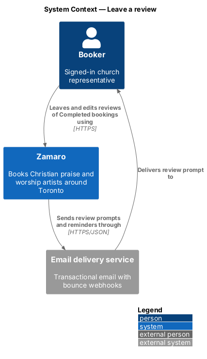
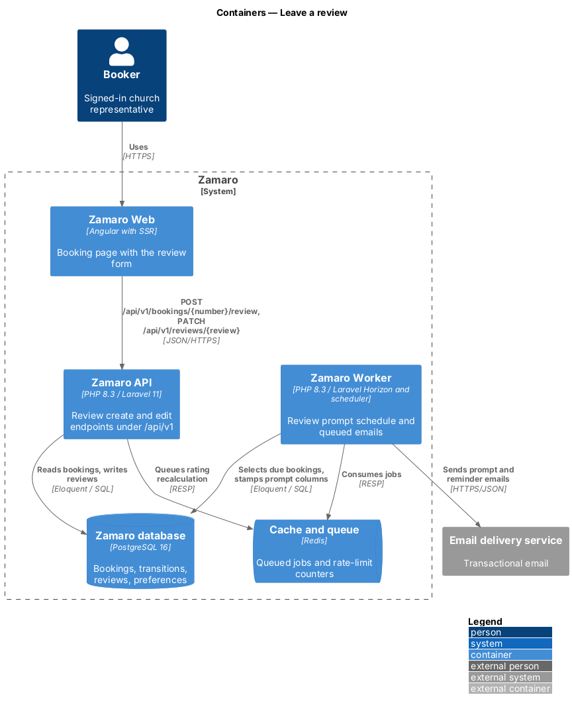
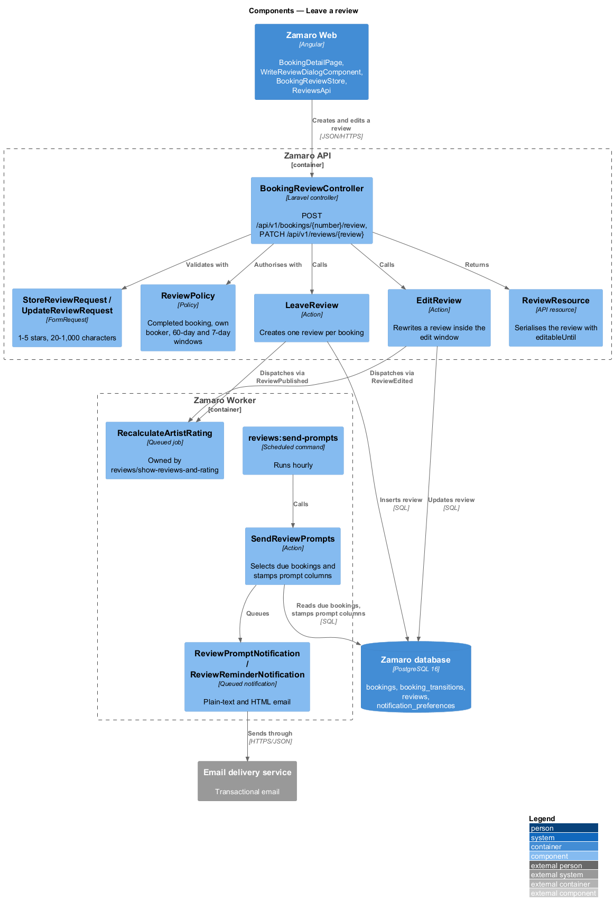
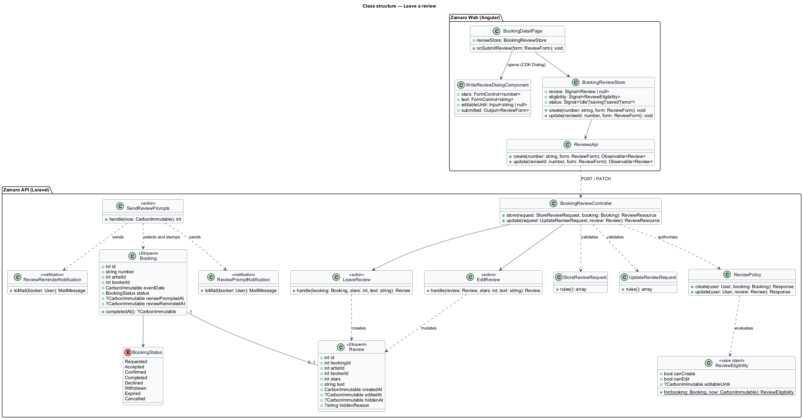
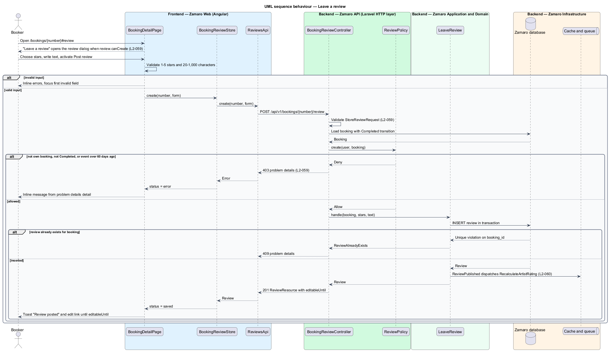
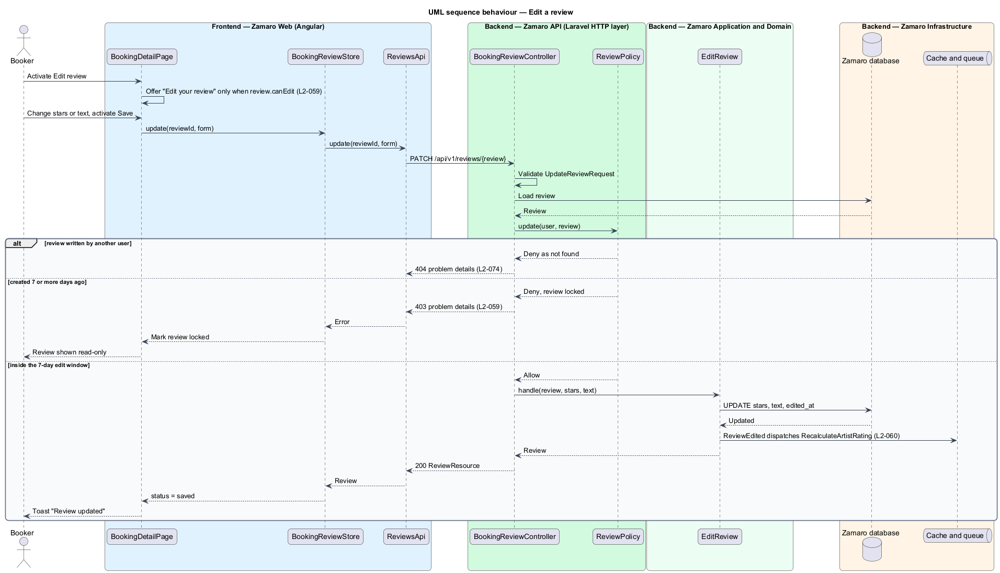
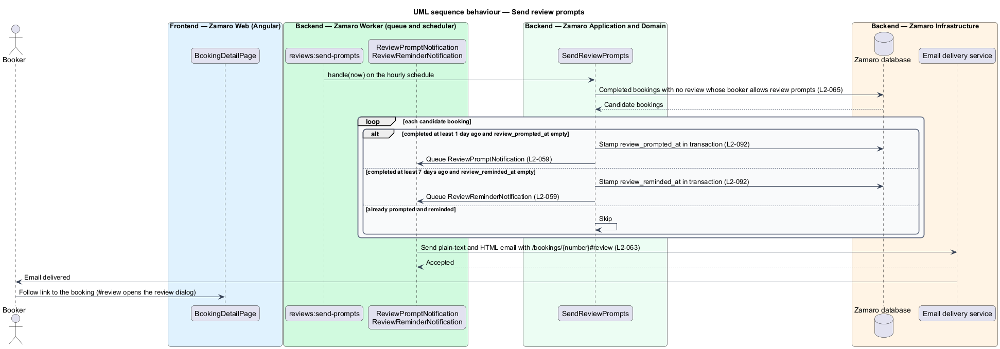

# Leave a review

## Overview

Zamaro is a marketplace where churches in and around Toronto book Christian praise
and worship artists. Reviews are how one church tells the next what an artist was
like on the day. They feed the rating and the "What churches say" section of every
artist profile.

This feature is the writing side of reviews: who may leave one, when, how it is
edited, and the emails that invite it. A booker writes the review from the booking
page once the booking is Completed. Showing reviews and computing the rating is a
separate slice (`reviews/show-reviews-and-rating`), as are the artist's reply
(`reviews/reply-to-review`) and reporting and moderation
(`reviews/report-and-moderate-review`).

Terms used in this design:

- **booker** — signed-in church representative who requests bookings
- **Completed booking** — booking whose Confirmed event started more than 24 hours ago (L2-029)
- **review** — star rating of 1 to 5 with 20 to 1,000 characters of text, written once per Completed booking
- **review window** — 60 days after the event date during which a booker may leave a review
- **edit window** — 7 days after a review is created during which its author may change it
- **locked review** — review older than its edit window, which no one can change through the application
- **review prompt** — email sent 1 day after a booking becomes Completed that invites a review
- **review reminder** — single follow-up email sent 7 days after completion when no review exists yet

Three rules govern the slice (L2-059). Only the booker of a Completed booking with
the artist may review, and anyone else receives 403. A review is editable for
7 days and locked after that. The prompt goes out 1 day after completion and one
reminder 7 days after completion, unless the booker turned review-prompt emails off
(L2-065).

## Description

The slice runs from the booking page in Zamaro Web to the reviews endpoints in the
Zamaro API, the Zamaro database, and a scheduled command in the Zamaro Worker that
sends prompt emails through the email delivery service.

**Frontend (Zamaro Web, `features/bookings`)**

- **`BookingDetailPage`** — routed page for `/bookings/:number`. When the booking
  resource reports `review.canCreate` or `review.canEdit`, it shows "Leave a review"
  or "Edit your review" in the payment stub, with the date the window closes. The
  button opens `WriteReviewDialogComponent`. The review prompt email links here with
  `#review`, which opens the dialog on load.
- **`WriteReviewDialogComponent`** — CDK dialog with a reactive form: a 1–5 star
  radio group (design-system radio group of `.choice--stub` options, each with
  stars and a word from Unforgettable to Poor, since the `rating` component is
  display-only) and a textarea with a live character count out of 1,000. It enforces 20–1,000 characters on the client, marks invalid
  fields and moves focus to the first one (L2-101). In edit mode it is prefilled and
  shows the date the review locks. It traps focus and returns it to the opening
  button on close.
- **`BookingReviewStore`** — signal-based store holding the current `Review`, the
  eligibility flags and a status (`idle`, `saving`, `saved`, `error`). While saving,
  the submit button shows its busy state ("Posting…", or "Saving…" in edit mode)
  and blocks a second submission (L2-108); on success it raises a toast (L2-109).
- **`ReviewsApi`** — typed client for `POST /api/v1/bookings/{number}/review` and
  `PATCH /api/v1/reviews/{review}`.

**Backend (Zamaro API)**

- **`BookingReviewController`** — `store` handles
  `POST /api/v1/bookings/{number}/review`; `update` handles
  `PATCH /api/v1/reviews/{review}`. Both sit behind the `auth:sanctum` middleware
  and the write rate limiter (L2-077).
- **`StoreReviewRequest`** and **`UpdateReviewRequest`** — FormRequests that
  validate `stars` as an integer from 1 to 5 and `text` as 20 to 1,000 characters
  after trimming. Failures return 422 problem details keyed by field (L2-095).
- **`ReviewPolicy`** — `create(User, Booking)` allows only the booking's own booker
  when the booking is Completed and the event date is within the last 60 days. A
  denial returns 403, as L2-059 states. `update(User, Review)` returns 404 for a
  review the user did not write (L2-074) and 403 once the edit window has closed.
- **`ReviewEligibility`** — value object computed from a booking and its review.
  It exposes `canCreate`, `canEdit` and `editableUntil`, and `BookingResource`
  embeds it so the page and the policy apply the same rule.
- **`LeaveReview`** — action that creates the `Review` inside `DB::transaction`.
  A unique index on `reviews.booking_id` turns a second submission into 409. It
  dispatches the `ReviewPublished` event.
- **`EditReview`** — action that rewrites stars and text, stamps `edited_at` and
  dispatches `ReviewEdited`.
- **`RecalculateArtistRating`** — queued job owned by
  `reviews/show-reviews-and-rating`; listeners for `ReviewPublished` and
  `ReviewEdited` dispatch it so the rating stays current.
- **`ReviewResource`** — API resource returning the review with `editableUntil`.

**Backend (Zamaro Worker)**

- **`reviews:send-prompts`** — scheduled command registered in `routes/console.php`
  to run hourly (exact cadence `<TO SUPPLY>`). It runs `SendReviewPrompts`.
- **`SendReviewPrompts`** — action that selects Completed bookings with no review,
  whose booker has review-prompt emails on. It sends `ReviewPromptNotification`
  when completion is at least 1 day old and `review_prompted_at` is empty. It sends
  `ReviewReminderNotification` when completion is at least 7 days old and
  `review_reminded_at` is empty. Each send stamps its column in the same
  transaction, so a repeated run has no effect (L2-092).
- **`ReviewPromptNotification`**, **`ReviewReminderNotification`** — queued email
  notifications with plain-text and HTML parts and a link to
  `/bookings/{number}#review` (L2-063).

**Data**

- `reviews` — `id`, `booking_id` (unique), `artist_id`, `booker_id`, `stars`
  (smallint, check 1–5), `text`, `created_at`, `edited_at`, `hidden_at`,
  `hidden_reason`, `hidden_by`. The hidden columns belong to
  `reviews/report-and-moderate-review`.
- `bookings` — gains `review_prompted_at` and `review_reminded_at`. Completion time
  comes from the Completed row in `booking_transitions` (L2-029), written by
  `bookings/run-booking-lifecycle`.
- `notification_preferences` — read for the review-prompt opt-out (L2-065), owned by
  `notifications/manage-email-preferences`.

**Mock screens** — the dialog is
[`dialogs/write-review`](../../../mocks/dialogs/write-review/default.html) in states
default, busy, invalid, failed and [`edit`](../../../mocks/dialogs/write-review/edit.html)
(Naomi's review of ZAM-0114, editable until Tue 24 Nov), shown over
[`pages/booking-detail/completed`](../../../mocks/pages/booking-detail/completed.html).

The 60-day review window counts from the event date, as L2-059 states ("within 60
days of the event"). The booking page shows the closing date, for example "You can
leave a review until Wed 13 Jan 2027, 60 days after the event" for ZAM-0114 on
Sat 14 Nov.

## Requirements

The feature realises the following level-2 (L2) requirement. It refines the level-1
(L1) requirement shown, and the text is quoted from `docs/specs/L2.md`.

| L2 ID | Refines (L1) | Requirement |
|-------|--------------|-------------|
| `L2-059` | `L1-013` | **Who can review.** Acceptance criteria: 1. Given a Completed booking, when the booker opens it within 60 days of the event, then they can leave one review with 1–5 stars and text of 20–1,000 characters. 2. Given a booker without a Completed booking with that artist, when they try to submit a review, then it is rejected with 403. 3. Given a review, when it is less than 7 days old, then the booker can edit it; after that it is locked. 4. Given a booking becomes Completed, when 1 day has passed, then the booker is emailed a review prompt; one reminder is sent after 7 days if no review exists. |

## Diagrams

### System context

A booker leaves a review in Zamaro, which emails review prompts and reminders
through the email delivery service.

### Containers

The booking page in Zamaro Web calls the reviews endpoints in the Zamaro API. The
Zamaro Worker runs the prompt schedule and sends emails through the email delivery
service.

### Components

`BookingReviewController` validates with the review FormRequests, authorises with
`ReviewPolicy` and calls `LeaveReview` or `EditReview`. In the worker,
`SendReviewPrompts` selects due bookings and queues the two notifications.

### Class structure

`ReviewEligibility` is the single expression of the review and edit windows. Both
`ReviewPolicy` and `BookingResource` read it, and each `Review` belongs to exactly
one `Booking`.

### Behaviour — leave a review

The policy checks the Completed status, the booker and the 60-day window before the
action writes. A non-eligible booker receives 403, invalid input 422, and a second
review for the same booking 409.

### Behaviour — edit a review

An edit inside the 7-day window rewrites the review and triggers a rating
recalculation. After the window the policy rejects the edit with 403 and the page
shows the review as locked.

### Behaviour — send review prompts

The hourly command sends the prompt 1 day after completion and the single reminder
7 days after completion. Stamped columns keep a repeated run from sending twice.

