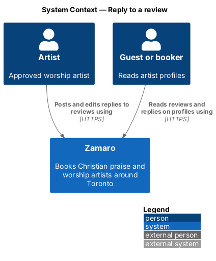
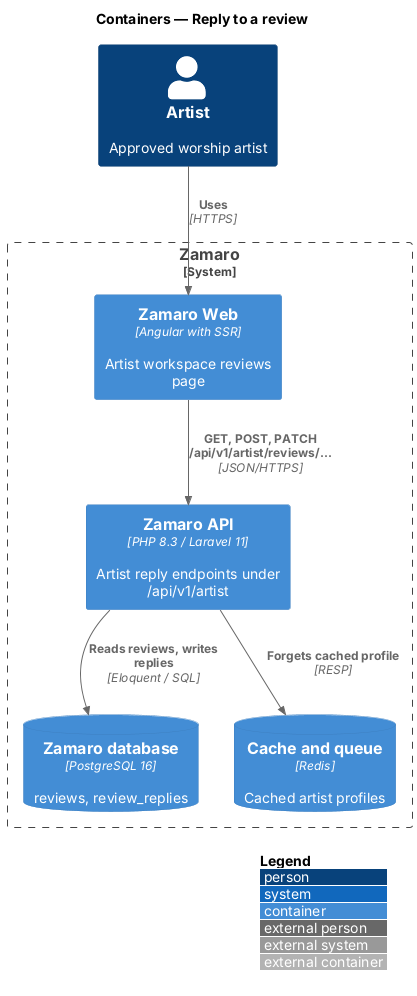
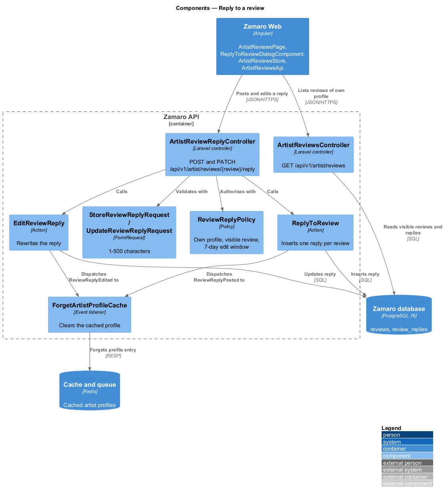
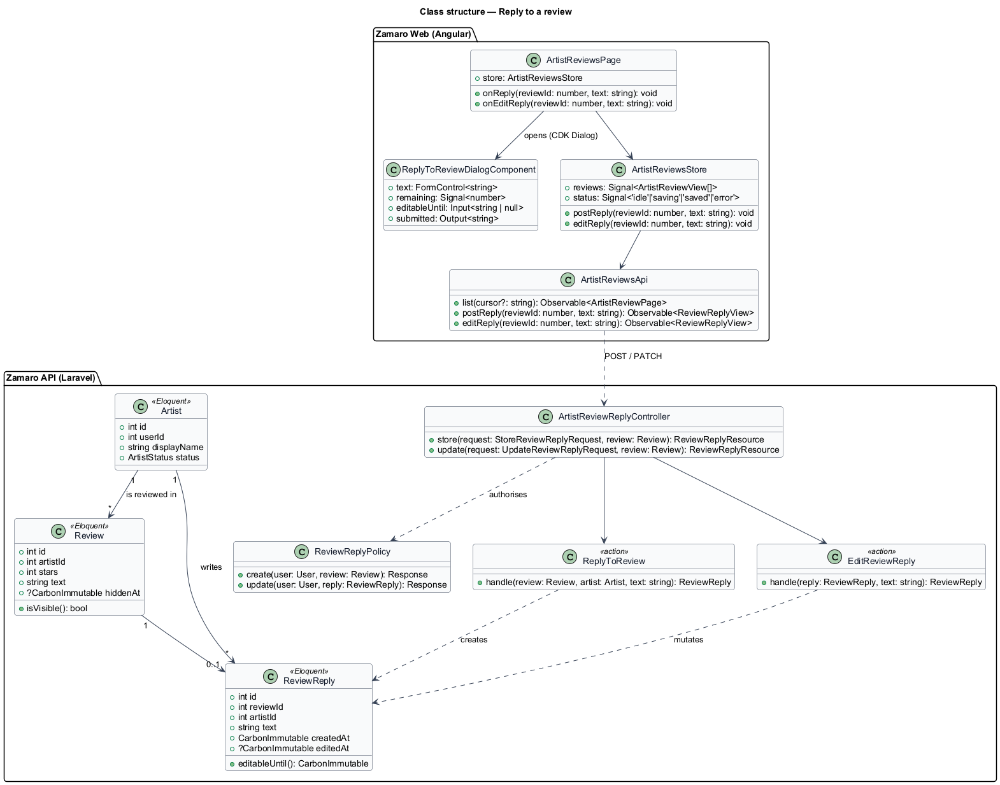
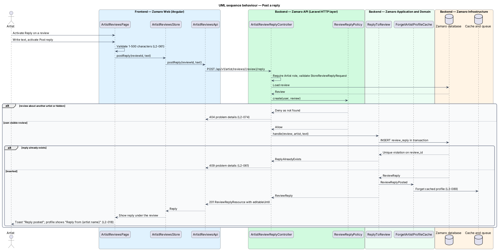
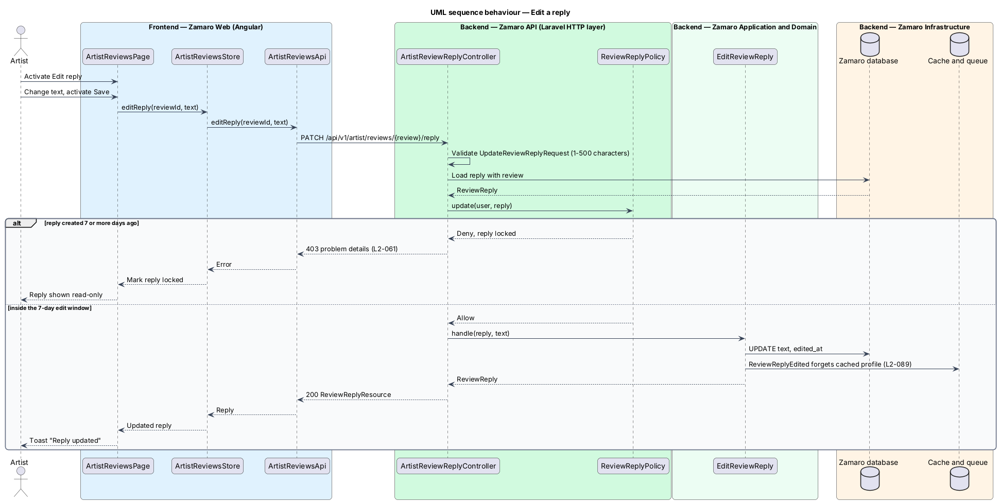

# Reply to a review

## Overview

Zamaro is a marketplace where churches in and around Toronto book Christian praise
and worship artists. Churches review artists after a Completed booking, and those
reviews appear on the artist's public profile. An artist cannot remove a review,
but can answer it in public.

This feature lets an artist post and edit that answer from the artist workspace.
The reply then shows beneath the review on the profile. Writing reviews is
`reviews/leave-review`, rendering them on the profile is
`reviews/show-reviews-and-rating`, and reporting a review is
`reviews/report-and-moderate-review`.

Terms used in this design:

- **artist** — approved worship artist account (solo, duo, band or choir acting as one account)
- **artist workspace** — signed-in area under `/artist/*` where an artist manages their profile and bookings
- **visible review** — review that moderation has not hidden
- **artist reply** — public text of 1 to 500 characters written by the reviewed artist beneath one visible review
- **reply edit window** — 7 days after a reply is created during which the artist may change it

The rule is L2-061: one reply per visible review, 1 to 500 characters, shown
publicly beneath the review and editable for 7 days. On the profile it carries the
label "Reply from {artist name}" (L2-018).

## Description

The slice runs from the reviews page in the artist workspace to the reply endpoints
in the Zamaro API and the Zamaro database.

**Frontend (Zamaro Web, `features/artist-workspace`)**

- **`ArtistReviewsPage`** — routed page for `/artist/reviews`. It lists the visible
  reviews of the signed-in artist's own profile, newest first, with each review's
  reply and either a Reply button, an Edit reply button while the reply edit window
  is open, or "Reply locked" after it. The dashboard's Reviews panel links here. It
  also hosts the Report action from `reviews/report-and-moderate-review`; it offers
  no delete action (L2-062).
- **`ReplyToReviewDialogComponent`** — CDK dialog opened by Reply or Edit reply. It
  shows the review, a textarea with a live count out of 500, Post reply (Save reply
  in edit mode) and Cancel. In edit mode it shows the time the reply locks. It
  validates 1–500 characters after trimming, traps focus and returns it to the
  opening button on close (L2-101).
- **`ArtistReviewsStore`** — signal-based store holding the page of reviews, the
  reply being edited and a status. While saving, the submit button shows its busy
  state ("Posting…", or "Saving…" in edit mode) and blocks a second submission
  (L2-108); on success it raises a "Reply posted" toast (L2-109).
- **`ArtistReviewsApi`** — typed client for `GET /api/v1/artist/reviews`,
  `POST /api/v1/artist/reviews/{review}/reply` and
  `PATCH /api/v1/artist/reviews/{review}/reply`.

**Backend (Zamaro API)**

- **`ArtistReviewsController`** — `index` lists visible reviews of the caller's own
  artist profile with cursor pagination (L2-095). The `/api/v1/artist` route group
  requires the Artist role and returns 404 to anyone else (L2-074).
- **`ArtistReviewReplyController`** — `store` and `update` for the reply routes.
- **`StoreReviewReplyRequest`** and **`UpdateReviewReplyRequest`** — FormRequests
  that require `text` of 1 to 500 characters after trimming; failures return 422.
- **`ReviewReplyPolicy`** — `create(User, Review)` allows only the artist whose
  profile the review is about, and only while the review is visible; any other case
  returns 404 (L2-074). `update(User, ReviewReply)` returns 403 once the reply edit
  window has closed.
- **`ReplyToReview`** — action that inserts the `ReviewReply` inside
  `DB::transaction`. A unique index on `review_replies.review_id` turns a second
  reply into 409. It dispatches `ReviewReplyPosted`.
- **`EditReviewReply`** — action that rewrites the text, stamps `edited_at` and
  dispatches `ReviewReplyEdited`.
- **`ForgetArtistProfileCache`** — listener for both reply events that clears the
  cached profile so the reply appears on the next render (L2-089).
- **`ReviewReplyResource`** — serialises the reply with `editableUntil`.

Whether the reviewing booker is emailed when a reply is posted is not stated in the
specs and is `<TO SUPPLY>`. If moderation later hides the review, the reply is
hidden with it, because it renders only beneath a visible review.

**Mock screens** — the page is
[`pages/artist-reviews`](../../../mocks/pages/artist-reviews/default.html) in states
default (Abigail: one reply editable, one locked, two without a reply), loading,
[`empty`](../../../mocks/pages/artist-reviews/empty.html) (Miriam) and error. The
dialog is [`dialogs/reply-review`](../../../mocks/dialogs/reply-review/default.html) in
states default, [`edit`](../../../mocks/dialogs/reply-review/edit.html), busy, invalid
and failed. The public reply under the review is in
[`pages/artist`](../../../mocks/pages/artist/default.html).

**Data**

- `review_replies` — `id`, `review_id` (unique, foreign key to `reviews`),
  `artist_id`, `text` (varchar 500), `created_at`, `edited_at`.

## Requirements

The feature realises the following level-2 (L2) requirement. It refines the level-1
(L1) requirement shown, and the text is quoted from `docs/specs/L2.md`.

| L2 ID | Refines (L1) | Requirement |
|-------|--------------|-------------|
| `L2-061` | `L1-013` | **Artist reply to a review.** Acceptance criteria: 1. Given a visible review of their profile, when the artist replies with 1–500 characters, then the reply is shown publicly beneath the review; one reply per review, editable for 7 days. |

## Diagrams

### System context

An artist replies to reviews in Zamaro, and guests and bookers read the replies on
the artist's public profile.

### Containers

The artist workspace in Zamaro Web calls the reply endpoints in the Zamaro API,
which writes the reply to the database and clears the cached profile in Redis.

### Components

`ArtistReviewReplyController` validates the text, authorises with
`ReviewReplyPolicy` and calls `ReplyToReview` or `EditReviewReply`. A listener
clears the profile cache after each change.

### Class structure

Each visible `Review` has at most one `ReviewReply`, written by the `Artist` the
review is about.

### Behaviour — post a reply

The policy confirms that the review is visible and about the caller's own profile.
The unique index rejects a second reply with 409.

### Behaviour — edit a reply

An edit within 7 days rewrites the reply. After that the policy rejects the edit
with 403 and the page shows the reply as locked.

