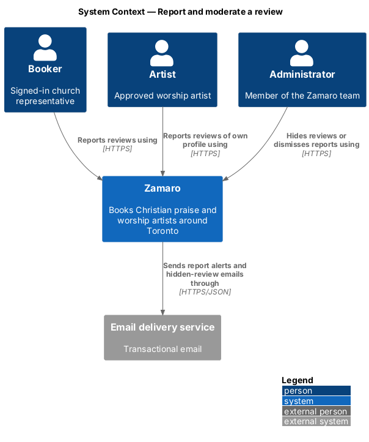
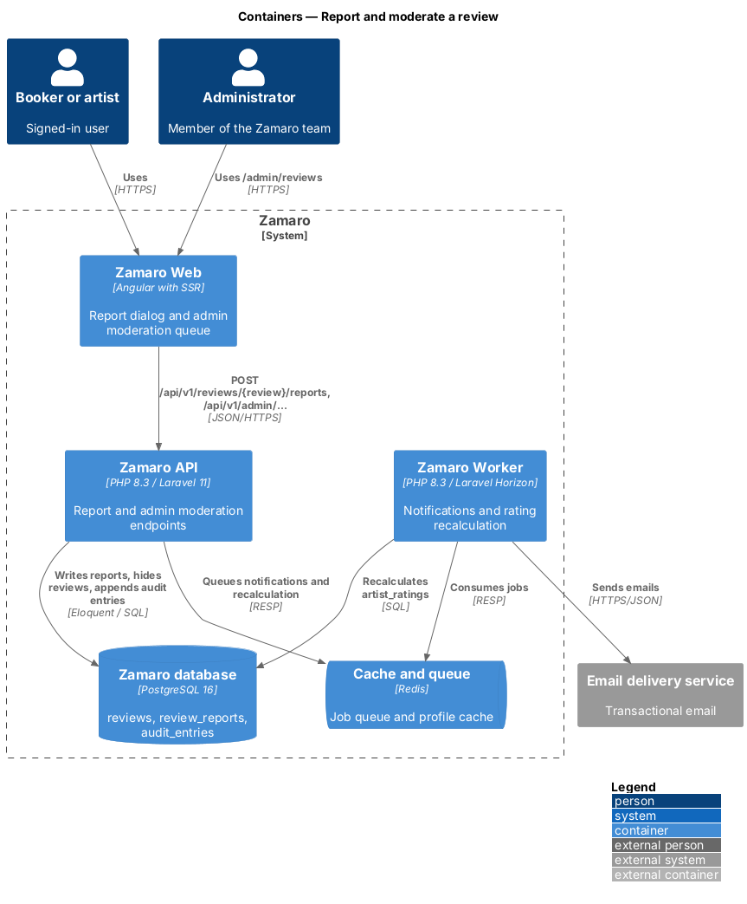
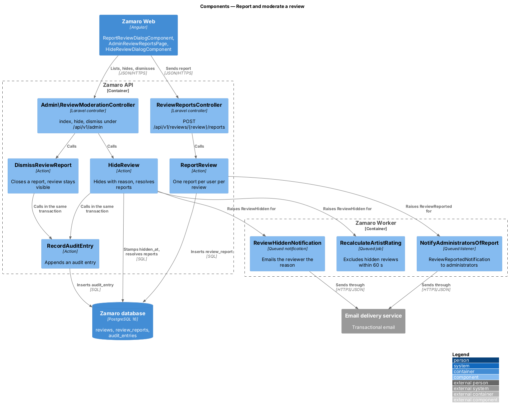
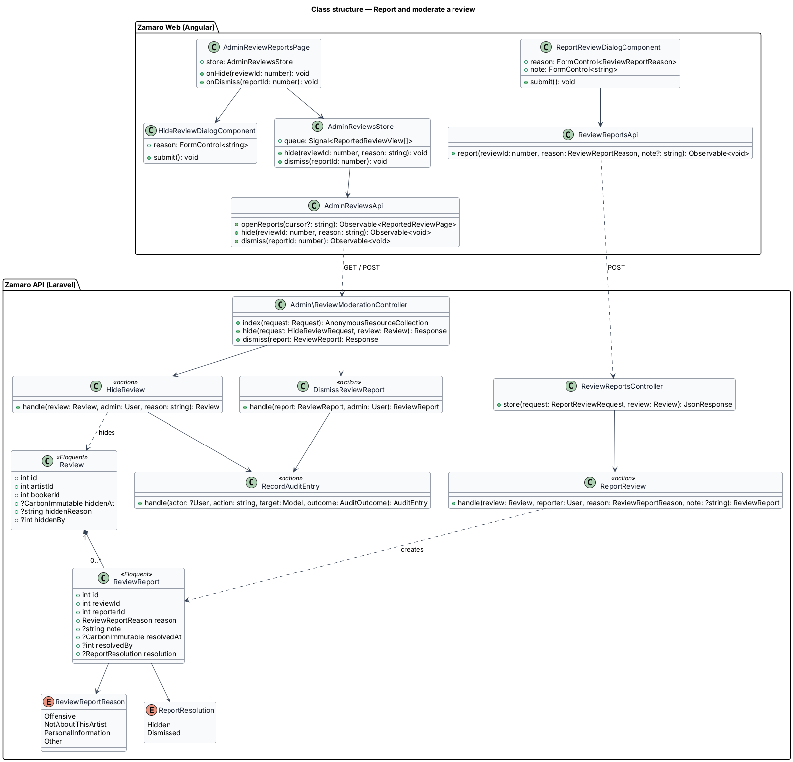
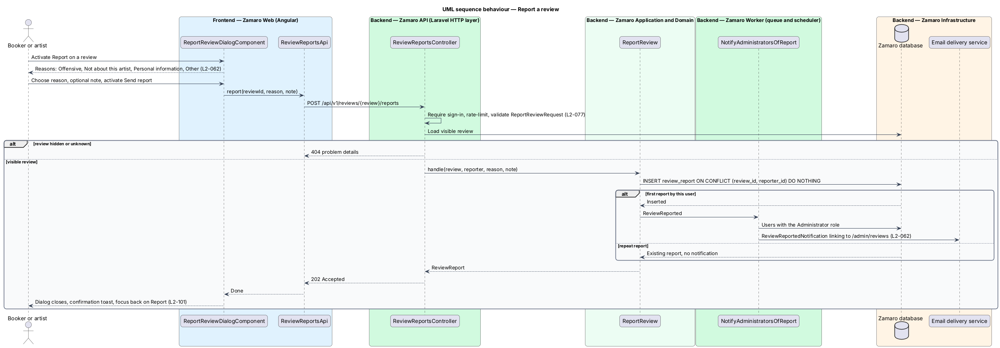
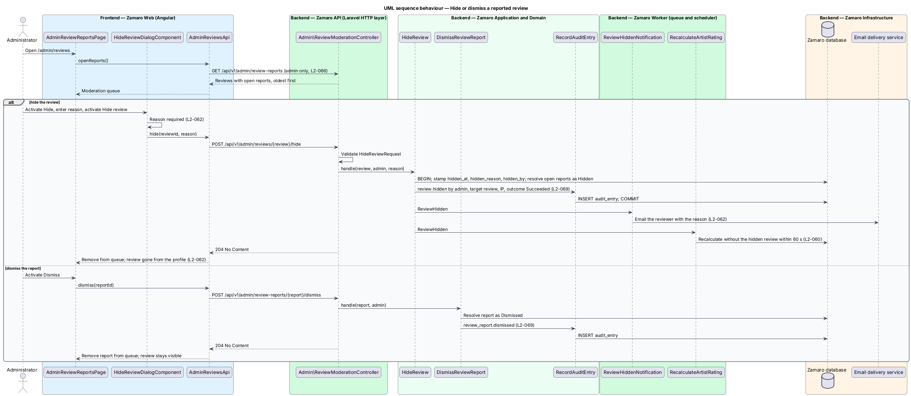

# Report and moderate a review

## Overview

Zamaro is a marketplace where churches in and around Toronto book Christian praise
and worship artists. Reviews on artist profiles are public and drive the rating, so
a review that is offensive, about the wrong artist or exposes personal information
harms real people. Nobody outside the Zamaro team can remove one.

This feature is the path from a report to a decision. Any signed-in user reports a
review with a reason, administrators are notified, and an administrator either hides
the review with a recorded reason or dismisses the report. Writing reviews is
`reviews/leave-review`; the rating that a hidden review leaves is computed in
`reviews/show-reviews-and-rating`. The audit trail is
`administration/record-audit-log`, and the `/admin` access rules are
`administration/secure-admin-access`.

Terms used in this design:

- **review report** — record of one signed-in user flagging one review with a reason
- **report reason** — one of Offensive, Not about this artist, Personal information, Other
- **open report** — review report that no administrator has resolved
- **hidden review** — review that an administrator removed from public view with a recorded reason; it stays in the database
- **dismissal** — administrator decision that closes a report and leaves the review visible
- **moderation queue** — admin page listing reviews with open reports, oldest first

Three rules come from L2-062. A report carries a reason and notifies an
administrator. Hiding requires a reason, removes the review from the profile,
emails the reviewer and is audit-logged. An artist has no delete action and can only
report.

## Description

The slice runs from the Report link on a review in Zamaro Web to the reports
endpoint, the admin moderation endpoints, the Zamaro Worker and the email delivery
service.

**Frontend (Zamaro Web)**

- **`ReviewComponent`** (`features/artist-profile`) — shows a Report link on each
  review for a signed-in user. A guest sees no link.
- **`ArtistReviewsPage`** (`features/artist-workspace`, from
  `reviews/reply-to-review`) — offers Reply and Report on each review of the
  artist's own profile, and no delete action (L2-062).
- **`ReportReviewDialogComponent`** — design-system dialog with a radio group of the
  four report reasons, an optional note (length `<TO SUPPLY>`) and Send report. It
  traps focus and returns it to the Report link on close (L2-101). On success it
  closes and raises a confirmation toast (copy `<TO SUPPLY>`).
- **`ReviewReportsApi`** — typed client for
  `POST /api/v1/reviews/{review}/reports`.
- **`AdminReviewReportsPage`** (`features/admin`) — routed page for
  `/admin/reviews`. It lists reviews with open reports, each with the review text,
  stars, artist, reviewer, report count and reasons, and the actions Hide and
  Dismiss.
- **`HideReviewDialogComponent`** — dialog with a required reason textarea and Hide
  review. Submitting with an empty reason shows an inline error.
- **`AdminReviewsStore`** and **`AdminReviewsApi`** — store and typed client for
  `GET /api/v1/admin/review-reports`,
  `POST /api/v1/admin/reviews/{review}/hide` and
  `POST /api/v1/admin/review-reports/{report}/dismiss`.

**Backend (Zamaro API)**

- **`ReviewReportsController`** — `store` for
  `POST /api/v1/reviews/{review}/reports`, behind `auth:sanctum` and the write rate
  limiter (L2-077). A hidden or unknown review returns 404.
- **`ReportReviewRequest`** — validates `reason` against the `ReviewReportReason`
  enum and the optional `note`. Whether Other requires a note is `<TO SUPPLY>`.
- **`ReportReview`** — action that inserts a `ReviewReport`. A unique index on
  `(review_id, reporter_id)` makes a repeat report by the same user return the
  existing report without a second notification. A new report dispatches
  `ReviewReported`.
- **`Admin\ReviewModerationController`** — `index`, `hide` and `dismiss` under
  `/api/v1/admin`, which returns 404 to non-administrators (L2-066).
- **`HideReviewRequest`** — requires a non-empty `reason` (maximum length
  `<TO SUPPLY>`).
- **`HideReview`** — action that, in one `DB::transaction`, sets `hidden_at`,
  `hidden_reason` and `hidden_by` on the review, resolves every open report on it
  with resolution `Hidden`, and calls `RecordAuditEntry` with action
  `review.hidden` (L2-069). After commit it dispatches `ReviewHidden`.
- **`DismissReviewReport`** — action that resolves one report with resolution
  `Dismissed` and records the audit entry `review_report.dismissed`.
- **Route inventory test** — an acceptance test asserts that no route deletes a
  review, for any role (L2-062).

**Backend (Zamaro Worker)**

- **`NotifyAdministratorsOfReport`** — queued listener for `ReviewReported` that
  sends `ReviewReportedNotification` to every user with the Administrator role,
  linking to `/admin/reviews`.
- **`ReviewHiddenNotification`** — queued email to the reviewer naming the artist,
  the booking number and the administrator's reason (L2-063).
- **`RecalculateArtistRating`** — dispatched for `ReviewHidden` by
  `reviews/show-reviews-and-rating`; it removes the review from the rating within
  60 seconds (L2-060) and clears the cached profile.

Restoring a hidden review is not described in the specs and is `<TO SUPPLY>`.

**Data**

- `review_reports` — `id`, `review_id`, `reporter_id`, `reason`, `note`,
  `created_at`, `resolved_at`, `resolved_by`, `resolution` (`Hidden`, `Dismissed`);
  unique `(review_id, reporter_id)`; partial index on open reports.
- `reviews` — `hidden_at`, `hidden_reason`, `hidden_by`.
- `audit_entries` — written through `RecordAuditEntry`.

## Requirements

The feature realises the following level-2 (L2) requirement. It refines the level-1
(L1) requirement shown, and the text is quoted from `docs/specs/L2.md`.

| L2 ID | Refines (L1) | Requirement |
|-------|--------------|-------------|
| `L2-062` | `L1-013` | **Review reporting and moderation.** Acceptance criteria: 1. Given a signed-in user, when they report a review with a reason (Offensive, Not about this artist, Personal information, Other), then an administrator is notified. 2. Given an administrator hides a review, when they save, then a reason is required, the review disappears from the profile, the reviewer is emailed, and the action is audit-logged. 3. Given an artist, when they look for a way to delete a review, then none exists; they can only report it. |

## Diagrams

### System context

Signed-in bookers and artists report reviews, and administrators moderate them.
Zamaro emails administrators and reviewers through the email delivery service.

### Containers

Zamaro Web sends reports and moderation decisions to the Zamaro API. The Zamaro
Worker sends the notifications and recalculates the rating.

### Components

`ReportReview` records the report and raises `ReviewReported`. `HideReview` hides
the review, resolves its reports and calls `RecordAuditEntry` in one transaction,
then raises `ReviewHidden`.

### Class structure

A `Review` collects many `ReviewReport` records, each with a `ReviewReportReason`.
Hiding stamps the review itself, so every reader of visible reviews excludes it.

### Behaviour — report a review

A signed-in user picks a reason and sends the report. A first report by that user
notifies every administrator; a repeat report changes nothing.

### Behaviour — hide or dismiss a reported review

An administrator hides with a required reason or dismisses the report. Hiding
writes the audit entry in the same transaction, emails the reviewer and removes the
review from the rating.

