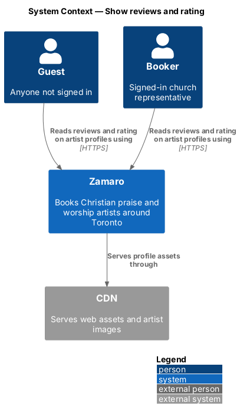
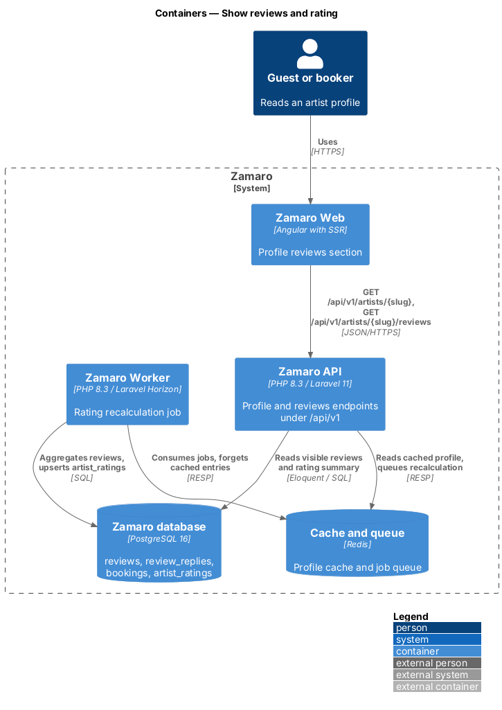
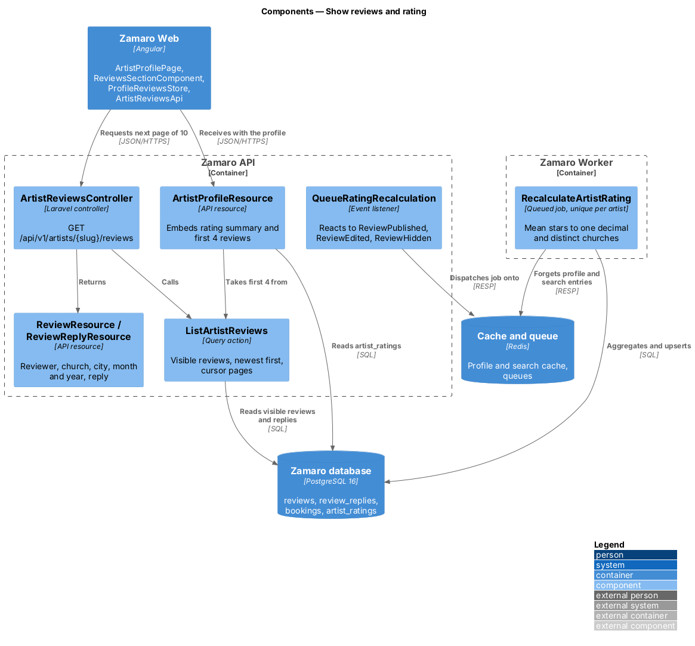
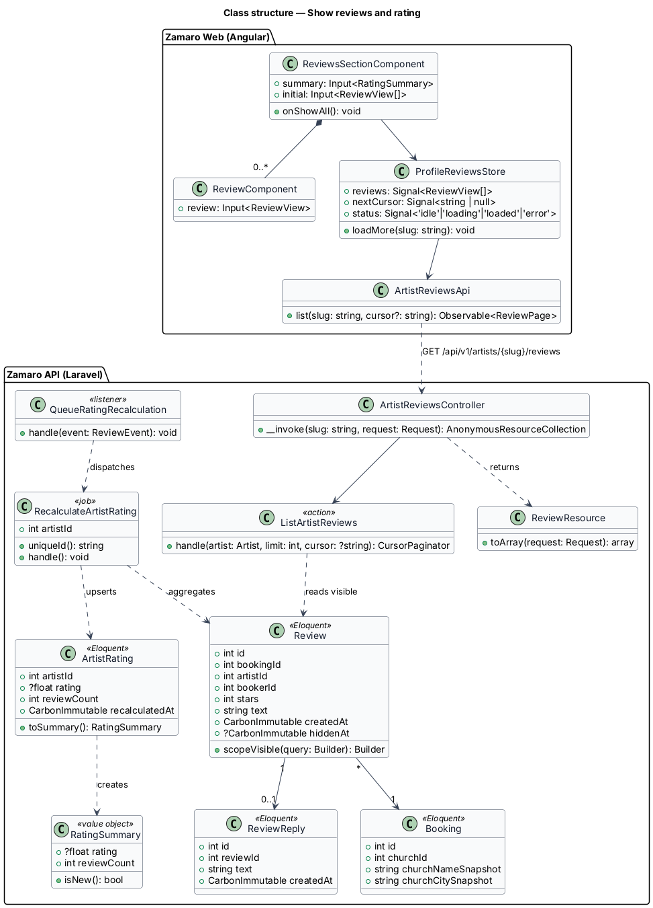
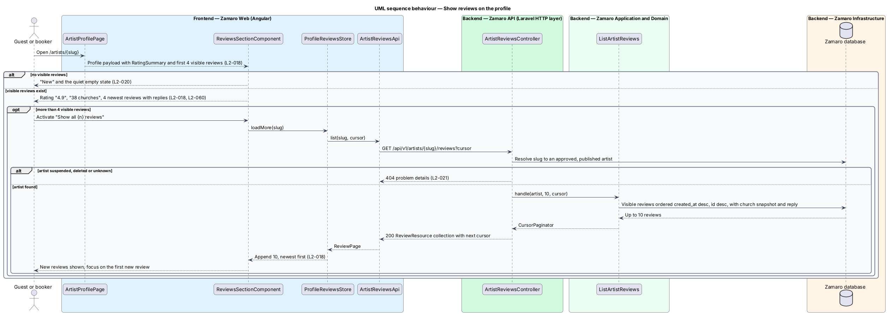
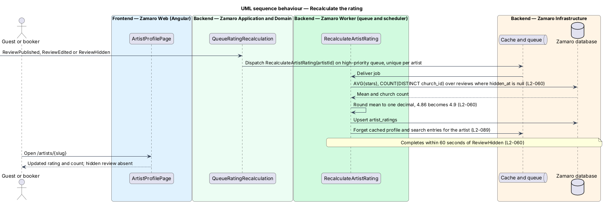

# Show reviews and rating

## Overview

Zamaro is a marketplace where churches in and around Toronto book Christian praise
and worship artists. Every artist profile at `/artists/{slug}` carries a "What
churches say" section under the "Word of mouth" kicker. It shows the artist's
rating, how many churches reviewed them, and the reviews themselves.

This feature is the reading side of reviews: the rating calculation and the review
list on the profile, including artist replies. Writing a review is
`reviews/leave-review`, writing a reply is `reviews/reply-to-review`, and hiding a
review is `reviews/report-and-moderate-review`. The rating computed here also
appears on result cards in `discovery/search-available-artists`.

Terms used in this design:

- **visible review** — review that moderation has not hidden (`hidden_at` is empty)
- **rating** — mean star value of an artist's visible reviews, rounded to one decimal place
- **review count** — number of distinct churches that left at least one visible review of the artist
- **rating summary** — stored pair of rating and review count for one artist, maintained by a queued job
- **artist reply** — single public response from the artist shown beneath a review, labelled "Reply from {artist name}"

The profile shows the rating, the review count and the 4 most recent visible
reviews (L2-018). "Show all {n} reviews" loads 10 more at a time, newest first.
The rating is the mean of visible stars to one decimal place, and the count is of
churches, not reviews (L2-060). A hidden review leaves the rating within
60 seconds.

## Description

The slice runs from the reviews section of the artist profile in Zamaro Web to a
reviews endpoint in the Zamaro API, a recalculation job in the Zamaro Worker, the
Zamaro database and the Redis cache.

**Frontend (Zamaro Web, `features/artist-profile`)**

- **`ArtistProfilePage`** — routed page for `/artists/:slug`, server-rendered. It
  receives the rating summary and the first 4 reviews inside the profile payload,
  so the section renders without a second request.
- **`ReviewsSectionComponent`** — the "What churches say" section. It shows the
  design-system `rating` (stars, rating such as "4.9" and count such as
  "38 churches"), the list of `ReviewComponent` entries and, when more than 4
  visible reviews exist, the "Show all {n} reviews" button. With no reviews it
  shows the quiet empty state from the artist `empty` mock (L2-020).
- **`ReviewComponent`** — design-system `review` figure. It renders stars with an
  accessible label such as "5 out of 5 stars", the quote, the reviewer name, church,
  city, and month and year through `FormatService` (en-CA, L2-110). A reply renders
  beneath it under "Reply from {artist name}". A review by a deleted booker reads
  "A church in {city}" (L2-082).
- **`ProfileReviewsStore`** — signal-based store holding the loaded reviews, the
  next cursor and a status (`idle`, `loading`, `loaded`, `error`). After a page
  appends, it moves focus to the first new review (L2-101).
- **`ArtistReviewsApi`** — typed client for
  `GET /api/v1/artists/{slug}/reviews?cursor=`.

**Backend (Zamaro API)**

- **`ArtistReviewsController`** — invokable controller for
  `GET /api/v1/artists/{slug}/reviews`. It resolves the slug the same way the
  profile does, so a suspended, deleted or unpublished artist returns 404 (L2-021).
- **`ListArtistReviews`** — query action returning visible reviews ordered by
  `created_at` descending then `id` descending, 10 per page, with cursor pagination
  (L2-095). It eager-loads the booking's church snapshot, the booker and the reply.
- **`ArtistProfileResource`** — owned by `artist-profiles/view-artist-profile`; it embeds the
  `RatingSummary` and the first 4 reviews from `ListArtistReviews`.
- **`ReviewResource`** — serialises `stars`, `text`, an `attribution` object
  (`reviewerName`, `churchName`, `city` and `monthYear`, built by the
  `ReviewAttribution` value object of `privacy/minimise-public-exposure`) and an
  optional `ReviewReplyResource`. It never exposes the booker's email, user ID, the
  booking number or the event date (L2-083).
- **`ReviewReplyResource`** — serialises the reply text, artist display name and
  month and year, shown as "Reply from Abigail Mensah · October 2026".

**Backend (Zamaro Worker)**

- **`RecalculateArtistRating`** — queued job keyed by artist ID and made unique per
  artist while queued, so a burst of review events collapses into one run. It
  computes `AVG(stars)` and `COUNT(DISTINCT bookings.church_id)` over visible
  reviews, rounds the mean to one decimal with PHP `round()` (4.86 becomes 4.9),
  and upserts `artist_ratings`. It then forgets the cached profile and search
  entries for the artist (L2-089).
- **`QueueRatingRecalculation`** — listener for `ReviewPublished`, `ReviewEdited`
  and `ReviewHidden`. It dispatches `RecalculateArtistRating` on the high-priority
  queue so a hidden review leaves the rating within 60 seconds (L2-060). Queue lag
  above 5 minutes already alerts (L2-093); a tighter alert for this queue is
  `<TO SUPPLY>`.

**Mocks**

- [Artist profile · default](../../../mocks/pages/artist/default.html) — "What
  churches say" with "★★★★★ 4.9 · 38 churches", Abigail's 4 most recent reviews, her
  replies beneath two of them ("Reply from Abigail Mensah") and "Show all 38 reviews".
- [Artist profile · empty](../../../mocks/pages/artist/empty.html) — "No church
  reviews yet" and "Be her first booking" for Miriam.
- [Discover · default](../../../mocks/pages/discover/default.html) — the rating on
  the headliner ("★ 4.9 · 38 churches") and on each ticket.

**Data**

- `reviews` — read with a partial index on `(artist_id, created_at desc, id desc)
  where hidden_at is null`.
- `review_replies` — joined one-to-one on `review_id`.
- `artist_ratings` — `artist_id` (primary key), `rating` (numeric(2,1), null with
  no reviews), `review_count`, `recalculated_at`. Search and profile both read it,
  and "New" shows when `review_count` is 0 (L2-006).

## Requirements

The feature realises the following level-2 (L2) requirements. Each refines the
level-1 (L1) requirement shown, and the text is quoted from `docs/specs/L2.md`.

| L2 ID | Refines (L1) | Requirement |
|-------|--------------|-------------|
| `L2-018` | `L1-003` | **Reviews on the profile.** Acceptance criteria: 1. Given an artist with reviews, when the profile renders, then the section shows the average rating, review count, and the 4 most recent visible reviews with stars, text, reviewer name, church, city and month and year. 2. Given more than 4 visible reviews, when "Show all {n} reviews" is activated, then 10 more load at a time, newest first. 3. Given a review with an artist reply (L2-061), when it renders, then the reply shows beneath it labelled "Reply from {artist name}". |
| `L2-060` | `L1-013` | **Rating calculation.** Acceptance criteria: 1. Given an artist with visible reviews, when the rating is shown, then it is the mean star rating rounded to one decimal place (4.86 shows "4.9"). 2. Given the review count, when it is shown, then it counts distinct churches that left a visible review ("38 churches"). 3. Given a review is hidden by moderation, when the rating is recalculated, then the hidden review is excluded within 60 seconds. |

## Diagrams

### System context

Guests and bookers read reviews on an artist's profile in Zamaro. Profile pages
and their media are served through the CDN.

### Containers

Zamaro Web renders the profile with the first 4 reviews and calls the Zamaro API
for further pages. The Zamaro Worker keeps the stored rating summary current and
clears cached entries in Redis.

### Components

`ArtistReviewsController` calls `ListArtistReviews` for each page of 10. Review
events reach `QueueRatingRecalculation`, which dispatches `RecalculateArtistRating`
to rewrite `artist_ratings`.

### Class structure

`RatingSummary` is the value both the profile and search cards present. Each
`Review` belongs to one `Booking` and so to one `Church`, which is what the review
count counts.

### Behaviour — show reviews on the profile

The profile arrives with the rating summary and 4 reviews. Each activation of
"Show all {n} reviews" fetches the next 10, newest first, and appends them.

### Behaviour — recalculate the rating

A review event queues one recalculation per artist. The job excludes hidden reviews,
counts distinct churches and clears caches, which keeps a hidden review out of the
rating within 60 seconds.

