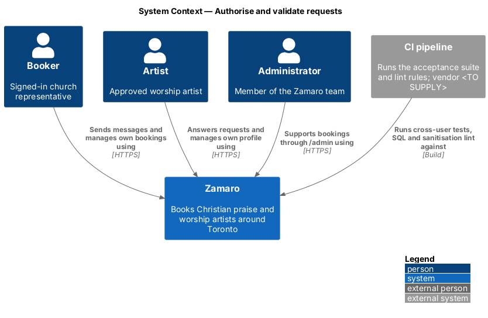
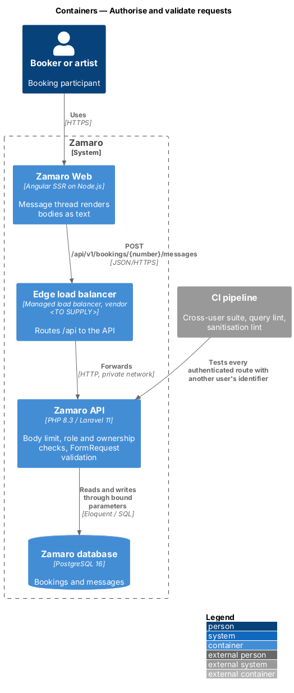
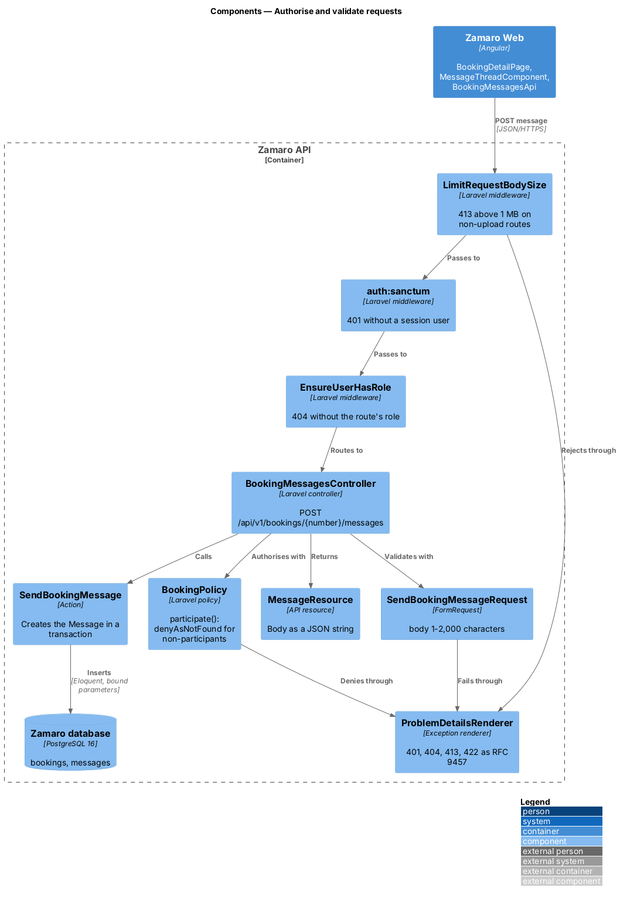
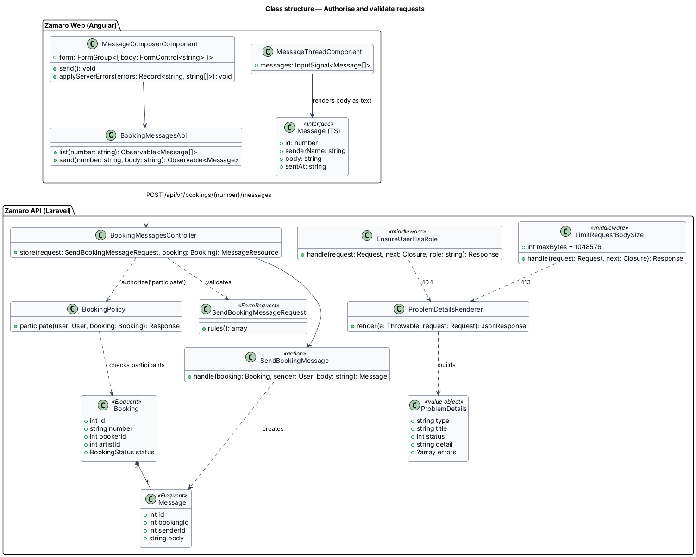
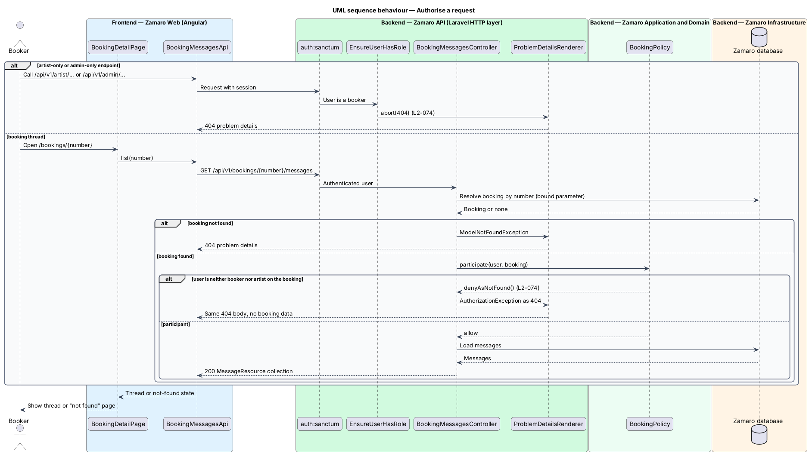
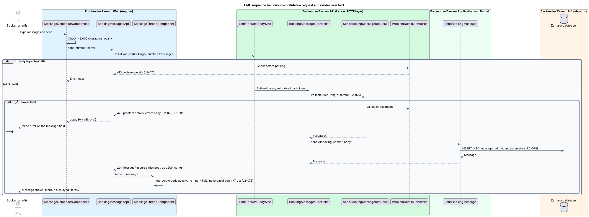

# Authorise and validate requests

## Overview

Every Zamaro API endpoint receives input from a browser that the server does not
control. A booker could replay another booking's number, an artist could post a
20 MB "message", and any text a user types ends up on someone else's screen. This
feature is the server-side gate every request passes before it touches data, and the
rendering rule every piece of user text follows on the way out.

The slice follows one representative request end to end: a booker or artist sends a
message on a booking thread with `POST /api/v1/bookings/{number}/messages` (L2-045).
The same middleware, policy, FormRequest and problem-details conventions apply to every
authenticated endpoint. Sessions and CSRF sit in `security/manage-sessions-and-csrf`,
throttling in `security/limit-request-rates`, and file uploads, which have their own
size rules, in `security/scan-and-serve-uploads`.

Terms used in this design:

- **role check** — server-side test that the signed-in user holds the role an endpoint requires (`Booker`, `Artist` or `Administrator`)
- **ownership check** — server-side test that the signed-in user owns or takes part in the resource named in the request
- **participant** — booker or artist named on a booking
- **concealing 404** — not-found response returned for a resource that exists but is not the caller's, identical to the response for a resource that does not exist
- **problem details** — RFC 9457 JSON error body with `type`, `title`, `status`, `detail` and, for 422, an `errors` object keyed by field (L2-095)
- **output encoding** — rendering of user-supplied text as text, so that markup inside it is shown and never interpreted
- **cross-user test** — automated acceptance test that requests a resource of user A while signed in as user B and expects a concealing 404

L2-074 makes every endpoint check role and ownership on the server and answer a failed
check with 404. L2-075 makes every field validated on the server, every query
parameterised, every piece of user text output-encoded and every oversized body on a
non-upload endpoint rejected with 413.

## Description

The slice runs from the message thread in Zamaro Web, through the edge, to the
Laravel middleware stack, the policy, the FormRequest, the action and the database.

**Frontend (Zamaro Web, `features/bookings`)**

- **`BookingDetailPage`** — routed page for `/bookings/:number`. It hosts the message
  thread for the booking.
- **`MessageThreadComponent`** — renders each message body with text interpolation
  (`{{ message.body }}`) inside an element styled `white-space: pre-wrap`. It never
  binds user content to `[innerHTML]` and never calls a `DomSanitizer.bypassSecurityTrust*`
  method, so Angular encodes every character as text (L2-075).
- **`MessageComposerComponent`** — reactive form with a `body` control limited to
  1–2,000 characters. It mirrors the server rules for fast feedback; the server
  remains the authority. On 422 it maps `errors.body` onto the control.
- **`BookingMessagesApi`** — typed client for `GET` and `POST
  /api/v1/bookings/{number}/messages`.
- **Lint rule** — the ESLint configuration bans calls to `bypassSecurityTrust*` and
  template bindings of `[innerHTML]` outside an allow-list of static, translated
  strings. A violation fails CI.

**Backend (Zamaro API), in request order**

- **`App\Http\Middleware\LimitRequestBodySize`** — first middleware on the `api` group.
  It rejects a request whose `Content-Length`, or whose streamed body, exceeds
  1,048,576 bytes with 413 (L2-075). Routes tagged with the `uploads` middleware group
  are exempt and enforce their own limits. The edge body limit for non-upload paths is
  `<TO SUPPLY>`.
- **`auth:sanctum`** — returns 401 when no session user is present.
- **`App\Http\Middleware\EnsureUserHasRole`** — route middleware used as `role:artist`
  on `/api/v1/artist/*` and `role:admin` on `/api/v1/admin/*`. A user without the role
  receives `abort(404)`, never 403 (L2-074).
- **Route model binding** — `{booking:number}` resolves the `Booking` by its number,
  and a missing booking yields 404.
- **`App\Policies\BookingPolicy::participate`** — allows the booker and the artist on
  the booking and returns `Response::denyAsNotFound()` for anyone else, so the
  response matches a missing booking (L2-074). Administrators use the read-only
  thread view from the administration subsystem (L2-045). Policies for messages,
  receipts, saved lists, documents and payout records follow the same
  `denyAsNotFound` rule.
- **`App\Http\Requests\SendBookingMessageRequest`** — FormRequest with
  `body => ['required', 'string', 'min:1', 'max:2000']`. Every FormRequest in the API
  declares type, length, range and format rules for each accepted field and ignores
  undeclared fields through `$request->validated()` (L2-075).
- **`App\Http\Controllers\Api\V1\BookingMessagesController::store`** — authorises with
  the policy, takes the validated data and calls the action.
- **`App\Actions\Messaging\SendBookingMessage`** — creates the `Message` through
  Eloquent inside `DB::transaction`. Contact redaction and the notification throttle
  belong to the messaging slice (L2-045, L2-046).
- **`App\Http\Resources\MessageResource`** — returns the body as a JSON string. The
  API never returns HTML.
- **`ProblemDetailsRenderer`** — exception renderer registered in
  `bootstrap/app.php`. It renders `ValidationException` as 422 with `errors` keyed by
  field, `PostTooLargeException` and the body-size rejection as 413, and every
  not-found or concealed resource as the same 404 body.

**Query rule**

Every database access uses Eloquent or the query builder with bound parameters. A CI
static-analysis rule fails the build when `DB::raw`, `DB::select`, `DB::statement` or
any `*Raw` builder method receives a non-literal first argument, which catches
concatenated or interpolated SQL. The tool that hosts the rule is `<TO SUPPLY>`.

**Cross-user acceptance suite**

`tests/Feature/Security/CrossUserAccessTest.php` enumerates every route that carries
`auth:sanctum`. For each route it reads a fixture from
`tests/Feature/Security/route-ownership-fixtures.php` that creates a resource owned by
user A and a signed-in user B. It asserts a 404 whose body contains none of the
resource's fields. Role-restricted routes also assert 404 for a booker. A route with no
fixture fails the test, so a new endpoint cannot ship without its cross-user proof
(L2-074).

**Data**

The representative request reads `bookings` and writes `messages`. The slice adds no
tables.

## Requirements

The feature realises the following level-2 (L2) requirements; each refines the level-1 (L1) requirement shown, and the text is quoted from `docs/specs/L2.md`.

| L2 ID | Refines (L1) | Requirement |
|-------|--------------|-------------|
| `L2-074` | `L1-016` | **Authorisation.** Every endpoint checks role and ownership on the server. Acceptance criteria: 1. Given a booker, when they call any artist-only or admin-only endpoint, then the response is 404. 2. Given a user requests a booking, message, receipt, saved list, document or payout record they do not own or take part in, when the request arrives, then the response is 404 and no data is returned. 3. Given the automated acceptance suite, when it runs, then every authenticated endpoint has a test proving another user's resource identifier is refused. |
| `L2-075` | `L1-016` | **Input validation and output encoding.** Acceptance criteria: 1. Given any API request, when it arrives, then every field is validated on the server for type, length, range and format, and invalid requests return 422 with per-field errors. 2. Given any database access, when it runs, then it uses parameterised queries or the ORM's query builder; raw string-concatenated SQL fails the CI lint. 3. Given any user-supplied text, when it is rendered, then it is output-encoded as text; the frontend never bypasses Angular sanitisation for user content. 4. Given a request body larger than 1 MB to a non-upload endpoint, when it arrives, then it is rejected with 413. |

## Diagrams

### System context

Bookers, artists and administrators call Zamaro, which checks every request on the
server. The CI pipeline runs the cross-user suite and the lint rules before a release.

### Containers

Zamaro Web calls the Zamaro API through the edge. The API authorises and validates
each request before it reads or writes the database.

### Components

Inside the Zamaro API, the body-size limit, authentication, role middleware, policy
and FormRequest run in order before `SendBookingMessage`. `ProblemDetailsRenderer`
shapes every rejection.

### Class structure

`BookingMessagesController` depends on `BookingPolicy`, `SendBookingMessageRequest` and
`SendBookingMessage`. On the frontend, `MessageThreadComponent` renders `Message` bodies
as text.

### Behaviour — authorise a request

A missing role or a booking the caller does not take part in ends in the same
concealing 404 before any data is read for the response.

### Behaviour — validate a request and render the result

An oversized body ends in 413 and an invalid field in 422 with per-field errors. A
valid message is stored through Eloquent and rendered on the thread as text.

