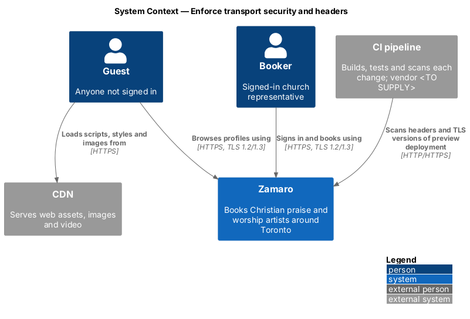
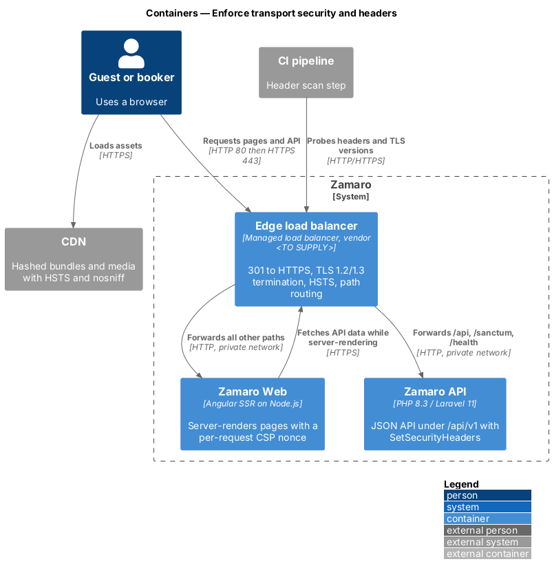
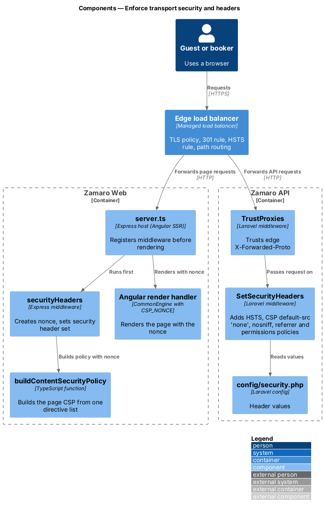
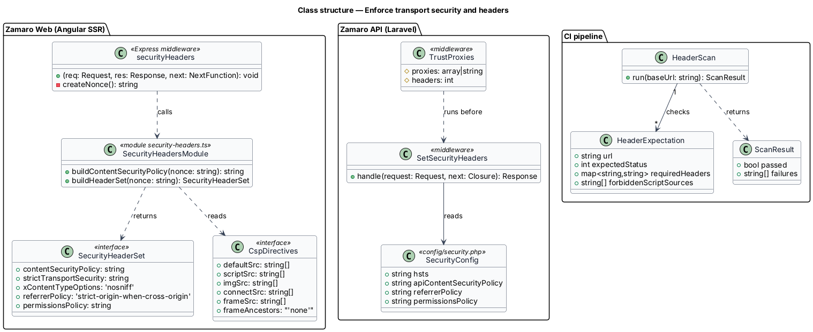
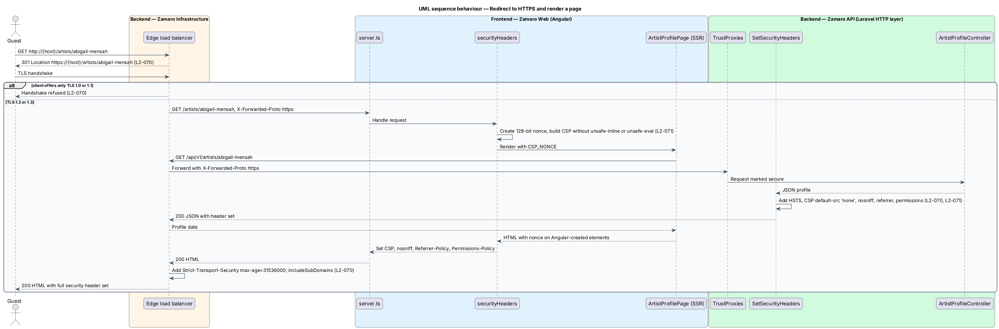
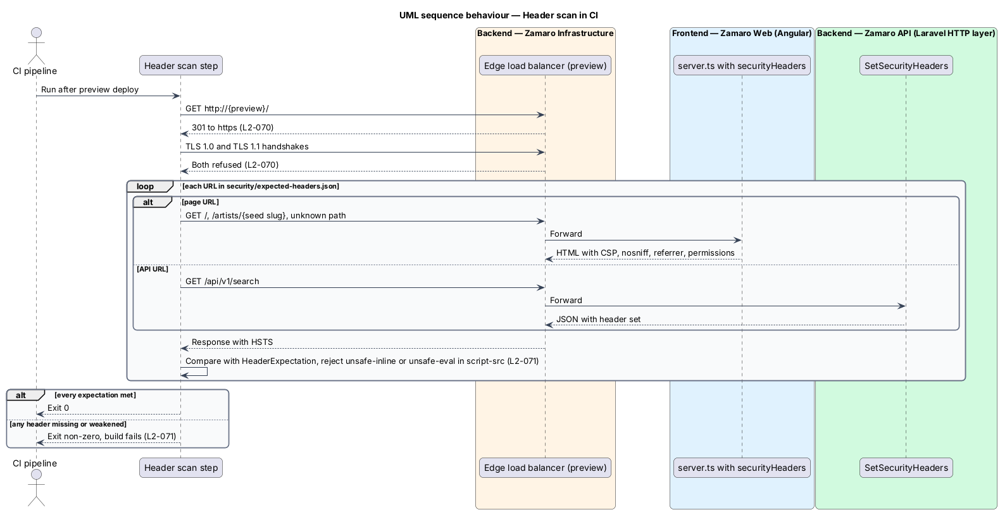

# Enforce transport security and headers

## Overview

Zamaro carries sign-ins, church addresses, booking messages and card payments over
the public internet. The security goal in L1-016 starts at the outermost layer: every
connection uses current TLS, browsers remember to use HTTPS, and every HTML page tells
the browser which scripts it may run, who may frame it and which device features it
may touch.

This feature is that outer layer. It follows one representative request end to end:
a guest types `http://` and an artist profile address, the edge redirects to HTTPS,
Zamaro Web renders the page on the server, and each tier adds its share of the
security header set. A CI step proves the headers are present before every release.
The sibling cross-cutting slices sit beside it in the same subsystem:
`security/manage-sessions-and-csrf`, `security/authorise-and-validate-requests`,
`security/scan-and-serve-uploads`, `security/limit-request-rates` and
`security/protect-secrets-and-data`.

Terms used in this design:

- **edge** — managed load balancer in front of Zamaro Web and the Zamaro API that terminates TLS and routes requests by path
- **origin** — Zamaro Web or Zamaro API instance that receives traffic from the edge on a private network
- **HSTS** — HTTP Strict Transport Security; response header that tells a browser to use only HTTPS for the host for a stated period
- **Content-Security-Policy (CSP)** — response header that lists the sources from which a page may load scripts, styles, images, frames and connections
- **nonce** — random value generated once per HTML response that marks the page's own `<script>` elements as allowed by the CSP
- **security header set** — HSTS from L2-070 plus the CSP, `X-Content-Type-Options`, `Referrer-Policy` and `Permissions-Policy` headers from L2-071
- **header scan** — CI step that requests a fixed list of URLs from a preview deployment and fails the build when a header is missing or weakened

Two rules apply. L2-070 fixes the transport: plain HTTP only ever receives a 301 to
HTTPS, the TLS handshake accepts versions 1.2 and 1.3 only, and every response carries
HSTS for one year including subdomains. L2-071 fixes the page headers and makes their
absence a build failure.

## Description

The slice runs from the browser through the edge to Zamaro Web and the Zamaro API, and
from the CI pipeline to a preview deployment. It stores no data.

**Edge (`Edge load balancer`, vendor `<TO SUPPLY>`)**

- **HTTP listener (port 80)** — answers every request with `301 Moved Permanently` to
  the same host, path and query on `https://`. It forwards nothing to an origin
  (L2-070).
- **HTTPS listener (port 443)** — TLS policy that accepts TLS 1.2 and TLS 1.3 only.
  The cipher suite list and the certificate authority are `<TO SUPPLY>`.
- **Path routing** — sends `/api/*`, `/sanctum/*` and `/health/*` to the Zamaro API
  and every other path to Zamaro Web. Zamaro Web and the API therefore share one
  origin, which the CSRF cookie flow in `security/manage-sessions-and-csrf` relies on.
- **Response header rule** — adds
  `Strict-Transport-Security: max-age=31536000; includeSubDomains` to every response,
  the 301 included. Browsers ignore HSTS received over plain HTTP, so the first HTTPS
  response is the one that takes effect. HSTS preload submission is `<TO SUPPLY>`.
- **Forwarding headers** — sets `X-Forwarded-Proto` and `X-Forwarded-For` on every
  request it passes to an origin. Origins accept traffic only from the edge.

**CDN**

The CDN serves the hashed JavaScript and CSS bundles of Zamaro Web and the public
media domain (L2-088). Its response header configuration adds HSTS and
`X-Content-Type-Options: nosniff`; the exact configuration mechanism is `<TO SUPPLY>`.

**Frontend (Zamaro Web, Angular SSR on Node.js)**

- **`server.ts`** — Express host generated by Angular SSR. It registers the
  `securityHeaders` middleware before the Angular render handler, so every
  server-rendered page passes through it.
- **`securityHeaders`** — Express middleware. It generates a 128-bit nonce per request
  with `crypto.randomBytes(16)`, stores it in `res.locals.cspNonce`, and sets the
  security header set on every HTML response.
- **`buildContentSecurityPolicy(nonce)`** in `security-headers.ts` — single source of
  the page policy. It emits `default-src 'self'`,
  `script-src 'self' 'nonce-{nonce}'` plus the CDN origin, the bot challenge provider
  origin (`security/limit-request-rates`) and the payment processor's hosted-field
  origin, `img-src` and `media-src` for the CDN and the media domain, `connect-src
  'self'` plus the error tracking ingest origin, `frame-src` for the processor and
  bot challenge, `frame-ancestors 'none'`, `object-src 'none'`, `base-uri 'self'` and
  `form-action 'self'`. It never emits `unsafe-inline` or `unsafe-eval` for scripts.
  The exact third-party origins, the `style-src` policy and the CSP reporting endpoint
  are `<TO SUPPLY>`.
- **Nonce hand-off** — the render call provides the nonce through Angular's `CSP_NONCE`
  injection token. Angular adds it to the inline style and script elements it creates
  during rendering and hydration, so the page needs no `unsafe-inline`.
- **Fixed headers** — `X-Content-Type-Options: nosniff`,
  `Referrer-Policy: strict-origin-when-cross-origin` and
  `Permissions-Policy: camera=(), microphone=(), geolocation=()`. The church location
  field on Discover uses address search and city chips, so the page never asks for
  browser geolocation.
- **Template rule** — components bind events with Angular event bindings, which
  compile to listeners. Templates contain no inline `on*` handlers and no
  `javascript:` URLs.

**Backend (Zamaro API)**

- **`App\Http\Middleware\SetSecurityHeaders`** — global middleware appended in
  `bootstrap/app.php`. It sets HSTS, `X-Content-Type-Options: nosniff`,
  `Referrer-Policy: strict-origin-when-cross-origin` and the Permissions-Policy on
  every response. API responses are JSON or RFC 9457 problem details, never documents,
  so they carry the restrictive `Content-Security-Policy: default-src 'none';
  frame-ancestors 'none'`. Header values come from `config/security.php`.
- **`TrustProxies`** — Laravel middleware configured with the edge's address ranges
  (`<TO SUPPLY>`) and `X-Forwarded-Proto`, so `$request->secure()` is true behind the
  edge.
- **`AppServiceProvider`** — calls `URL::forceScheme('https')` in production, so every
  generated link, signed URL and email link uses HTTPS.

**CI (`CI pipeline`, vendor `<TO SUPPLY>`)**

- **Header scan step** — runs after the preview deployment. It requests `http://` for
  the root, `/`, one seeded `/artists/{slug}`, an unknown path that returns the 404
  page, and `GET /api/v1/search`. It compares each response with
  `security/expected-headers.json`: the 301 for HTTP, the exact HSTS value, a CSP whose
  `script-src` holds no `unsafe-inline` or `unsafe-eval`, `frame-ancestors 'none'`,
  `nosniff`, the referrer policy and a Permissions-Policy that denies camera,
  microphone and geolocation. It also attempts TLS 1.0 and TLS 1.1 handshakes and
  expects both to fail. Any mismatch exits non-zero and fails the build (L2-071). The
  scanning tool is `<TO SUPPLY>`.

## Requirements

The feature realises the following level-2 (L2) requirements; each refines the level-1 (L1) requirement shown, and the text is quoted from `docs/specs/L2.md`.

| L2 ID | Refines (L1) | Requirement |
|-------|--------------|-------------|
| `L2-070` | `L1-016` | **Transport security.** Acceptance criteria: 1. Given any HTTP request, when it arrives, then it is redirected with 301 to HTTPS. 2. Given an HTTPS connection, when it is negotiated, then only TLS 1.2 and 1.3 are accepted. 3. Given any response, when it is returned, then it carries `Strict-Transport-Security: max-age=31536000; includeSubDomains`. |
| `L2-071` | `L1-016` | **Security headers.** Acceptance criteria: 1. Given any HTML response, when it is returned, then it carries a Content-Security-Policy without `unsafe-inline` or `unsafe-eval` for scripts, `frame-ancestors 'none'`, `X-Content-Type-Options: nosniff`, `Referrer-Policy: strict-origin-when-cross-origin`, and a Permissions-Policy that disables camera, microphone and geolocation. 2. Given an automated header scan in CI, when any of these headers is missing, then the build fails. |

## Diagrams

### System context

Guests and bookers reach Zamaro only over HTTPS, static assets come through the CDN,
and the CI pipeline scans each preview deployment before a release.

### Containers

The edge load balancer terminates TLS, redirects plain HTTP and routes by path to Zamaro
Web or the Zamaro API. Both origins add the security header set to their responses.

### Components

Inside Zamaro Web, `securityHeaders` builds the per-request CSP and hands the nonce to
the Angular renderer. Inside the Zamaro API, `TrustProxies` and `SetSecurityHeaders`
apply the same set to every JSON response.

### Class structure

`SecurityHeaderSet` on the frontend and `SetSecurityHeaders` on the backend read their
values from one configuration each. The CI scan checks both against
`HeaderExpectation` entries.

### Behaviour — redirect and render a page

A plain HTTP request ends at the edge with a 301. The HTTPS request reaches Zamaro Web,
which renders the profile with a fresh nonce and returns it with the full header set.

### Behaviour — header scan in CI

The CI pipeline probes the preview deployment over HTTP, HTTPS and old TLS versions.
A missing or weakened header fails the build.

