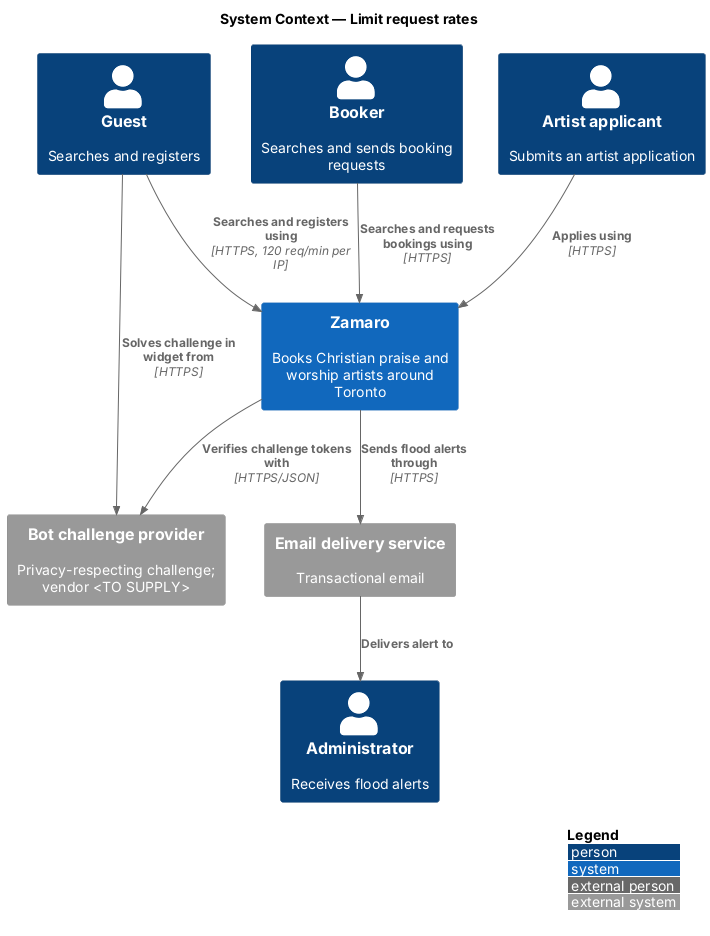
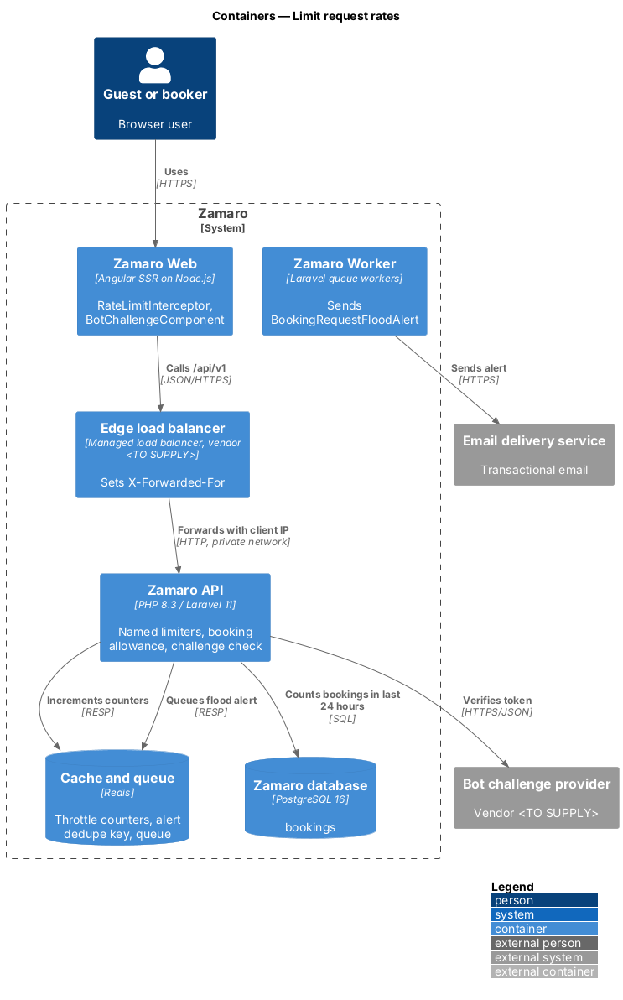
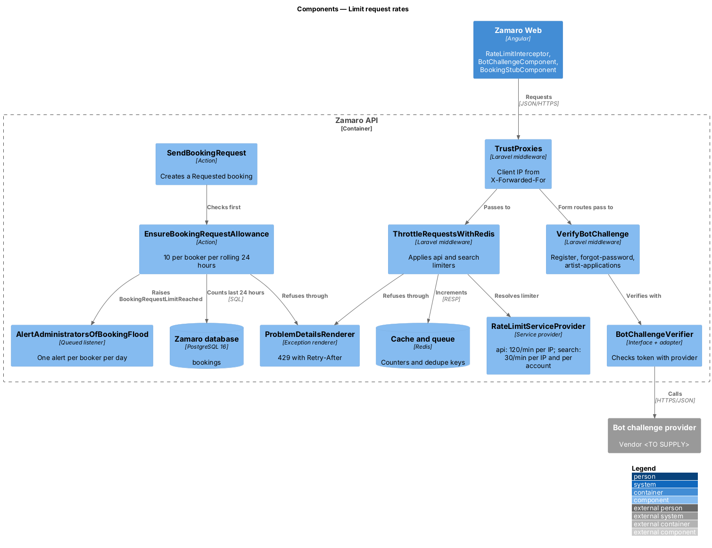
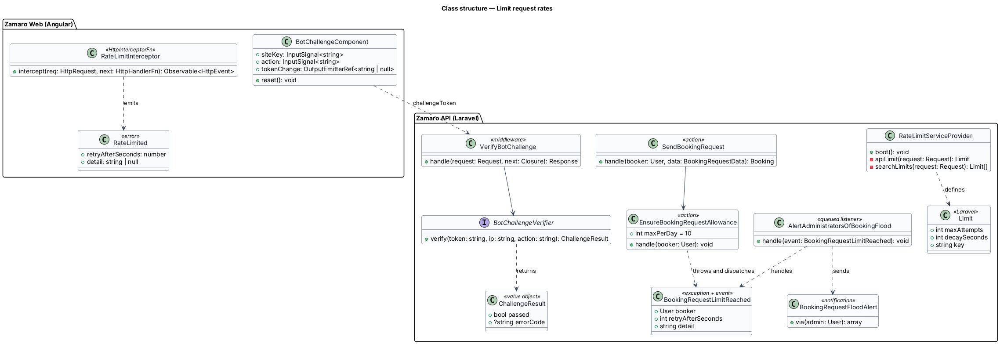
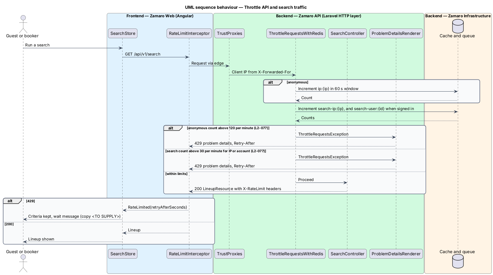
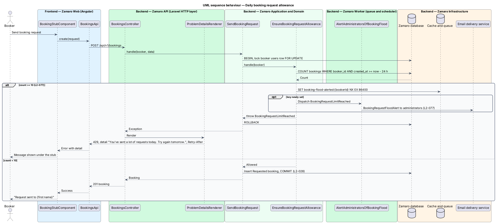
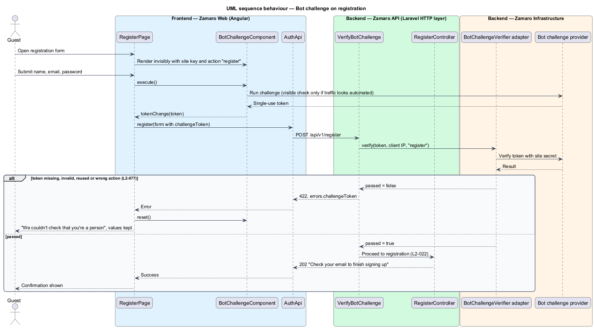

# Limit request rates

## Overview

Zamaro's public endpoints answer anyone, and some of them cost real money or real
attention. A search calls the routing provider for uncached distances (L2-002), a
booking request lands in an artist's inbox and email (L2-028), and a registration or
password reset sends email to an address the sender types. Without limits, one script
could scrape the whole lineup, flood artists with requests or turn Zamaro into a spam
relay. This feature caps how fast one client may call Zamaro and puts a bot challenge
in front of the three forms that send email to arbitrary addresses.

The slice follows representative requests end to end: a burst of searches from one
browser (`GET /api/v1/search`), an eleventh booking request in 24 hours
(`POST /api/v1/bookings`) and a registration submission
(`POST /api/v1/register`). Search itself is
`discovery/search-available-artists`. The per-account sign-in lockout (L2-072) belongs
to the identity slices. The edge that supplies the client IP is described in
`security/enforce-transport-and-headers`.

Terms used in this design:

- **rate limiter** — named rule that counts requests per key in a time window and refuses requests beyond the allowance
- **limiter key** — value that identifies whose requests are counted, such as the client IP or the account ID
- **client IP** — address of the browser as reported by the edge in `X-Forwarded-For`, not the address of the edge itself
- **anonymous traffic** — requests that carry no signed-in session
- **daily booking allowance** — maximum of 10 booking requests per booker in any rolling 24-hour window
- **bot challenge** — privacy-respecting test, run by the bot challenge provider, whose single-use token proves a form was submitted by a person
- **flood alert** — notification to administrators that a booker reached the daily booking allowance

L2-077 sets four limits: 120 API requests per minute per IP for anonymous traffic,
30 searches per minute per IP or per account, 10 booking requests per booker in
24 hours with an administrator alert, and a passing bot challenge on registration,
password reset and artist application.

## Description

The slice runs from Zamaro Web through the edge to Laravel middleware and actions,
with counters in Redis, booking counts in the database and token checks against the
bot challenge provider.

**Frontend (Zamaro Web)**

- **`RateLimitInterceptor`** — `HttpInterceptorFn` that recognises 429 responses,
  reads `Retry-After`, and passes a typed `RateLimited` error with the wait in seconds
  to the caller. It does not retry on its own.
- **`SearchStore`** (`discovery/search-available-artists`) — on `RateLimited`, keeps
  the criteria and shows "Too many searches in a minute" with "Give it {n} seconds,
  then try again.", where {n} comes from `Retry-After`; Try again counts down and
  re-runs the same search when it reaches zero.
- **`BookingStubComponent`** — on a 429 from `POST /api/v1/bookings`, shows the
  problem-details `detail` verbatim: "You've sent a lot of requests today. Try again
  tomorrow."
- **`BotChallengeComponent`** — wraps the bot challenge provider's widget on the
  registration, password-reset and artist-application forms. The widget is invisible:
  it runs when the form is submitted and shows the provider's own short check only
  when traffic looks automated. It emits the token into a hidden `challengeToken`
  control and the form posts once the token exists. After any failed submission it
  resets the widget, because tokens are single-use, and the form shows "We couldn't
  check that you're a person" with every value kept. The provider's script origin is
  allowed in the page CSP.

**Mock screens** — the search limit is
[`pages/discover/limited`](../../../mocks/pages/discover/limited.html), the daily
allowance message is [`pages/book/limit`](../../../mocks/pages/book/limit.html) and a
failed bot challenge is
[`pages/sign-up/challenge`](../../../mocks/pages/sign-up/challenge.html).

**Backend (Zamaro API)**

- **`TrustProxies`** — trusts the edge's address ranges (`<TO SUPPLY>`), so
  `$request->ip()` returns the client IP.
- **`App\Providers\RateLimitServiceProvider`** — registers the named limiters with
  `RateLimiter::for(...)`:
  - **`api`** — applied to the whole `/api/v1` group. Anonymous traffic receives
    `Limit::perMinute(120)->by('ip:'.$ip)`. The limit for signed-in users is
    `<TO SUPPLY>`.
  - **`search`** — applied to `GET /api/v1/search`. It returns two limits,
    `Limit::perMinute(30)->by('search-ip:'.$ip)` and, for a signed-in user,
    `Limit::perMinute(30)->by('search-user:'.$userId)`. Either one refuses the
    request when exceeded.
- **`ThrottleRequestsWithRedis`** — Laravel throttle middleware enabled with
  `$middleware->throttleWithRedis()`. It stores counters in Redis, and on refusal
  throws `ThrottleRequestsException` carrying `Retry-After`, `X-RateLimit-Limit` and
  `X-RateLimit-Remaining`.
- **`ProblemDetailsRenderer`** — renders `ThrottleRequestsException` as 429 problem
  details and keeps its headers. Its `type` URI is `<TO SUPPLY>`.
- **`App\Actions\Bookings\EnsureBookingRequestAllowance`** — called by
  `SendBookingRequest` inside its `DB::transaction`, after locking the booker's
  `users` row with `lockForUpdate()`. It counts the booker's `bookings` created in the
  last 24 hours. At 10 or more it throws `BookingRequestLimitReached`, which renders as
  429 with the detail "You've sent a lot of requests today. Try again tomorrow." and a
  `Retry-After` equal to the seconds until the oldest of those bookings leaves the
  window. Counting stored bookings, rather than hits on a throttle counter, keeps
  rejected attempts out of the count.
- **`App\Events\BookingRequestLimitReached`** and
  **`App\Listeners\AlertAdministratorsOfBookingFlood`** — the listener sends the queued
  `BookingRequestFloodAlert` notification to every `Administrator` with the booker's
  name and request count. A Redis key `booking-flood-alerted:{bookerId}` with a 24-hour
  expiry limits the alert to one per booker per day. The alert channel beyond email is
  `<TO SUPPLY>`.
- **`App\Http\Middleware\VerifyBotChallenge`** — route middleware on
  `POST /api/v1/register`, `POST /api/v1/password/forgot` and
  `POST /api/v1/artist-applications`. It reads `challengeToken` from the body and calls
  `BotChallengeVerifier`. A missing or failed token returns 422 with an error on
  `challengeToken`: "We couldn't check that you're a person. Try again; if it keeps
  happening, email hello@zamaro.ca." Behaviour when the provider is
  unreachable is `<TO SUPPLY>`.
- **`App\Services\Security\BotChallengeVerifier`** — interface with one adapter for the
  bot challenge provider (vendor `<TO SUPPLY>`). It sends the token, the client IP and
  the expected form action with the site secret from the secrets manager, and returns
  a `ChallengeResult`.

**Data**

Throttle counters live in Redis with the window as their expiry. The booking allowance
reads `bookings.booker_id` and `bookings.created_at`; an index on
`(booker_id, created_at)` supports the count. The slice adds no tables.

## Requirements

The feature realises the following level-2 (L2) requirement; it refines the level-1 (L1) requirement shown, and the text is quoted from `docs/specs/L2.md`.

| L2 ID | Refines (L1) | Requirement |
|-------|--------------|-------------|
| `L2-077` | `L1-016` | **Rate limiting and abuse prevention.** Acceptance criteria: 1. Given anonymous traffic, when one IP exceeds 120 API requests per minute, then further requests return 429 with a `Retry-After` header. 2. Given searches, when one IP or account exceeds 30 per minute, then further searches return 429. 3. Given a booker, when they send more than 10 booking requests in 24 hours, then further requests are rejected with "You've sent a lot of requests today. Try again tomorrow." and an administrator is alerted. 4. Given registration, password reset and artist application forms, when they are submitted, then a privacy-respecting bot challenge must pass. |

## Diagrams

### System context

Guests, bookers and artist applicants call Zamaro within its limits. Zamaro verifies
challenge tokens with the bot challenge provider and alerts administrators about
booking floods.

### Containers

The Zamaro API counts requests in Redis and counts booking requests in the database.
The Zamaro Worker delivers the flood alert.

### Components

The `api` and `search` limiters run in `ThrottleRequestsWithRedis`.
`EnsureBookingRequestAllowance` guards booking creation, and `VerifyBotChallenge` guards
the three email-sending forms.

### Class structure

`RateLimitServiceProvider` defines the limiters, `EnsureBookingRequestAllowance` raises
`BookingRequestLimitReached`, and `BotChallengeVerifier` returns a `ChallengeResult`.

### Behaviour — throttle API and search traffic

Each request increments the IP counter, and a search also increments the search
counters. Any exceeded counter returns 429 with `Retry-After`.

### Behaviour — daily booking allowance

The eleventh booking request in 24 hours is refused with the specified message, and
administrators receive one alert.

### Behaviour — bot challenge on a form

Registration submits only with a token, and the API verifies it with the provider
before the registration action runs.

