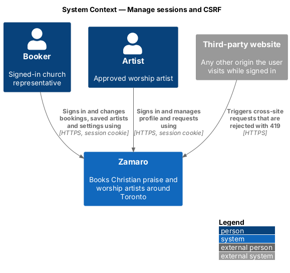
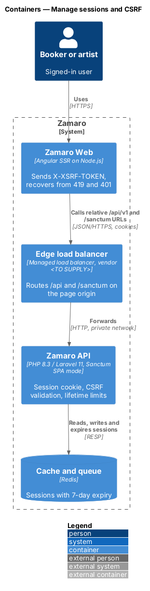
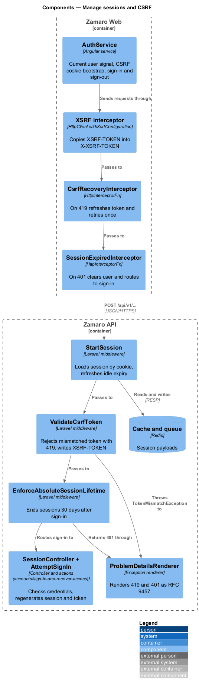
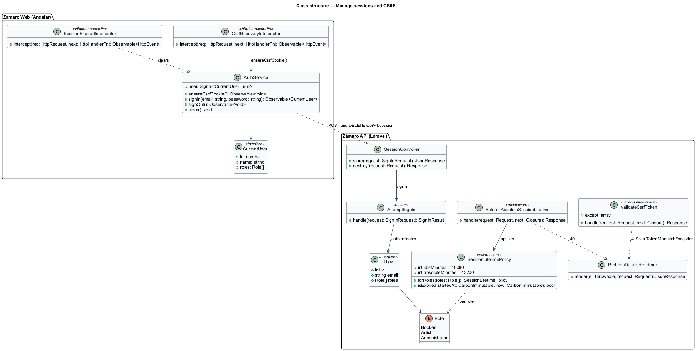
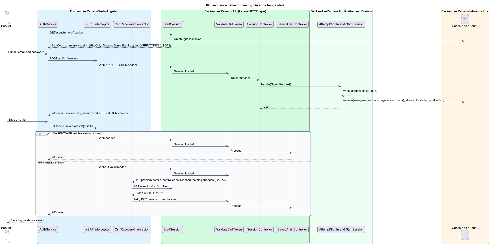
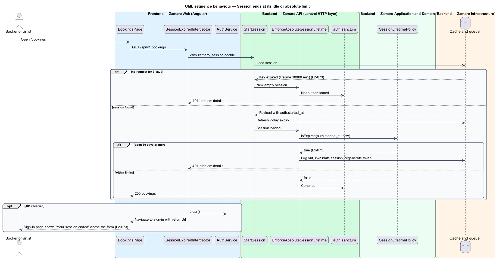

# Manage sessions and CSRF

## Overview

Zamaro Web and the Zamaro API use a cookie-based session rather than bearer tokens.
A cookie travels with every request the browser makes to Zamaro, including requests
that another website triggers. This feature keeps that cookie out of reach of page
scripts, stops other websites from using it to change anything, and ends sessions that
have sat idle or lived too long.

The slice follows a representative request end to end: a booker signs in, the API
starts a fresh session, and the booker then makes a state-changing call such as saving
an artist (`PUT /api/v1/saved-artists/{artistId}`, L2-026). The same protection covers every
`POST`, `PUT`, `PATCH` and `DELETE` under `/api/v1`. The sign-in form, the password
rules and the failed-attempt lockout belong to the identity slices (L2-023, L2-072).
Transport and header protection sit in `security/enforce-transport-and-headers`, and
endpoint authorisation in `security/authorise-and-validate-requests`.

Terms used in this design:

- **session** — server-side record in Redis, keyed by a random identifier, that ties a browser to a signed-in user
- **session cookie** — `zamaro_session` cookie that carries the encrypted session identifier
- **session fixation** — attack in which an identifier known before sign-in stays valid after it
- **CSRF** — cross-site request forgery; attack in which another website makes the browser send a state-changing request with the user's cookies
- **CSRF token** — per-session random value that a state-changing request repeats in the `X-XSRF-TOKEN` header
- **XSRF-TOKEN cookie** — script-readable cookie through which the API hands the current CSRF token to Zamaro Web
- **idle limit** — 7 days without a request, after which a booker or artist session ends
- **absolute limit** — 30 days since sign-in, after which a booker or artist session ends regardless of activity

L2-073 sets three rules: the session cookie is `HttpOnly`, `Secure` and `SameSite=Lax`
and its identifier changes at sign-in; a state-changing request without a valid CSRF
token receives 419 and changes nothing; and a booker or artist session ends at the idle
or absolute limit. The 30-minute idle limit for administrators (L2-066) belongs to the
administration subsystem.

## Description

The slice runs from the HTTP layer of Zamaro Web through the edge to the Laravel
middleware stack and the session store in Redis. The edge routes `/api/*` and
`/sanctum/*` on the same host as the pages, so Zamaro Web calls the API with relative
URLs on one origin.

**Frontend (Zamaro Web)**

- **`provideHttpClient(withXsrfConfiguration(...))`** — configures Angular's built-in
  XSRF interceptor with cookie `XSRF-TOKEN` and header `X-XSRF-TOKEN`. The interceptor
  copies the cookie into the header on every mutating request to a relative URL.
- **`AuthService`** — holds the current user as a signal. At start-up it calls
  `GET /sanctum/csrf-cookie` once to obtain the token cookie, then `GET /api/v1/me` to
  load the user. It exposes `signIn`, `signOut` and `clear`.
- **`CsrfRecoveryInterceptor`** — on a 419 response, calls `GET /sanctum/csrf-cookie`
  and retries the original request once. A second 419 surfaces an error toast through
  `ToastService`; its copy is `<TO SUPPLY>`. The retry is safe because the rejected
  request changed nothing.
- **`SessionExpiredInterceptor`** — on a 401 response while `AuthService` holds a user,
  calls `AuthService.clear()` and navigates to `/sign-in` with a `returnUrl` and a
  session-ended flag. The sign-in page then shows "Your session ended" above the form
  with a line naming what is kept, for example "Sign in again to keep your request to
  Abigail Mensah for Sat 14 Nov. Nothing you typed is lost." Any form draft is kept
  and reopens after sign-in.
- **SSR rule** — server rendering forwards no browser cookies to the API. Public pages
  render in their signed-out form and the header switches to the signed-in state after
  hydration, when `AuthService` loads `/api/v1/me`.

**Mock screens** — the session-ended state is
[`pages/sign-in/expired`](../../../mocks/pages/sign-in/expired.html).

**Backend (Zamaro API)**

- **`config/session.php`** — driver `redis`, cookie `zamaro_session`,
  `http_only => true`, `secure => true`, `same_site => 'lax'`, `lifetime => 10080`
  minutes (7 days idle), `expire_on_close => false`. Laravel refreshes the Redis key's
  expiry on every request, so the lifetime acts as the idle limit.
- **Session middleware on the `api` group** — `EncryptCookies`,
  `AddQueuedCookiesToResponse`, `StartSession` and `ValidateCsrfToken` run on every
  `/api/v1` route, configured in `bootstrap/app.php`. Processor and email-delivery
  webhook routes sit outside the group and verify signatures instead. A cross-site
  request therefore reaches `ValidateCsrfToken` and receives 419, whatever its origin.
- **`ValidateCsrfToken`** — Laravel middleware. It compares `X-XSRF-TOKEN` with the
  session's token for every method other than `GET`, `HEAD` and `OPTIONS`. On a
  mismatch it throws `TokenMismatchException` before routing reaches a controller, so
  nothing changes (L2-073). It writes a fresh `XSRF-TOKEN` cookie (`Secure`,
  `SameSite=Lax`, readable by script) on every response.
- **`SessionController`**, **`AttemptSignIn`** and **`StartSession`** — owned by
  `accounts/sign-in-and-recover-access` (L2-023), behind `POST /api/v1/session`. After
  a successful credential check, the `StartSession` action calls
  `$request->session()->regenerate()` and `$request->session()->regenerateToken()`,
  then stores `auth.started_at` in the session. Regeneration removes the pre-sign-in
  identifier, which defeats session fixation.
- **`App\Http\Middleware\EnforceAbsoluteSessionLifetime`** — runs after
  `StartSession`. For an authenticated booker or artist whose `auth.started_at` is 30
  or more days old, it logs out the web guard, invalidates the session, regenerates the
  token and returns 401.
- **`App\Support\SessionLifetimePolicy`** — value object holding the idle limit
  (10,080 minutes) and the absolute limit (43,200 minutes) for the `Booker` and
  `Artist` roles. The administration slice adds the administrator values.
- **`ProblemDetailsRenderer`** — exception renderer registered in `bootstrap/app.php`.
  It renders 419 and 401 as RFC 9457 problem details (L2-095). The `type` URIs and
  titles are `<TO SUPPLY>`.
- **`SessionController@destroy`** — `DELETE /api/v1/session` runs the `SignOut`
  action of the identity slice, which logs out the guard, invalidates the session and
  regenerates the token (L2-023).

**Data**

Sessions live in Redis under the `zamaro_session:` key prefix with a 7-day expiry. Each
session payload holds `_token` (the CSRF token), the authenticated user ID and
`auth.started_at`. The slice adds no database tables.

## Requirements

The feature realises the following level-2 (L2) requirement; it refines the level-1 (L1) requirement shown, and the text is quoted from `docs/specs/L2.md`.

| L2 ID | Refines (L1) | Requirement |
|-------|--------------|-------------|
| `L2-073` | `L1-016` | **Sessions and CSRF.** Acceptance criteria: 1. Given a session, when its cookie is issued, then it is `HttpOnly`, `Secure`, `SameSite=Lax`, and the session ID is regenerated at sign-in. 2. Given a state-changing request without a valid CSRF token, when it arrives, then it is rejected with 419 and nothing changes. 3. Given a booker or artist session, when it has been idle 7 days or open 30 days, then it ends and the user must sign in again. |

## Diagrams

### System context

Bookers and artists hold sessions with Zamaro. A third-party website can make their
browsers send requests to Zamaro, and those requests change nothing.

### Containers

Zamaro Web and the Zamaro API share one origin behind the edge. The API keeps sessions
in Redis.

### Components

The Angular XSRF interceptor and the two recovery interceptors wrap every API call.
On the API, the session middleware, `ValidateCsrfToken` and
`EnforceAbsoluteSessionLifetime` run before any controller.

### Class structure

`AuthService` and the interceptors mirror the backend middleware. `SessionLifetimePolicy`
carries the idle and absolute limits that the session configuration and
`EnforceAbsoluteSessionLifetime` apply.

### Behaviour — sign in and change state

Sign-in replaces the session identifier and token. A later state-changing request
carries the token in a header; a request without a valid token receives 419 and
changes nothing.

### Behaviour — session ends at a limit

A session idle for 7 days expires in Redis, and a session open for 30 days is
invalidated by `EnforceAbsoluteSessionLifetime`. Both cases return 401 and Zamaro Web
sends the user to sign in again.

