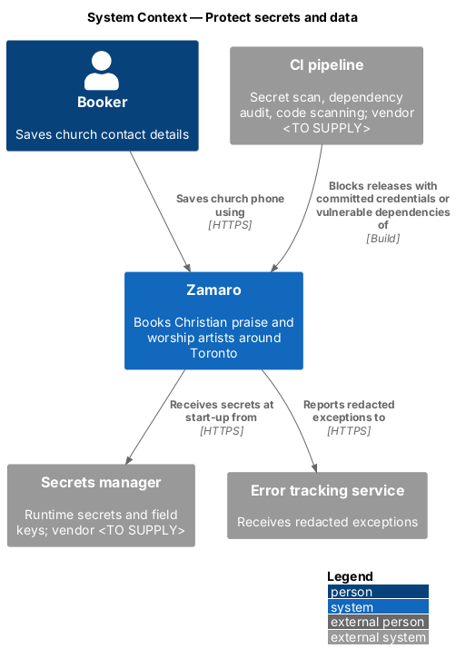
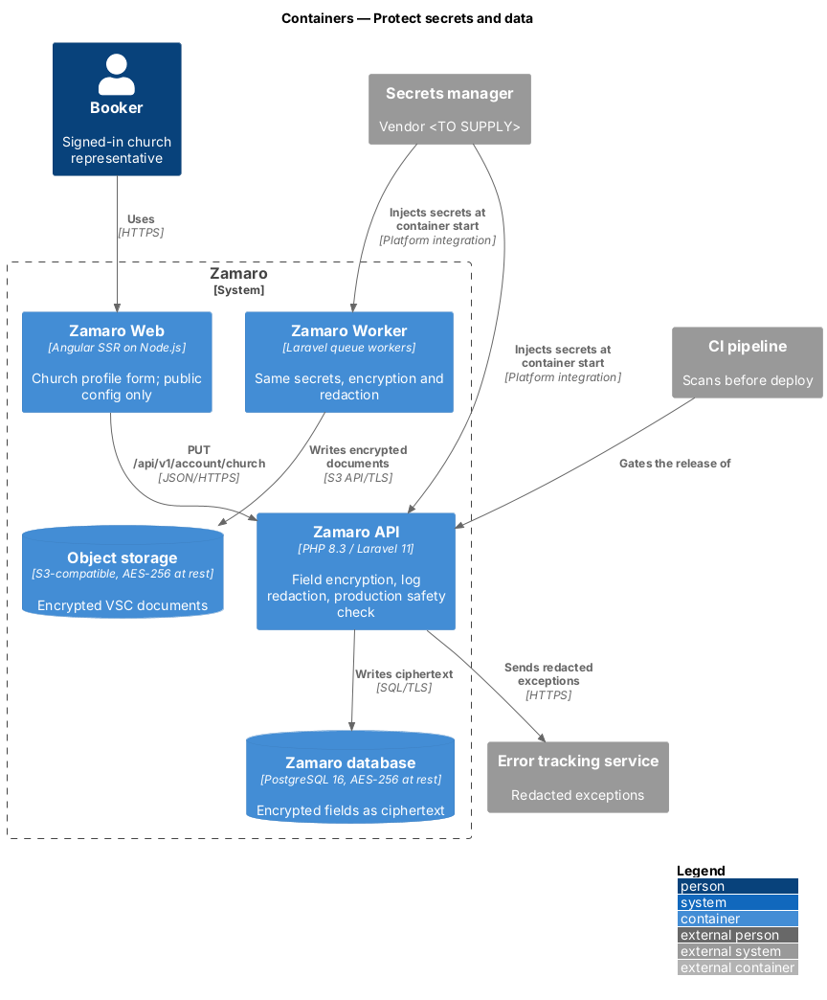
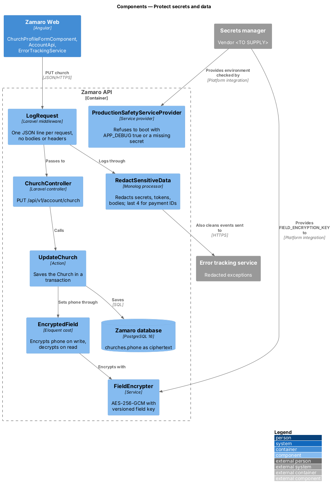
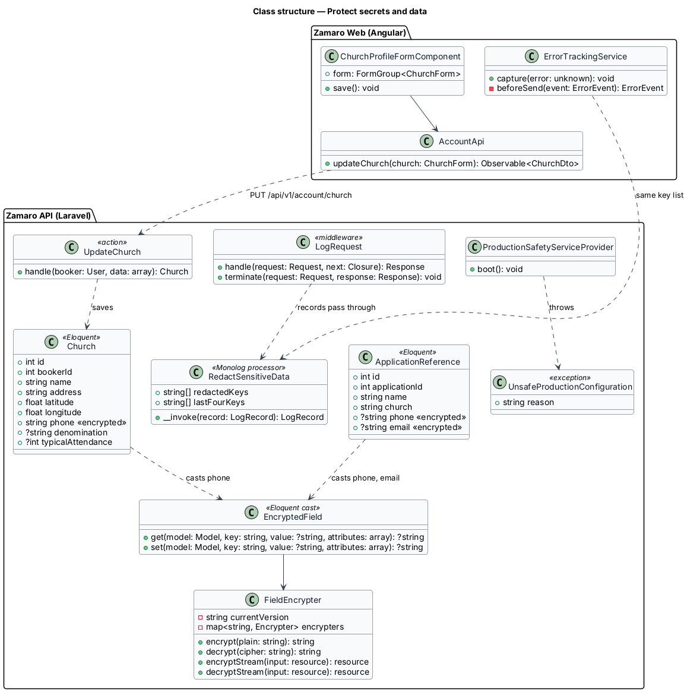
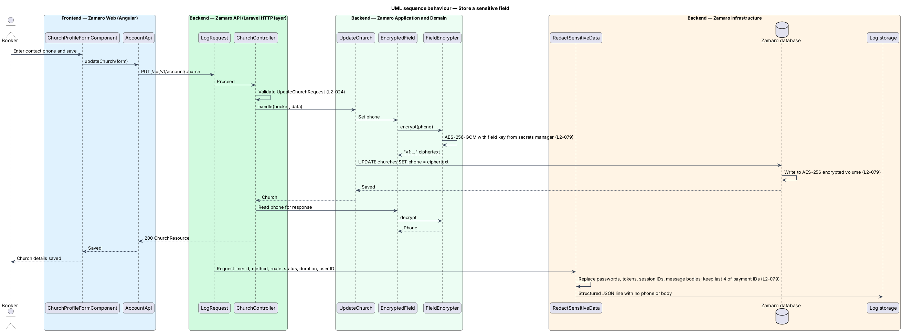
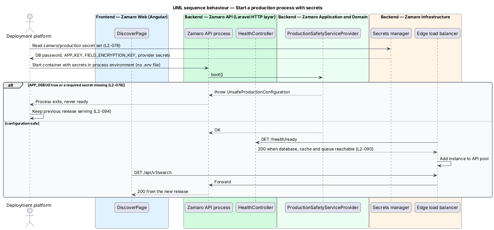

# Protect secrets and data

## Overview

Zamaro holds two kinds of material that an attacker wants. The first is its own
credentials: the database password, the application key, and the API secrets for the
payment processor, the email delivery service and the other providers. The second is
personal data: church phone numbers, artist references' contact details and Police
Vulnerable Sector Check documents. This feature keeps credentials out of the
repository and out of the build, keeps vulnerable dependencies out of production, and
keeps personal data encrypted on disk and absent from logs.

The slice follows one representative request end to end: a booker saves a church
contact phone number with `PUT /api/v1/account/church` (L2-024). The request is
logged with sensitive fields redacted, the phone number is encrypted by the
application before it reaches PostgreSQL, and PostgreSQL stores it on an encrypted
volume. Two supporting paths complete the slice: the start-up of each production
process, which reads its secrets from the secrets manager, and the CI steps that scan
for committed credentials and vulnerable packages. The VSC document upload that this
encryption also covers is in `security/scan-and-serve-uploads`; transport encryption is
in `security/enforce-transport-and-headers`.

Terms used in this design:

- **secret** — credential or key whose disclosure grants access, such as a database password, an API secret or an encryption key
- **secrets manager** — managed service that stores secrets and releases them to authorised production workloads at run time
- **encryption at rest** — AES-256 encryption applied by the database, object storage and backup services to the data they write to disk
- **field encryption** — additional AES-256 encryption applied by the Zamaro API to named columns and documents before they are stored
- **field key** — 256-bit key used for field encryption, held in the secrets manager and never in the database
- **redaction** — replacement of a sensitive value in a log record with a fixed placeholder before the record is written
- **dependency audit** — CI step that checks Composer and npm lock files against published vulnerability advisories

L2-078 makes CI fail on a committed credential or a high or critical dependency
vulnerability, and makes production read secrets from the secrets manager with
`APP_DEBUG` false. L2-079 makes every store encrypted at rest with AES-256, adds field
encryption for VSC documents, reference contact details and phone numbers, and keeps
passwords, tokens, session IDs, payment identifiers beyond the last 4 digits and
message bodies out of logs.

## Description

The slice runs from Zamaro Web through the Zamaro API to the database, with the
secrets manager feeding the API at start-up and the CI pipeline guarding the
repository.

**Frontend (Zamaro Web)**

- **`ChurchProfileFormComponent`** — form on `/account/*` for church name, address,
  contact phone, denomination and typical attendance (L2-024). It submits through
  `AccountApi`.
- **`AccountApi`** — typed client for `GET` and `PUT /api/v1/account/church`.
- **`ErrorTrackingService`** — reports frontend exceptions to the error tracking
  service (L2-093). Its `beforeSend` hook applies the same redaction key list as the
  backend, and it never attaches form values or request bodies.
- **Build rule** — the Angular build embeds only public configuration such as the
  error tracking public key and the bot challenge site key. Server secrets are not
  available to the frontend build.

**Backend (Zamaro API and Zamaro Worker)**

- **Secrets at start-up** — the deployment platform reads the `zamaro/production`
  secret set from the secrets manager and injects it into the process environment when
  each API and Worker container starts. Images and the repository contain no `.env`
  file and no credential. The platform mechanism and the secrets manager vendor are
  `<TO SUPPLY>`.
- **`App\Providers\ProductionSafetyServiceProvider`** — in `boot()`, when
  `app()->isProduction()`, it throws `UnsafeProductionConfiguration` if
  `config('app.debug')` is true or any name in `config('security.required_secrets')`
  is empty. The process then fails to start, `/health/ready` never answers 200 for it
  (L2-090), and the deployment does not shift traffic to it (L2-094).
- **`App\Support\Encryption\FieldEncrypter`** — wraps
  `Illuminate\Encryption\Encrypter` with cipher `aes-256-gcm` and the field key from
  `FIELD_ENCRYPTION_KEY`, which differs from `APP_KEY`. Each ciphertext starts with
  a key version such as `v1:`, so previous keys listed in
  `FIELD_ENCRYPTION_PREVIOUS_KEYS` still decrypt older values. The rotation procedure
  is `<TO SUPPLY>`.
- **`App\Casts\EncryptedField`** — Eloquent cast that calls `FieldEncrypter` on write
  and read. It applies to `churches.phone`, `application_references.phone`,
  `application_references.email` and the artist contact phone and email shown after
  confirmation (L2-046). These columns are `text` and are never used in `WHERE`
  clauses.
- **`FieldEncrypter::encryptStream`** — encrypts VSC documents before
  `PromoteUpload` writes them to object storage (`security/scan-and-serve-uploads`).
- **`UpdateChurchRequest`**, **`ChurchController::update`** and
  **`App\Actions\Account\UpdateChurch`** — validate the phone as a North American
  number (L2-024) and save the `Church`; the cast encrypts the phone.
- **`App\Http\Middleware\LogRequest`** — writes one structured JSON line per request
  with request ID, method, route name, status, duration and user ID (L2-093). It never
  logs request bodies, headers or cookies.
- **`App\Logging\RedactSensitiveData`** — Monolog processor attached to every channel
  through the `App\Logging\ApplyRedaction` tap in `config/logging.php`. It walks the
  record's context and extra data and replaces values whose key matches the redaction
  list with `[REDACTED]`: `password`, `password_confirmation`, `current_password`,
  `token`, any key ending in `_token`, `challengeToken`, `authorization`, `cookie`,
  `set-cookie`, `x-xsrf-token`, `session_id`, `recovery_codes`, and message `body`. It
  reduces `processor_payment_id`, `payment_method_id` and any 12–19 digit card-number
  pattern to the last 4 digits (L2-079). The backend error tracking client applies the
  same processor before sending.

**At-rest encryption (Zamaro Infrastructure)**

The managed PostgreSQL service encrypts its storage and its point-in-time backups with
AES-256 (L2-091). The object storage buckets use default server-side AES-256
encryption, and log storage is encrypted by its service. All of them sit in Canadian
regions (L2-084). The hosting provider and the configuration check that proves
encryption is on are `<TO SUPPLY>`.

**CI (`CI pipeline`, vendor `<TO SUPPLY>`)**

- **Secret scan** — scans the pushed commits for credential patterns and fails the
  build on any finding. The scanning tool is `<TO SUPPLY>`.
- **Dependency audit** — runs `composer audit --locked` and `npm audit
  --audit-level=high` and fails the build on any high or critical advisory. The
  severity filter for Composer output is `<TO SUPPLY>`.
- **Code scanning** — static application security testing over PHP and TypeScript;
  the tool and its failing threshold are `<TO SUPPLY>`.

**Data**

The slice changes the column type of the encrypted fields to `text`. It adds no
tables. Secrets never appear in the database, the repository, the image or the logs.

## Requirements

The feature realises the following level-2 (L2) requirements; each refines the level-1 (L1) requirement shown, and the text is quoted from `docs/specs/L2.md`.

| L2 ID | Refines (L1) | Requirement |
|-------|--------------|-------------|
| `L2-078` | `L1-016` | **Secrets, dependencies and code scanning.** Acceptance criteria: 1. Given the repository, when CI runs, then a secret scanner fails the build if any credential is committed. 2. Given Composer and npm dependencies, when CI runs, then any known vulnerability rated high or critical fails the build. 3. Given production, when the application starts, then it reads secrets from the platform's secrets manager and `APP_DEBUG` is false. |
| `L2-079` | `L1-016` | **Data protection at rest and in logs.** Acceptance criteria: 1. Given the database, object storage and backups, when they are stored, then they are encrypted at rest with AES-256. 2. Given VSC documents, reference contact details and phone numbers, when they are stored, then they are additionally encrypted at the application level with a key held outside the database. 3. Given application logs, when any request is logged, then passwords, tokens, session IDs, payment identifiers beyond last 4 digits and message bodies are redacted. |

## Diagrams

### System context

Bookers send personal data to Zamaro. Zamaro reads its credentials from the secrets
manager and reports errors to the error tracking service, and the CI pipeline scans
every change before release.

### Containers

The Zamaro API and Worker receive secrets from the secrets manager at start-up. The
database and object storage encrypt at rest, and the API adds field encryption for the
named fields.

### Components

`ProductionSafetyServiceProvider` checks configuration at boot. `EncryptedField` and
`FieldEncrypter` encrypt the phone number, and `RedactSensitiveData` cleans every log
record.

### Class structure

`Church` declares the `EncryptedField` cast on `phone`, which delegates to
`FieldEncrypter`. `RedactSensitiveData` holds the redaction list that logging and error
tracking share.

### Behaviour — store a sensitive field

The phone number is encrypted by the application before the insert, and PostgreSQL
writes the ciphertext to encrypted storage. The request log line carries no body, and
any context passes through redaction.

### Behaviour — start with secrets

A production process starts with secrets from the secrets manager and refuses to start
with `APP_DEBUG` true or a secret missing. Zamaro Web receives traffic from a process
only after it reports ready.

