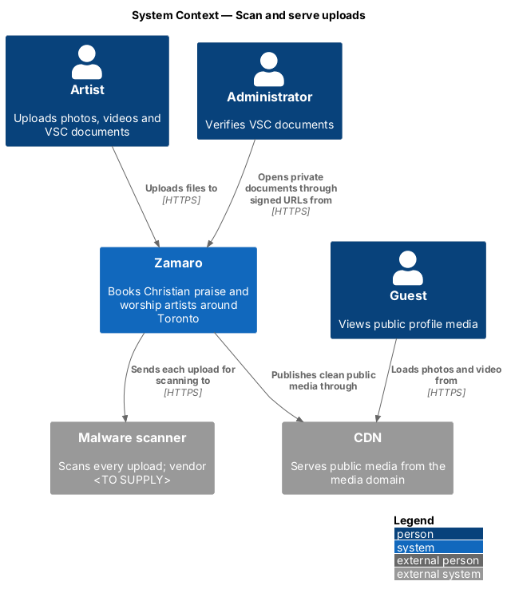
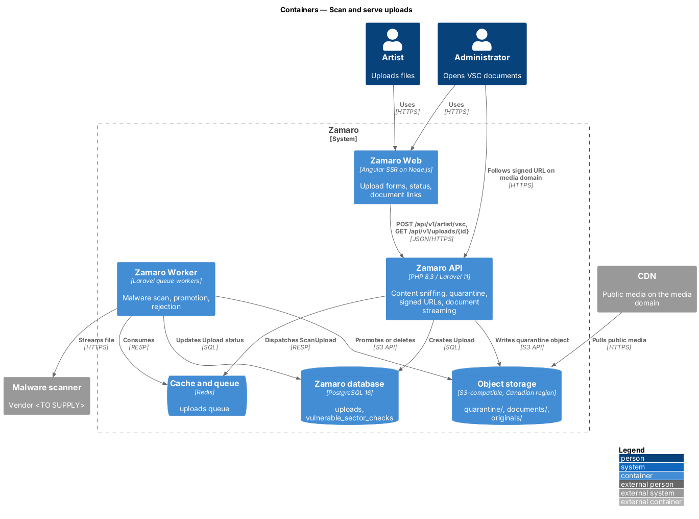
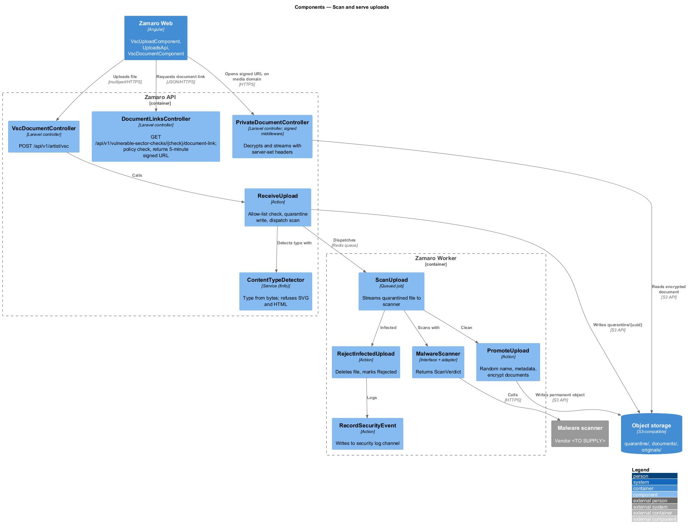
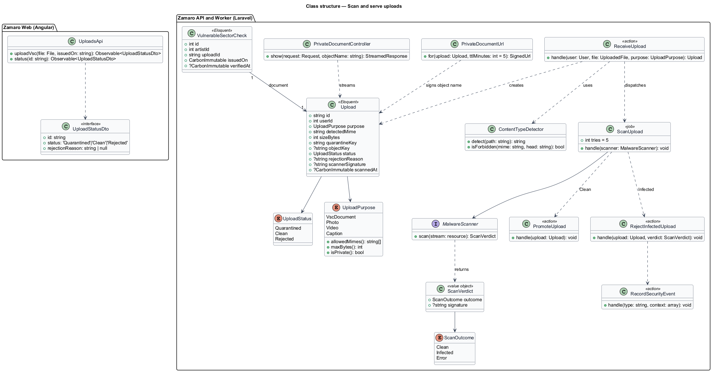
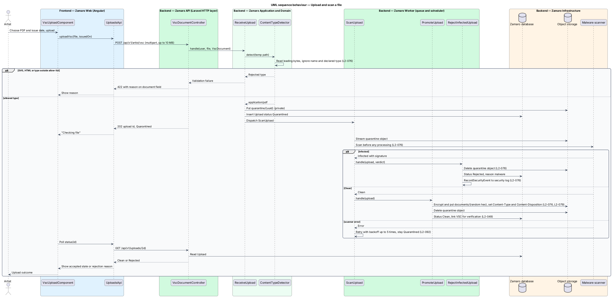
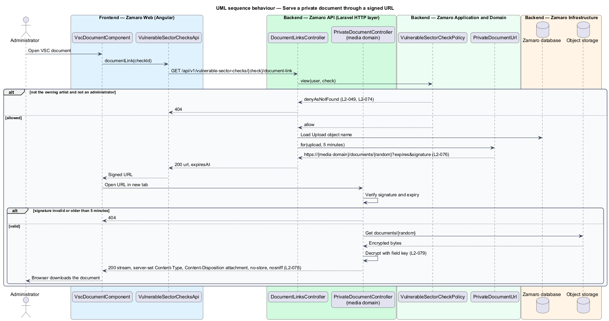

# Scan and serve uploads

## Overview

Artists upload photos, videos and caption files for their profiles (L2-051, L2-052),
and Police Vulnerable Sector Check documents for youth events (L2-049). Each upload is
a file from outside Zamaro that Zamaro later shows to other people. A disguised HTML
or SVG file could run script in a viewer's browser, and an infected PDF could reach an
administrator's machine. This feature is the shared pipeline every upload passes
through: verify the type from the bytes, scan for malware, store under a random name,
and serve with headers the server chooses.

The slice follows one representative upload end to end: an artist uploads a VSC
document as a PDF, the Zamaro Worker scans it, and an administrator later opens it
through a signed URL that expires after 5 minutes. Photos and videos use the same
intake, scan and naming steps, then go to their own processing slices; their public
copies are served from the media domain through the CDN. Body-size limits for
non-upload endpoints sit in `security/authorise-and-validate-requests`, and the
application-level encryption of VSC documents in `security/protect-secrets-and-data`.

Terms used in this design:

- **upload** — file received from a user, tracked by an `Upload` record from receipt until it is promoted or rejected
- **content sniffing** — detection of a file's type from its leading bytes, ignoring its name and its declared `Content-Type`
- **quarantine** — private object-storage prefix that holds an upload until the malware scan passes
- **promotion** — move of a clean upload from quarantine to its permanent location under a random name
- **media domain** — separate registrable domain, distinct from the Zamaro web origin, from which stored uploads are served
- **signed URL** — URL that carries an expiry time and an HMAC signature, valid for one document until it expires
- **security event** — structured log record of a security-relevant occurrence, written to the `security` log channel

L2-076 sets three rules. The type comes from content, SVG and HTML are refused, and the
scan runs before any processing. An infected file is deleted, the upload rejected and a
security event logged. Stored files come from a separate domain under random names with
server-set `Content-Type` and `Content-Disposition`, and private documents only through
5-minute signed URLs.

## Description

The slice runs from the artist workspace in Zamaro Web to the Zamaro API, the Zamaro
Worker, object storage, the malware scanner and back out through the media domain.

**Frontend (Zamaro Web)**

- **`VscUploadComponent`** — file picker and issue-date field in the artist workspace
  (`/artist/*`). It sends the file as `multipart/form-data`. The accepted-types hint is
  a convenience only; the server decides.
- **`UploadsApi`** — typed client for the upload endpoints and for
  `GET /api/v1/uploads/{id}`, which it polls until the status leaves `Quarantined`.
- **`UploadStatusComponent`** — shows "Checking the file", then the accepted state or
  the rejection reason. A VSC document rejected by the malware scan reads "Rejected"
  and the earlier verified check still counts; a rejected photo reads "This photo
  wasn't uploaded. Our safety scan flagged the file, so we deleted it. Export the
  photo again and try that copy."
- **`VscDocumentComponent`** — owned by
  `artist-onboarding/verify-vulnerable-sector-check` and reused in the administrator's
  application view; it requests a signed link through `VulnerableSectorChecksApi` and
  opens it in a new tab.

**Mock screens** — the VSC upload is
[`dialogs/upload-check`](../../../mocks/dialogs/upload-check/default.html) in states
default, [`busy`](../../../mocks/dialogs/upload-check/busy.html) (upload progress),
[`invalid`](../../../mocks/dialogs/upload-check/invalid.html) (too large, wrong type or
a future date) and failed, after which the profile editor shows the check as
[`pages/edit-profile/check-pending`](../../../mocks/pages/edit-profile/check-pending.html)
("Checking the file"). A photo rejected by the scan is
[`dialogs/add-photo/failed`](../../../mocks/dialogs/add-photo/failed.html).

**Backend (Zamaro API)**

- **Upload routes** — sit in the `uploads` middleware group, exempt from the 1 MB body
  limit, each with its own maximum size: 10 MB for VSC documents (L2-049), 15 MB for
  photos (L2-051), 1 MB for caption files (L2-052). Video uploads arrive in resumable
  chunks (L2-052) and enter this pipeline once the final chunk is assembled.
- **`VscDocumentController::store`** — `POST /api/v1/artist/vsc`, behind
  `role:artist`. It validates with `StoreVscDocumentRequest` and calls
  `ReceiveUpload` with `UploadPurpose::VscDocument`. It returns 202 with the upload ID
  and status.
- **`App\Actions\Uploads\ReceiveUpload`** — asks `ContentTypeDetector` for the type,
  checks it against the purpose's allow-list, writes the bytes to
  `quarantine/{uuid}` in object storage, creates an `Upload` with status
  `Quarantined` and dispatches `ScanUpload`. A type outside the allow-list returns 422
  with the specific reason on the file field (L2-051).
- **`App\Services\Uploads\ContentTypeDetector`** — reads the leading bytes with
  `finfo` (libmagic) and returns the detected MIME type. It refuses `image/svg+xml`,
  `text/html`, `application/xhtml+xml` and any file whose first non-whitespace bytes
  look like XML or HTML, whatever the purpose (L2-076).
- **`UploadPurpose` allow-lists** — `VscDocument`: `application/pdf`, `image/jpeg`,
  `image/png`. `Photo`: `image/jpeg`, `image/png`, `image/webp`, `image/heic`.
  `Video`: `video/mp4`, `video/quicktime`, `video/webm`. `Caption`: `text/vtt`.
- **`DocumentLinksController`** — owned by
  `artist-onboarding/verify-vulnerable-sector-check`:
  `GET /api/v1/vulnerable-sector-checks/{check}/document-link`, for the owning artist
  and administrators. `VulnerableSectorCheckPolicy::view` returns `denyAsNotFound()`
  for anyone else (L2-049, L2-074). The controller returns `{ url, expiresAt }` from
  `PrivateDocumentUrl`.
- **`App\Support\PrivateDocumentUrl`** — builds
  `URL::temporarySignedRoute('documents.show', now()->addMinutes(5), ...)` on the media
  domain host for the document's random object name.
- **`PrivateDocumentController`** — route `documents.show`, bound to the media domain
  host with `Route::domain(...)` and protected by the `signed` middleware. A missing,
  altered or expired signature returns 404. A valid request decrypts the document and
  streams it with `Content-Type` from the detected type,
  `Content-Disposition: attachment; filename="vulnerable-sector-check.{ext}"`,
  `Cache-Control: private, no-store`, `X-Content-Type-Options: nosniff` and
  `Content-Security-Policy: default-src 'none'; sandbox`.

**Backend (Zamaro Worker)**

- **`App\Jobs\ScanUpload`** — queued on `uploads`. It streams the quarantined object to
  `MalwareScanner`. The upload never leaves quarantine before a verdict, and a scanner
  error retries with backoff up to 5 times (L2-092).
- **`App\Services\Uploads\MalwareScanner`** — interface with one adapter for the
  malware scanner (vendor `<TO SUPPLY>`). It returns a `ScanVerdict` of `Clean`,
  `Infected` (with signature name) or `Error`.
- **`App\Actions\Uploads\PromoteUpload`** — for a clean upload, generates a random
  object name from 16 bytes of `random_bytes` in hex. It writes the object to its
  permanent location with server-set `Content-Type` and `Content-Disposition`
  metadata, deletes the quarantine copy and marks the upload `Clean`. VSC documents go
  to the private `documents/` prefix encrypted with the field key
  (`security/protect-secrets-and-data`) and are queued for administrator verification
  (L2-049). Photos and videos go to `originals/` and their processing jobs start.
- **`App\Actions\Uploads\RejectInfectedUpload`** — deletes the quarantine object,
  marks the upload `Rejected` with reason `malware`, and calls `RecordSecurityEvent`.
- **`App\Actions\Security\RecordSecurityEvent`** — writes a structured record to the
  `security` log channel with event type, upload ID, user ID, client IP and scanner
  signature. Alert routing for security events is `<TO SUPPLY>`.

**Media domain and CDN**

Public media (processed photos, video renditions, posters) is served by the CDN from
the media domain, whose host name is `<TO SUPPLY>`. Because it is a separate domain,
the browser sends no Zamaro cookies to it and a file served there cannot read Zamaro
pages. The CDN returns the object's stored `Content-Type` and `Content-Disposition`
and adds `X-Content-Type-Options: nosniff`. The `/documents/*` path on the media
domain bypasses the CDN cache and reaches `PrivateDocumentController` through the
edge; the exact CDN rule is `<TO SUPPLY>`.

**Data**

The `uploads` table holds `id` (UUID), `user_id`, `purpose`, `detected_mime`,
`size_bytes`, `quarantine_key`, `object_key`, `status` (`Quarantined`, `Clean`,
`Rejected`), `rejection_reason`, `scanner_signature` and `scanned_at`.
`vulnerable_sector_checks.upload_id` references the promoted document. Object storage
holds the `quarantine/`, `documents/` and `originals/` prefixes in the Canadian region
(L2-084); the quarantine and documents prefixes allow no public access.

## Requirements

The feature realises the following level-2 (L2) requirement; it refines the level-1 (L1) requirement shown, and the text is quoted from `docs/specs/L2.md`.

| L2 ID | Refines (L1) | Requirement |
|-------|--------------|-------------|
| `L2-076` | `L1-016` | **Upload security.** Acceptance criteria: 1. Given an uploaded file, when it is received, then its type is verified from its content (not its name or declared type), SVG and HTML are rejected, and it is scanned for malware before it is processed. 2. Given a file that fails the malware scan, when it is scanned, then it is deleted, the upload is rejected and a security event is logged. 3. Given stored uploads, when they are served, then they come from a separate domain under random names, with `Content-Disposition` and `Content-Type` set by the server, and private documents (L2-049) only through signed URLs that expire after 5 minutes. |

## Diagrams

### System context

Artists upload files and administrators open private documents. Zamaro sends every
upload to the malware scanner and serves public media through the CDN.

### Containers

The Zamaro API sniffs and quarantines uploads, and the Zamaro Worker scans and
promotes them. Object storage holds the files, and the media domain serves them.

### Components

`ReceiveUpload` and `ContentTypeDetector` run in the API; `ScanUpload`,
`PromoteUpload` and `RejectInfectedUpload` run in the Worker. `PrivateDocumentController`
answers signed URLs on the media domain.

### Class structure

An `Upload` moves from `Quarantined` to `Clean` or `Rejected`. `UploadPurpose` carries
each allow-list and size limit, and `ScanVerdict` decides between promotion and
rejection.

### Behaviour — upload and scan

The API rejects a wrong type at once. A file of an allowed type waits in quarantine
until the scanner answers, then is either promoted under a random name or deleted with
a security event.

### Behaviour — serve a private document

An administrator receives a URL valid for 5 minutes. The media domain checks the
signature, decrypts the document and streams it with server-set headers.

