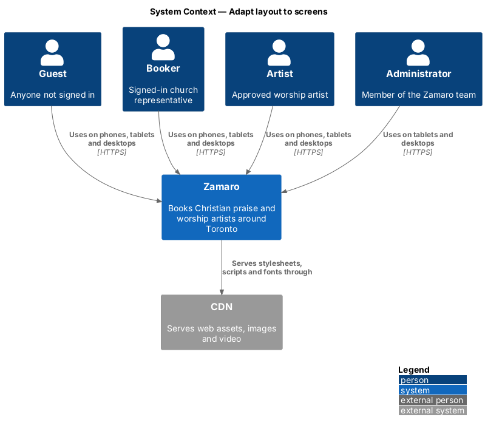
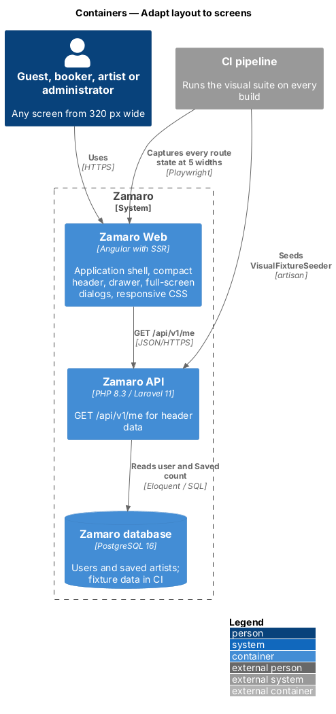
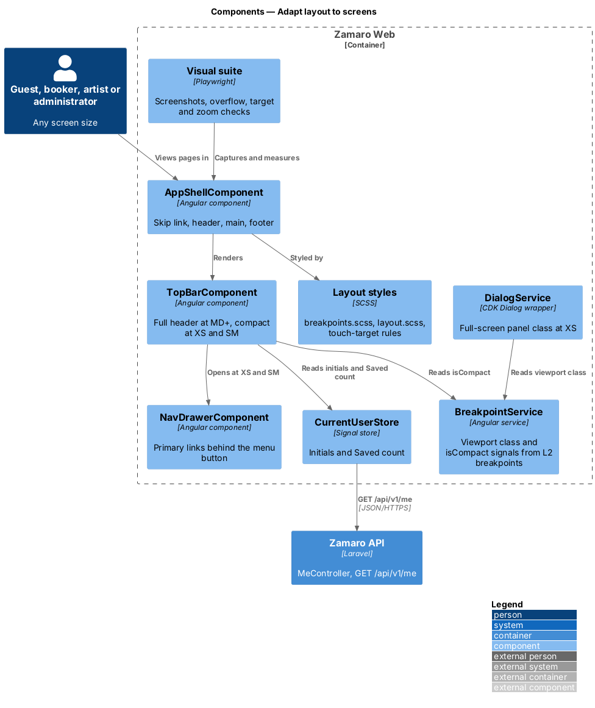
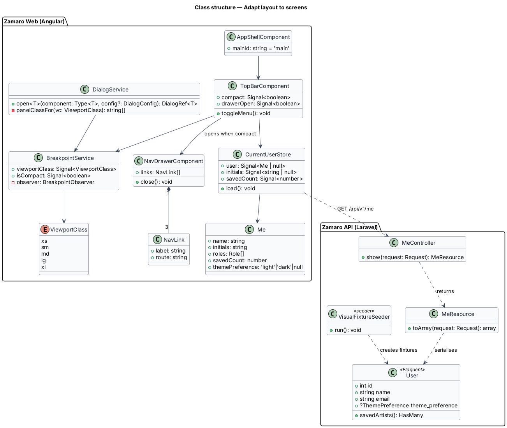
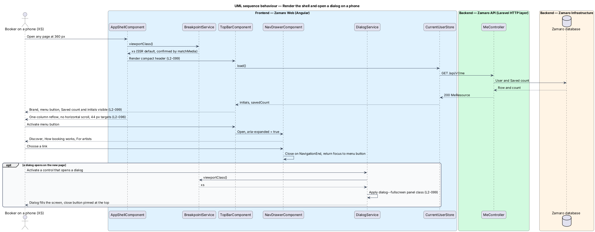
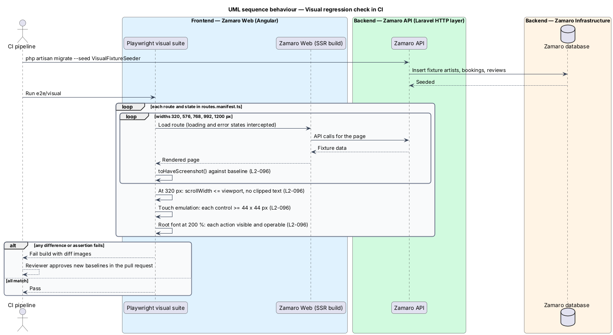

# Adapt layout to screens

## Overview

Zamaro is used on phones between rehearsals as often as on office desktops. This
feature is the responsive frame every page sits in: the rules that keep content
readable from a 320 px phone to a wide desktop, the compact header on small screens,
full-screen dialogs on phones, and the automated visual tests that catch layout
regressions before release.

The slice is cross-cutting. It owns the application shell and the shared layout
rules, not any one page's arrangement. Page-specific layouts build on it: the
Discover layout (L2-097) is described with the search in
`discovery/search-available-artists`, and the artist profile layout (L2-098) is
described with the profile. Focus, landmarks and dialog keyboard behaviour live in
`user-experience/meet-accessibility-standards`; the theme toggle in the header lives
in `user-experience/switch-theme`.

Terms used in this design:

- **breakpoint** — viewport width at which the layout changes, fixed by the L2 conventions as XS < 576 px, SM >= 576 px, MD >= 768 px, LG >= 992 px and XL >= 1200 px
- **viewport class** — one of XS, SM, MD, LG or XL for the current viewport width
- **reflow** — re-arrangement of content into fewer columns so that no horizontal scrolling or clipping occurs
- **touch target** — hit area of an interactive control, measured in CSS pixels
- **compact header** — top bar variant for XS and SM in which the primary links sit behind a menu button
- **navigation drawer** — overlay panel that holds the primary links of the compact header
- **full-screen dialog** — dialog variant for XS that covers the whole viewport with its close button pinned at the top
- **visual baseline** — approved screenshot of one page state at one viewport class, stored in the repository and compared on every build

## Description

The slice lives almost entirely in Zamaro Web. It touches the Zamaro API only through
the current-user endpoint that feeds the header's Saved count and account initials,
and through the seeded API that the visual test suite runs against.

**Frontend (Zamaro Web, `core/layout`)**

- **`breakpoints.scss`** — the single SCSS map of the L2 breakpoints and the
  `respond-to(xs|sm|md|lg|xl)` mixin. Layout itself is CSS: mobile-first media
  queries, CSS grid and `min-width: 0` on grid children. The design system's
  `--layout-breakpoint-*` tokens (640, 768, 1024 and 1280 px) differ from the L2
  values; Zamaro Web uses the L2 values, and the alignment of `tokens.css` is
  `<TO SUPPLY>`.
- **`BreakpointService`** — wraps the CDK `BreakpointObserver` with the same five
  queries. It exposes `viewportClass: Signal<ViewportClass>` and
  `isCompact: Signal<boolean>` (true at XS and SM). Components read it only where
  behaviour changes, not to lay out content. During server-side rendering it reports
  `xs`, so the first paint of a phone needs no client correction.
- **`AppShellComponent`** — root layout holding the skip link, `TopBarComponent`,
  the routed `<main>` and `FooterComponent`.
- **`TopBarComponent`** — the design-system top bar. At MD and above it shows
  Discover, How booking works and For artists inline. At XS and SM it switches to the
  compact header: the three links move into `NavDrawerComponent` behind a menu button
  with `aria-expanded` and `aria-controls`, while the Saved count and the account
  initials stay visible (L2-099). The Saved button keeps its word in the accessible
  name when only the heart and count show. The design system collapses below 1024 px
  and labels the second link "How it works"; this design follows L2-099.
- **`NavDrawerComponent`** — CDK overlay holding the primary links. It traps focus,
  closes on Escape, on backdrop click and on `NavigationEnd`, and returns focus to
  the menu button.
- **`DialogService`** — wrapper around the CDK `Dialog` used by every dialog. At XS
  it adds the `dialog--fullscreen` panel class: `100vw` by `100dvh`, a sticky header
  holding the title and close button, a scrolling body and a footer padded by the
  safe-area inset. The close button therefore stays reachable without scrolling
  (L2-099). The design system's 92 %-height bottom sheet is replaced by this variant
  at XS.
- **Global layout rules (`styles/layout.scss`)** — `rem` units for type and spacing,
  no fixed heights on text containers, `overflow-wrap: anywhere` on display names,
  media with `aspect-ratio`, and tables and tab strips that scroll inside their own
  container. These rules keep a 320 px viewport free of page-level horizontal
  scrolling and clipped text, and keep content and functions available at 200 % text
  zoom (L2-096).
- **Touch targets** — under `@media (pointer: coarse)` every button, link styled as
  a control, chip, toggle and form control has a minimum block and inline size of
  `--target-comfortable` (44 px), extended with padding or a `::before` hit area when
  the visible shape is smaller (L2-096). Whether inline links inside running text are
  exempt is `<TO SUPPLY>`.
- **`CurrentUserStore`** — signal store fed by `AuthService`. It holds the initials
  and the Saved count that the compact header keeps visible.

**Visual tests (Zamaro Web, `e2e/visual`)**

- **`visual.spec.ts`** — Playwright suite driven by `e2e/routes.manifest.ts`, the list
  of every route and every state (default, loading, empty, error and others) that the
  mocks define. It captures each entry at 320, 576, 768, 992 and 1200 px wide, one
  width per viewport class, and compares with `toHaveScreenshot()`. Any pixel
  difference above the threshold fails the build until a reviewer approves the new
  baseline in the same pull request (L2-096). The diff threshold and whether every
  capture also runs in both themes are `<TO SUPPLY>`.
- **`layout.spec.ts`** — at 320 px it asserts that
  `document.documentElement.scrollWidth` does not exceed the viewport width and that
  no text element with hidden overflow has a `scrollWidth` larger than its
  `clientWidth`. With touch emulation it measures each interactive control's bounding
  box against 44 × 44 px. With the root font size at 200 % it asserts that each
  manifest action is still visible and operable.

**Backend (Zamaro API)**

- **`MeController`** — `GET /api/v1/me` returns `MeResource` with the user's name,
  initials, roles, Saved count and theme preference. The header reads the initials and
  Saved count from it; a guest receives 401 and sees the signed-out header.
- **`VisualFixtureSeeder`** — database seeder used only in CI. It loads the fixed
  artists, bookings and reviews the mocks show, so screenshots are deterministic.
  Requests that fake loading and error states are intercepted in Playwright and never
  reach the API.

## Requirements

This feature realises the following level-2 (L2) requirements; page-specific layouts
(L2-097, L2-098) are realised by their page features.

| L2 ID | Refines (L1) | Requirement |
|-------|--------------|-------------|
| `L2-096` | `L1-020` | **Layout at every breakpoint.** Acceptance criteria: 1. Given any page at 320 px wide, when it renders, then there is no horizontal scrolling and no text is clipped. 2. Given XS, SM, MD, LG and XL viewports, when every page renders, then automated visual tests capture each and fail on unreviewed changes. 3. Given any interactive control, when it is measured, then its target is at least 44 × 44 CSS px on touch devices. 4. Given text is zoomed to 200%, when any page renders, then all content and functions remain available. |
| `L2-099` | `L1-020` | **Navigation and dialogs on small screens.** Acceptance criteria: 1. Given XS and SM, when the header renders, then Discover, How booking works and For artists collapse into a menu button, and the Saved count and account initials remain visible. 2. Given XS, when any dialog opens, then it fills the screen with its close button reachable without scrolling. |

## Diagrams

### System context

Guests, bookers, artists and administrators reach Zamaro on any screen size. A CDN
serves the web assets; no other external system takes part in layout.

### Containers

Zamaro Web renders the shell on the server and adapts it in the browser. It calls the
Zamaro API only for the current user's header data. CI runs the visual suite against
Zamaro Web backed by a seeded API.

### Components

Inside Zamaro Web, `AppShellComponent` composes the top bar, drawer and dialogs.
`BreakpointService` tells them when to switch to their compact variants, and
`CurrentUserStore` supplies the initials and Saved count.

### Class structure

The shell, header and dialog wrapper depend on `BreakpointService`. The header reads
`CurrentUserStore`, which mirrors the `MeResource` returned by `MeController`.

### Behaviour — render the shell and open a dialog on a phone

At XS the header renders compact from the first paint, keeps the Saved count and
initials visible, and opens the primary links in a drawer. A dialog opened at XS
covers the screen with its close button at the top.

### Behaviour — visual regression check in CI

The visual suite seeds the API, captures every route state at five widths, runs the
overflow, target-size and zoom assertions, and fails the build on any unapproved
difference.

