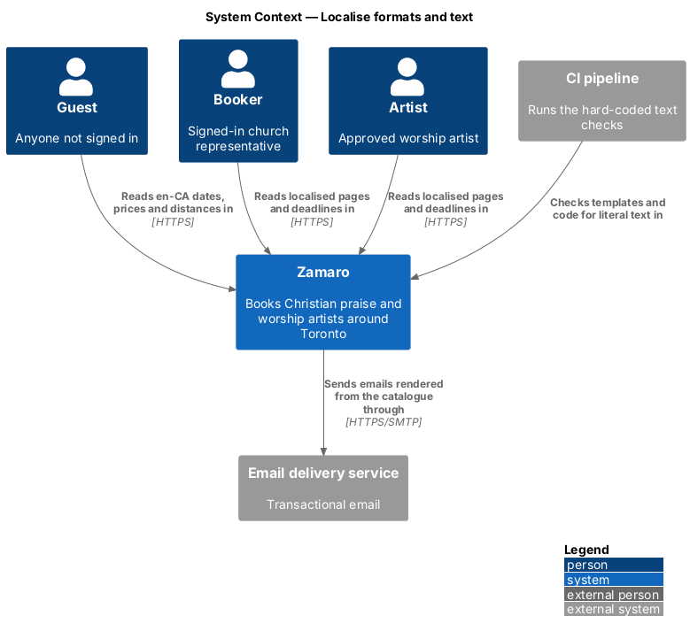
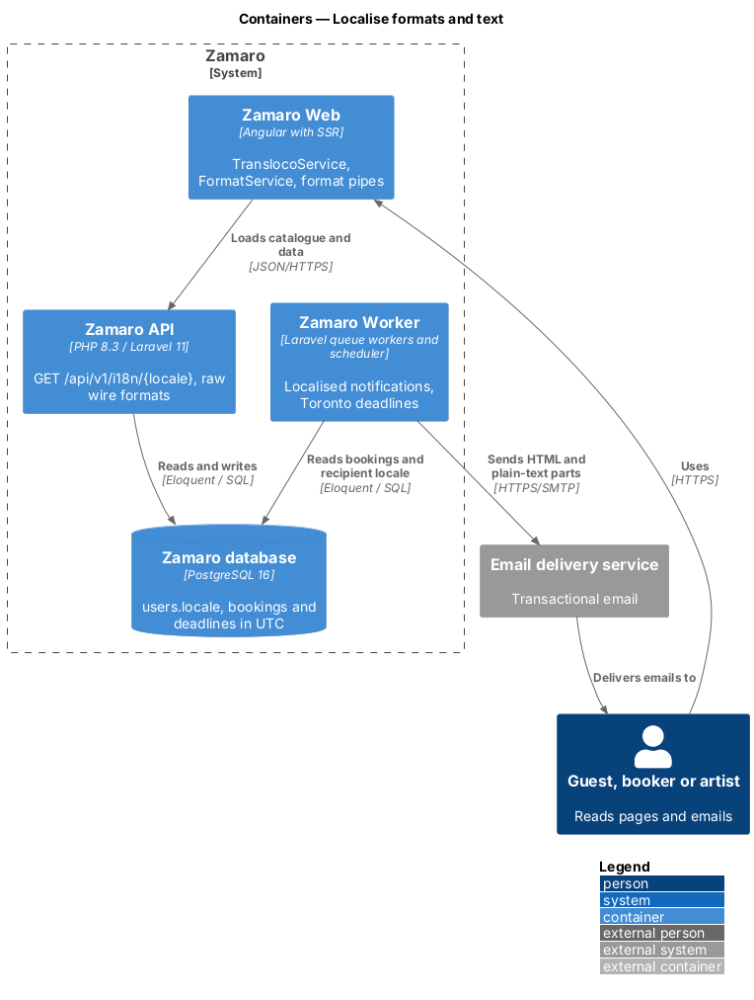
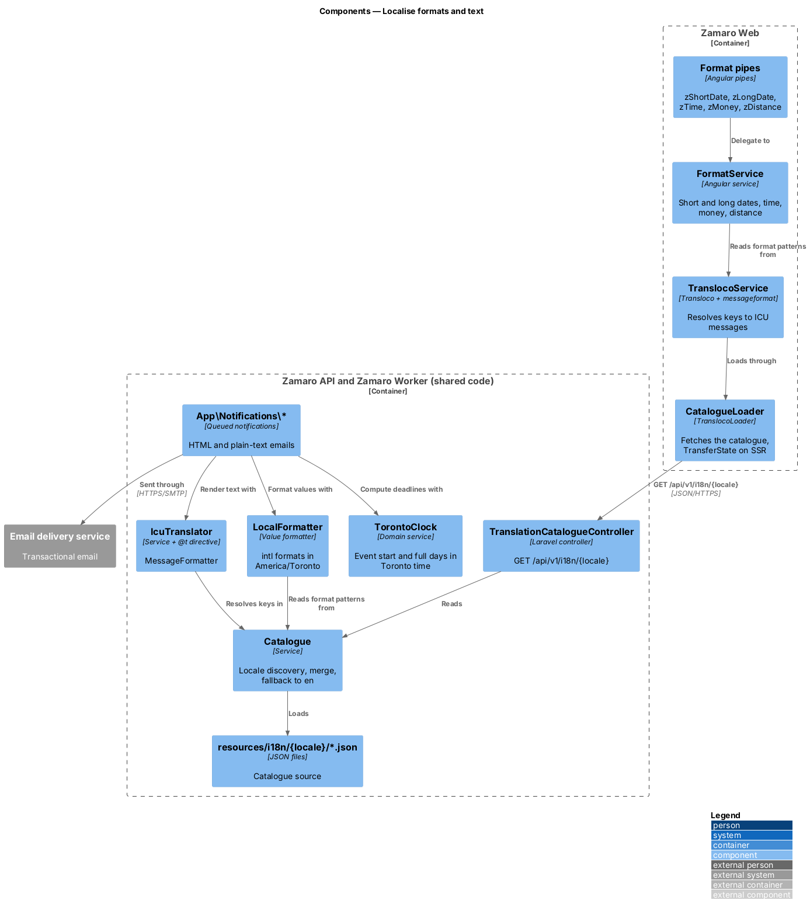
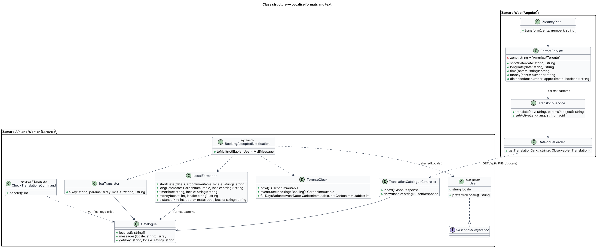
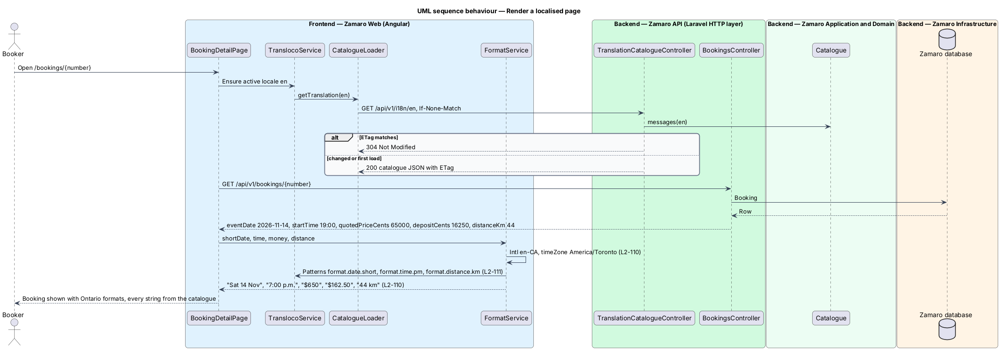
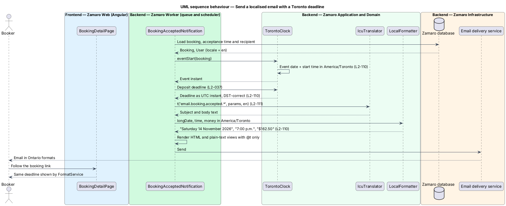
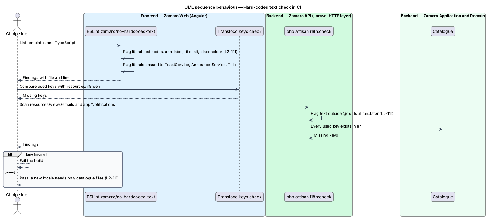

# Localise formats and text

## Overview

Zamaro serves churches in Ontario, so dates, times, money and distances read the way
people there write them: "Sat 14 Nov", "7:00 p.m.", "$1,800", "44 km". Deadlines such
as a request's response window are measured on Toronto clocks, including across
daylight-saving changes. Zamaro launches in English, and every user-facing string
comes from a translation catalogue so that a French catalogue can be added later
without code changes.

This feature is the shared localisation layer for Zamaro Web and for the emails the
Zamaro Worker sends. Page features call its formatters and catalogue keys rather than
formatting values themselves. The deadlines it measures belong to other slices: the
artist's response window (L2-030), the deposit window (L2-037) and the cancellation
cut-off (L2-042). The distance values it formats come from
`discovery/search-available-artists` (L2-002).

Terms used in this design:

- **locale** — language and region pair that selects catalogue text and formatting rules, `en-CA` at launch
- **short date** — weekday, day and abbreviated month, such as "Sat 14 Nov", with the year added outside the current year
- **long date** — full weekday, day, full month and year, such as "Saturday 14 November 2026"
- **wall-clock time** — local time shown on clocks in the `America/Toronto` zone, which shifts by one hour at each daylight-saving change
- **translation catalogue** — set of JSON files that map translation keys to text for one locale
- **translation key** — stable dotted identifier for one string, such as `booking.stub.submit`
- **ICU message** — catalogue text in ICU MessageFormat syntax with named placeholders and plural rules
- **hard-coded string** — user-facing text written directly in a template or code instead of read from the catalogue

## Description

The slice runs from shared formatters and the translation loader in Zamaro Web to the
catalogue endpoint in the Zamaro API, the email templates rendered by the Zamaro
Worker, and CI checks on both codebases.

**Translation catalogue**

- **Files** — `resources/i18n/{locale}/{namespace}.json` in the API codebase, one
  namespace per area (`common`, `discover`, `artist`, `booking`, `email` and others).
  Values are ICU messages, for example
  `"rating.label": "Rated {rating} out of 5 by {count, plural, one {# church} other {# churches}}"`.
  The English set is complete; any other locale may be partial and falls back to
  English per key.
- **Format patterns** — the catalogue also holds the ordering of date and time parts
  (`format.date.short` = `{weekday} {day} {month}`, `format.date.long`,
  `format.time.am` = `a.m.`, `format.time.pm` = `p.m.`) and the distance phrases
  (`format.distance.km`, `format.distance.under1`, `format.distance.about`). A
  French catalogue can therefore reorder or rename them without code changes
  (L2-111).
- **`TranslationCatalogueController`** — `GET /api/v1/i18n/{locale}` (anonymous,
  `routes/api_public.php`) returns the merged catalogue for one locale as
  `{"data":{"locale":"fr","messages":{"common.nav.discover":"Découvrir", ...}}}`, keys being
  `{namespace}.{key}`. It sends a strong `ETag` (SHA-256 of the body) and
  `Cache-Control: public, max-age=0, s-maxage=60`, so browsers revalidate and a matching
  `If-None-Match` returns 304. A locale with no directory returns a 404 problem.
  `GET /api/v1/i18n` lists the available locales; it is built when a locale switcher needs it.
- **`Catalogue`** — backend service that discovers locales from the directories present,
  loads and caches the merged JSON, and resolves a key with fallback to `en`. Adding
  `resources/i18n/fr/` makes French available with no code change (L2-111).
- **`users.locale`** — column, default `en`, read through
  `User::preferredLocale()` (`HasLocalePreference`) so queued emails render in the
  recipient's language. The control a person uses to choose French, and whether
  `Accept-Language` sets a guest's locale, are `<TO SUPPLY>`.

**Frontend (Zamaro Web, `core/i18n`)**

- **`TranslocoService`** — runtime catalogue with `@jsverse/transloco-messageformat`
  for ICU messages. `CatalogueLoader` implements `TranslocoLoader` and calls
  `GET /api/v1/i18n/{locale}`. During server-side rendering the catalogue travels to
  the browser through `TransferState`, so hydration makes no second request.
  Templates use the `transloco` pipe or the `*transloco` structural directive; code
  uses `translate()`.
- **`FormatService`** — single entry point for display formats, backed by `Intl` with
  `timeZone: 'America/Toronto'` (L2-110):
  - `shortDate(date)` — weekday and month names from `Intl.DateTimeFormat` parts, ordered
    by `format.date.short`; adds the year when the date falls outside the current
    Toronto year ("Sat 14 Nov", "Sat 13 Nov 2027").
  - `longDate(date)` — "Saturday 14 November 2026".
  - `time(hhmm)` — 12-hour clock with the catalogue's day-period words ("7:00 p.m.").
  - `money(cents)` — `Intl.NumberFormat` for `CAD` with the narrow `$` symbol and
    thousands separators; no decimals when the amount is whole dollars ("$1,800"), two
    decimals otherwise ("$162.50"). Amounts arrive from the API as integer cents.
  - `distance(km, approximate)` — "44 km", "Under 1 km" below 1 km, and the "about"
    phrase for approximate values.
- **Pipes** — `zShortDate`, `zLongDate`, `zTime`, `zMoney` and `zDistance`, pure
  pipes over `FormatService`.
- **Wire formats** — the API sends calendar dates as `YYYY-MM-DD`, times of day as
  `HH:MM`, instants as ISO 8601 UTC, money as integer cents and distances as whole
  kilometres, so no value is pre-formatted on the server for the web.

**Mocks and design system**

- The mocks use these formats throughout: short dates on the poster and stubs
  ([`discover/default`](../../../mocks/pages/discover/default.html), "Sat 14 Nov"),
  long dates in sentences and announcements ("Saturday 14 November 2026"), times
  and money on the booking ([`booking-detail/default`](../../../mocks/pages/booking-detail/default.html),
  "7:00 p.m.", "$650", "$162.50"), totals in [`earnings/default`](../../../mocks/pages/earnings/default.html)
  and distances on tickets ("44 km").
- Design system: the formats table in the [Content](../../../design-system/foundations/content.html)
  foundation and the [Content & tone](../../../design-system/patterns/content-and-tone.html)
  pattern follow L2-110.

**Backend (Zamaro API and Zamaro Worker)**

- **`LocalFormatter`** (`App\Support\LocalFormatter`) — PHP mirror of `FormatService`
  using `IntlDateFormatter` and `NumberFormatter` from the `intl` extension, the same
  catalogue patterns and the `America/Toronto` zone. Email templates, receipts and
  the calendar feed use it. A shared fixture, `resources/i18n/format-cases.json`, runs
  in both the frontend and backend test suites, so both formatters produce identical
  strings.
- **`IcuTranslator`** — resolves catalogue keys with PHP `MessageFormatter`. Blade
  templates call it through the `@t('key', [...])` directive.
- **Email notifications** — every `App\Notifications\*` class renders its HTML and
  plain-text views with `@t` and `LocalFormatter`, in `$notifiable->preferredLocale()`.
  No literal user-facing text appears in a template or notification class (L2-111).
- **`TorontoClock`** (`App\Support\TorontoClock`) — the only source of local time for
  deadlines (L2-110). `eventStart(Booking)` builds the event instant from the event
  date and start time in `America/Toronto`. `fullDaysBefore(eventDate, at)` counts
  whole Toronto calendar days. Deadlines are stored as UTC `timestamptz` and compared
  as instants. Tests cover the changes on Sunday 1 November 2026 and Sunday
  14 March 2027. Whether hour-based windows (72, 48, 24 and 12 hours) count elapsed
  hours or wall-clock hours across a change is `<TO SUPPLY>`.

**CI checks (L2-111)**

- **`zamaro/no-hardcoded-text`** — custom ESLint rule over Angular templates (through
  `@angular-eslint/template-parser`) and TypeScript. It flags template text nodes that
  contain letters, literal `aria-label`, `title`, `alt` and `placeholder` attributes,
  and string literals passed to `ToastService.show`, `AnnouncerService.polite` and
  `Title.setTitle`. Brand names listed in `i18n-allowlist.json` (for example
  "Zamaro") are exempt.
- **`php artisan i18n:check`** — `CheckTranslationsCommand` scans
  `resources/views/emails` and `app/Notifications` for literal text outside `@t` or
  `IcuTranslator`, and checks that every key used in either codebase exists in the
  English catalogue.
- Either check fails the build with the file, line and offending text.

## Requirements

This feature realises the following level-2 (L2) requirements.

| L2 ID | Refines (L1) | Requirement |
|-------|--------------|-------------|
| `L2-110` | `L1-024` | **Dates, times, money and distance.** Acceptance criteria: 1. Given a short date, when it is shown, then it uses the en-CA pattern "Sat 14 Nov"; a long date uses "Saturday 14 November 2026"; the year is added to short dates outside the current year. 2. Given a time, when it is shown, then it uses 12-hour format with "a.m."/"p.m." (for example "7:00 p.m."). 3. Given a money amount, when it is shown, then it uses "$" with thousands separators and no cents for whole dollars ("$1,800"), and two decimals otherwise ("$162.50"). 4. Given dates around a daylight-saving change, when deadlines (L2-030, L2-037, L2-042) are calculated, then they use `America/Toronto` wall-clock time. 5. Given a distance, when it is shown, then it uses kilometres ("44 km"). |
| `L2-111` | `L1-024` | **Translation-ready text.** Acceptance criteria: 1. Given the frontend and email templates, when CI runs, then a check fails if user-facing strings are hard-coded instead of coming from the translation catalogue. 2. Given the platform launches in English, when a French catalogue is added, then no code changes are needed to show French text. |

## Diagrams

### System context

People in Ontario read Zamaro pages and emails in local formats. The email delivery
service sends the localised emails.

### Containers

The Zamaro API serves the translation catalogue to Zamaro Web. The Zamaro Worker
renders emails from the same catalogue and formatter rules and hands them to the email
delivery service.

### Components

`CatalogueLoader` and `FormatService` serve every Angular template. On the server,
`Catalogue`, `IcuTranslator`, `LocalFormatter` and `TorontoClock` serve the API,
the worker's email notifications and the deadline jobs.

### Class structure

`FormatService` and `LocalFormatter` expose the same five formats over the same
catalogue patterns. `Catalogue` owns locale discovery and fallback for both the
endpoint and `IcuTranslator`.

### Behaviour — render a localised page

Zamaro Web loads the catalogue once, with a conditional request, then formats the
API's raw dates, times, cents and kilometres in `America/Toronto` and `en-CA`.

### Behaviour — send a localised email with a Toronto deadline

A queued notification computes its deadline with `TorontoClock`, renders both parts in
the recipient's locale and sends them through the email delivery service.

### Behaviour — hard-coded text check in CI

CI runs the ESLint rule over the frontend and `i18n:check` over the email templates,
and fails the build on any literal user-facing string or missing key.

