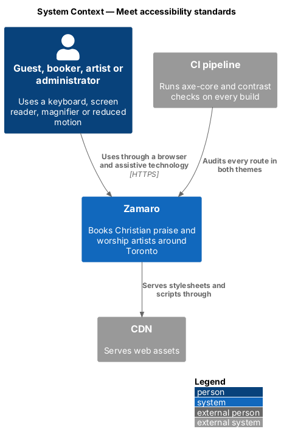
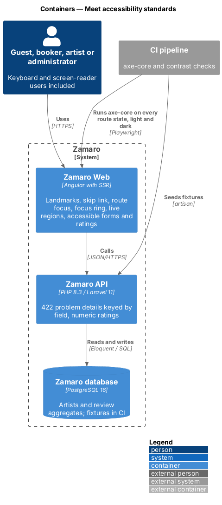
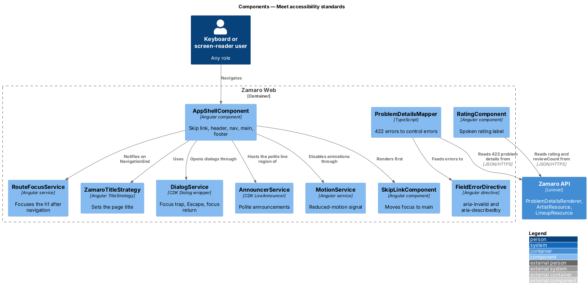
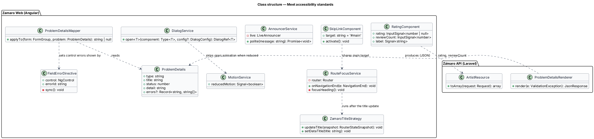
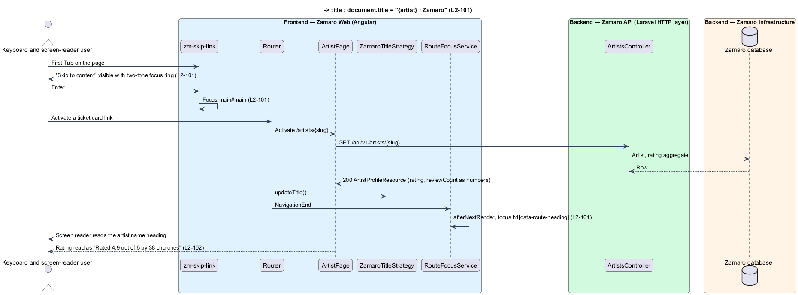
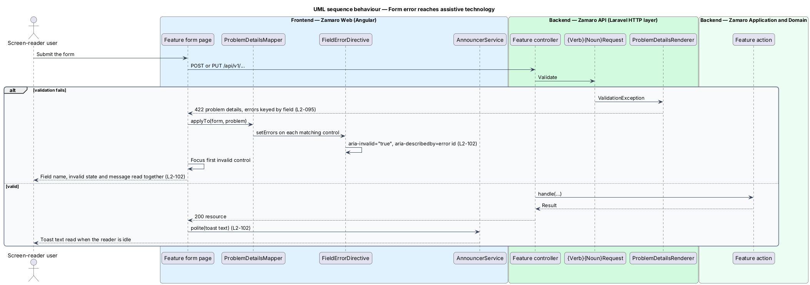
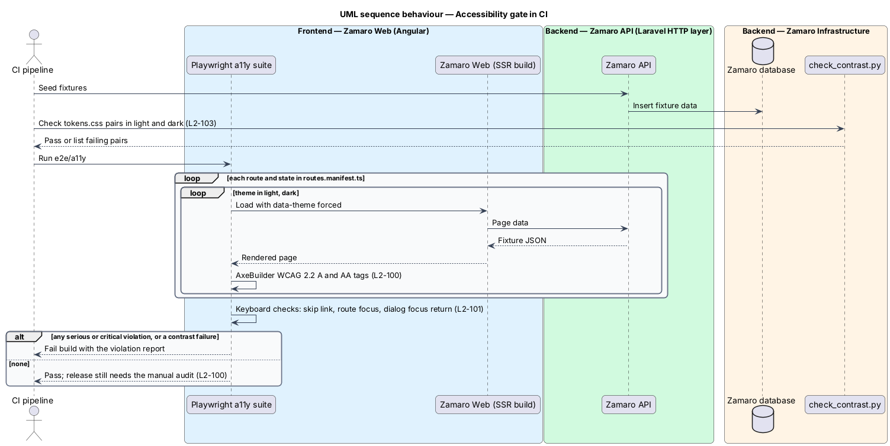

# Meet accessibility standards

## Overview

Zamaro is for every church representative and every artist, including people who use
a keyboard, a screen reader, magnification or reduced motion. L1-021 commits the
platform to WCAG 2.2 Level AA. This feature is the shared accessibility layer that
every page inherits, plus the automated and manual checks that hold each release to
that level.

The slice is cross-cutting. It provides the skip link, route focus, page titles, the
focus ring, dialog focus management, live announcements, accessible form errors, the
accessible star rating and reduced motion. Page features use these building blocks
rather than re-implementing them. The responsive shell and target sizes live in
`user-experience/adapt-layout-to-screens`; both themes and their switching live in
`user-experience/switch-theme`; skeletons, busy buttons and toasts live in
`user-experience/show-loading-and-feedback`. The search result summary that is
announced comes from `discovery/search-available-artists`.

Terms used in this design:

- **WCAG 2.2 AA** — Web Content Accessibility Guidelines version 2.2 at conformance level AA
- **axe-core** — open-source rules engine that reports accessibility violations with an impact of minor, moderate, serious or critical
- **landmark** — page region exposed to assistive technology through the `header`, `nav`, `main` or `footer` element
- **skip link** — first focusable link on a page that moves focus past the header to the main region
- **route focus** — placement of keyboard focus on the main heading after a client-side navigation
- **two-tone focus ring** — focus indicator of two adjacent rings in the theme's ink and signal-yellow colours, so that it contrasts with any background
- **focus trap** — confinement of Tab and Shift+Tab to the elements of an open dialog
- **polite live region** — element with `aria-live="polite"` whose text changes are read out when the screen reader is idle
- **manual audit** — release check carried out with a keyboard and the screen reader pairings NVDA with Firefox and VoiceOver with Safari

## Description

The slice lives mostly in Zamaro Web. It touches the Zamaro API where server data
shapes what assistive technology hears: field-level validation errors, rating values
and server-rendered markup.

**Frontend (Zamaro Web, `core/a11y`)**

- **`SkipLinkComponent`** — the design-system skip link, first in `AppShellComponent`.
  It is visually hidden until focused, reads "Skip to content" and moves focus to
  `<main id="main" tabindex="-1">` (L2-101).
- **`AppShellComponent` landmarks** — every route renders inside one `header`
  (`TopBarComponent`), one `nav aria-label="Primary"`, one `main` and one `footer`.
  Each page component renders exactly one `h1`, marked `data-route-heading` with
  `tabindex="-1"` (L2-102).
- **`RouteFocusService`** — listens for `NavigationEnd`. After the new view renders
  (`afterNextRender`), it focuses the `data-route-heading` element, or `main` when a
  page is still loading. Navigation that only changes query parameters, such as a sort
  change, keeps focus in place (L2-101).
- **`ZamaroTitleStrategy`** — Angular `TitleStrategy` that sets `document.title` from
  each route's translated title as `{page title} · Zamaro`, the pattern the mocks use.
  Pages with data in the title, such as an artist profile, update it once the data
  arrives (L2-101).
- **Focus ring (`styles/focus.scss`)** — one `:focus-visible` rule for buttons, links
  and chips that draws the design system's two-tone ring: an outline in
  `--color-focus-ring` at `--focus-ring-offset` with the gap filled by
  `--color-focus-ring-offset`, and `--shadow-focus` for text fields. Both themes and the stage islands re-map the two colours. `html` sets
  `scroll-padding-top` to the sticky top bar's height plus the ring, so the sticky
  header never covers a focused element (L2-101).
- **`DialogService`** (shared with `user-experience/adapt-layout-to-screens`) —
  opens every dialog through the CDK `Dialog` with `autoFocus: 'first-tabbable'`,
  `restoreFocus: true` and `closeOnEscape`. The CDK `FocusTrap` keeps Tab inside the
  dialog; on close, focus returns to the control that opened it (L2-101).
- **`AnnouncerService`** — thin wrapper over the CDK `LiveAnnouncer` in polite mode.
  `SearchStore` announces the result summary when a search finishes, and
  `ToastService` announces each toast's text (L2-102). The design system and the
  toast mocks put every toast, errors included, in one polite `role="status"` region.
- **`FieldErrorDirective` (`zFieldError`)** — applied to each form control inside
  `FormFieldComponent`. When the control is invalid and touched, or the form was
  submitted, it sets `aria-invalid="true"` and adds the error element's ID to
  `aria-describedby`; when valid, it removes both (L2-102). On submit with errors,
  focus moves to the first invalid control.
- **`ProblemDetailsMapper`** — converts an RFC 9457 `422` body into per-control
  errors by matching each key of `errors` to a form control name, so server-side
  errors use the same `zFieldError` wiring as client-side ones.
- **`RatingComponent`** — design-system rating. The visible stars are
  `aria-hidden="true"`; the wrapper has `role="img"` and an `aria-label` from the
  catalogue key `rating.label`, which reads "Rated 4.9 out of 5 by 38 churches"
  (L2-102). A rating with no reviews reads "New".
- **`MotionService`** — exposes `reducedMotion: Signal<boolean>` from
  `matchMedia('(prefers-reduced-motion: reduce)')`. The root component binds
  `[@.disabled]` to it, and `ScrollService` passes `behavior: 'auto'` instead of
  `'smooth'` when it is true. The token layer already reduces `--duration-*` to
  0.01 ms under the same query (L2-103).

**Mocks and design system**

- Every mock starts with the skip link and uses one `header`, `main` and `footer`
  and one `h1`, for example [`discover/default`](../../../mocks/pages/discover/default.html).
- Search announcements and the rating label:
  [`discover/default`](../../../mocks/pages/discover/default.html) and
  [`artist/default`](../../../mocks/pages/artist/default.html) ("Rated 4.9 out of 5 by 38 churches").
- Field errors with `aria-invalid` and `aria-describedby`: every `invalid` state, for
  example [`book/invalid`](../../../mocks/pages/book/invalid.html) and
  [`sign-in/invalid`](../../../mocks/pages/sign-in/invalid.html).
- Dialog focus: every dialog mock, for example
  [`cancel-booking/default`](../../../mocks/dialogs/cancel-booking/default.html), opens as a
  real modal through `assets/mock.js`.
- Polite toasts: [`notifications/saved-toast`](../../../mocks/notifications/saved-toast/success.html)
  and its [`danger`](../../../mocks/notifications/saved-toast/danger.html) state.
- Design system: the [Accessibility](../../../design-system/foundations/accessibility.html),
  [Motion](../../../design-system/foundations/motion.html) and
  [Color](../../../design-system/foundations/color.html) foundations, and the
  [Skip link](../../../design-system/components/skip-link.html),
  [Dialog](../../../design-system/components/dialog.html),
  [Form field](../../../design-system/components/form-field.html),
  [Rating](../../../design-system/components/rating.html) and
  [Toast](../../../design-system/components/toast.html) components.

**Automated and manual checks (`e2e/a11y`, CI)**

- **`a11y.spec.ts`** — Playwright suite with `@axe-core/playwright`. It visits every
  entry of `e2e/routes.manifest.ts` (every route in every state) in the light theme
  and again in the dark theme, runs the WCAG 2.0, 2.1 and 2.2 A and AA rule tags, and
  fails the build on any violation with impact `serious` or `critical` (L2-100). A
  keyboard sub-suite checks the skip link, route focus and dialog focus return
  (L2-101).
- **Contrast check** — CI runs `check_contrast.py` against
  `docs/design-system/tokens/tokens.css`, which tests every pair in
  `contrast-pairs.json` in both themes: body text at least 4.5:1, large text at least
  3:1, control borders and focus indicators at least 3:1 (L2-103).
- **Manual audit** — each release with UI changes carries a checklist completed with a
  keyboard, NVDA with Firefox and VoiceOver with Safari. Findings are filed as issues
  labelled `a11y`, and the release is blocked while any WCAG 2.2 AA finding is open
  (L2-100). The issue tracker and the release-gate mechanism are `<TO SUPPLY>`.

**Backend (Zamaro API)**

- **`ProblemDetailsRenderer`** — exception renderer for `ValidationException`. It
  returns `422` with an `errors` object keyed by the request field names (L2-095). The
  FormRequest field names match the Angular form control names, so each message links
  to its field.
- **Validation messages** — come from the translation catalogue described in
  `user-experience/localise-formats-and-text`, so the screen reader hears the same
  wording as the client-side check.
- **`ArtistResource` and `LineupResource`** — return `rating` (one decimal) and
  `reviewCount` as numbers, never as star strings, so `RatingComponent` composes the
  spoken label.
- **Server-side rendering** — Angular SSR on Node.js returns the landmarks, the single
  `h1`, the `lang="en"` attribute and the page title in the first HTML response, so
  assistive technology has the structure before hydration.

## Requirements

This feature realises the following level-2 (L2) requirements.

| L2 ID | Refines (L1) | Requirement |
|-------|--------------|-------------|
| `L2-100` | `L1-021` | **WCAG 2.2 AA conformance.** Acceptance criteria: 1. Given every route in every state, when axe-core runs in CI in both themes, then there are zero serious or critical violations. 2. Given each release with UI changes, when a manual audit with a keyboard and a screen reader (NVDA with Firefox and VoiceOver with Safari) is done, then no WCAG 2.2 AA failures remain open. |
| `L2-101` | `L1-021` | **Keyboard and focus.** Acceptance criteria: 1. Given any page, when Tab is first pressed, then a "Skip to content" link appears and moves focus to the main region. 2. Given any focusable element, when it has focus, then a visible two-tone focus ring (L1-022 colours) is shown that is never hidden by sticky headers. 3. Given a route change, when the new page renders, then focus moves to its main heading and the page title updates. 4. Given a dialog, when it is open, then focus is trapped inside, Escape closes it, and focus returns to the control that opened it. |
| `L2-102` | `L1-021` | **Assistive technology support.** Acceptance criteria: 1. Given every page, when it renders, then it uses header, nav, main and footer landmarks and one h1. 2. Given a search finishes or a toast appears, when it happens, then the result summary or toast text is announced through a polite live region. 3. Given a form error, when it appears, then the field has `aria-invalid="true"` and the message is linked with `aria-describedby`. 4. Given a star rating, when it is read by a screen reader, then it is announced as "Rated 4.9 out of 5 by 38 churches", not as star characters. |
| `L2-103` | `L1-021` | **Motion and contrast.** Acceptance criteria: 1. Given `prefers-reduced-motion: reduce`, when animations or smooth scrolling would run, then they are disabled. 2. Given both themes, when contrast is measured, then body text is at least 4.5:1, large text at least 3:1, and control borders and focus indicators at least 3:1 against adjacent colours. |

## Diagrams

### System context

People using assistive technology reach Zamaro through their browser and screen
reader. The CI pipeline checks every route before release.

### Containers

Zamaro Web delivers the accessible markup and behaviour. The Zamaro API supplies
field-keyed validation errors and numeric ratings. The CI pipeline runs axe-core and
the contrast check against both themes.

### Components

`AppShellComponent` hosts the skip link and landmarks. `RouteFocusService`,
`ZamaroTitleStrategy`, `DialogService`, `AnnouncerService`, `FieldErrorDirective` and
`RatingComponent` each own one accessibility behaviour that pages reuse.

### Class structure

The shared services sit beside the form and rating building blocks.
`ProblemDetailsMapper` translates the API's `ProblemDetails` into control errors that
`FieldErrorDirective` exposes through ARIA attributes.

### Behaviour — skip link and route change

The first Tab reveals the skip link. After a client-side navigation, the new page's
data loads, the title updates and focus moves to the main heading.

### Behaviour — form error reaches assistive technology

A server-side `422` is mapped onto the matching controls, each gains
`aria-invalid` and `aria-describedby`, and focus moves to the first invalid field. A
successful save announces its toast through the polite live region.

### Behaviour — accessibility gate in CI

CI seeds the API, then runs axe-core over every route state in both themes and the
token contrast check, and fails the build on any serious or critical violation.

