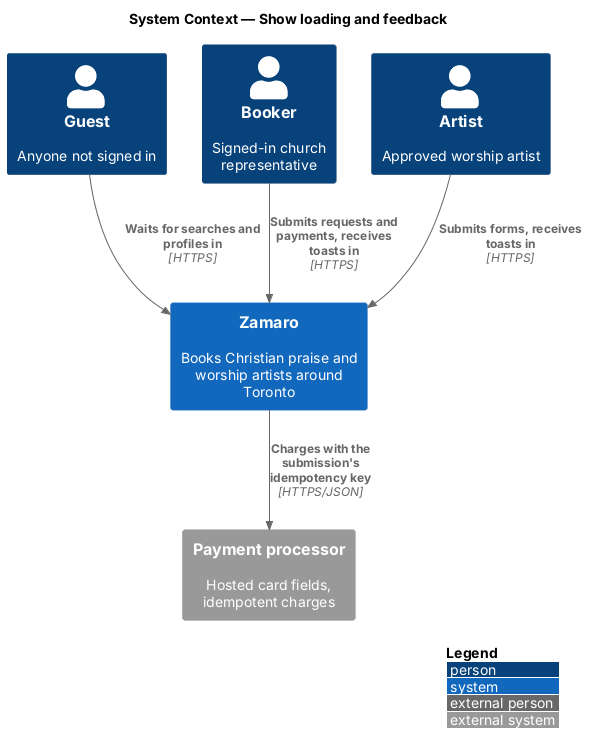
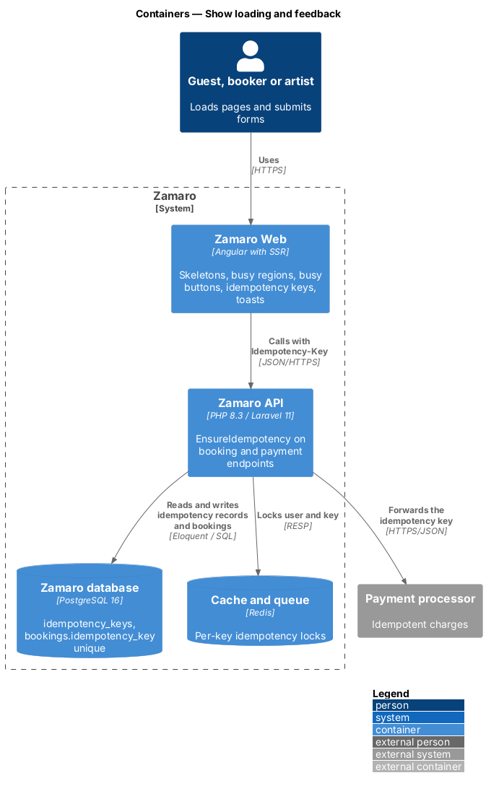
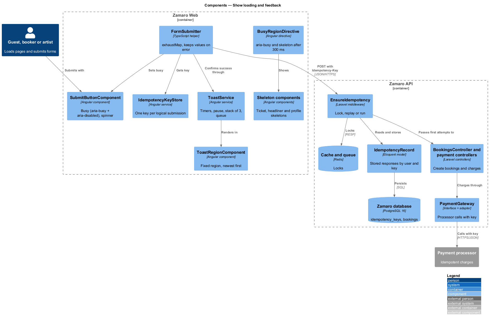
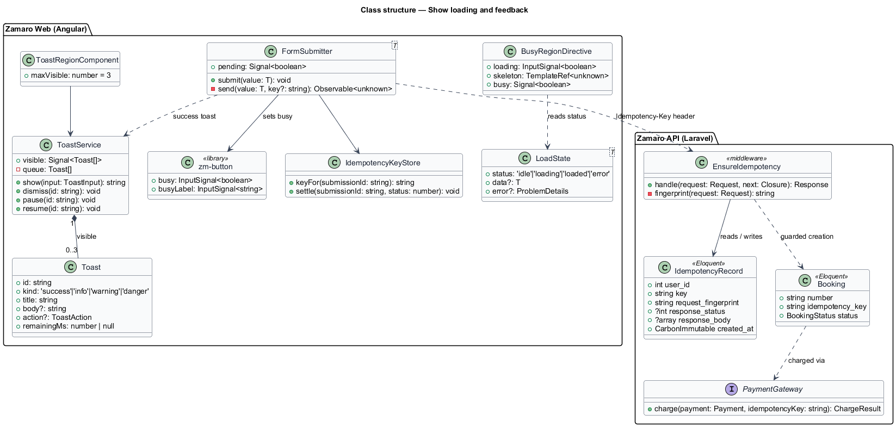
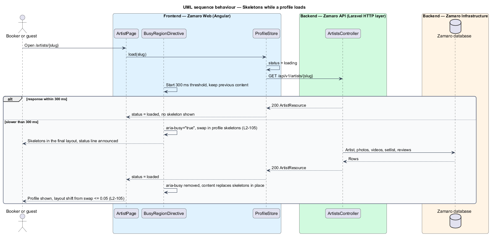
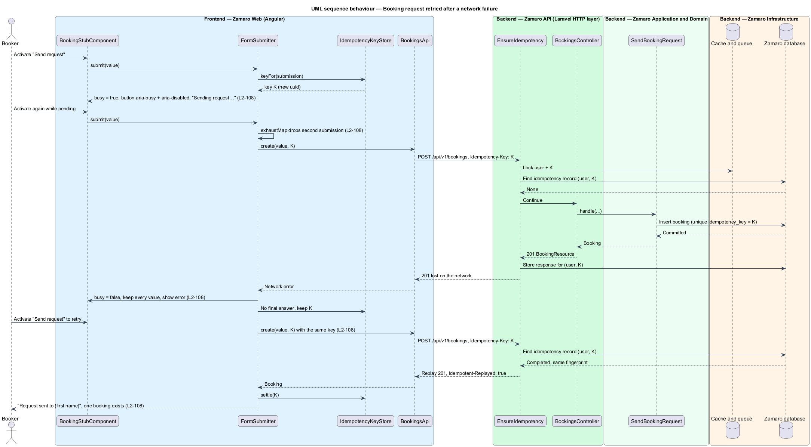
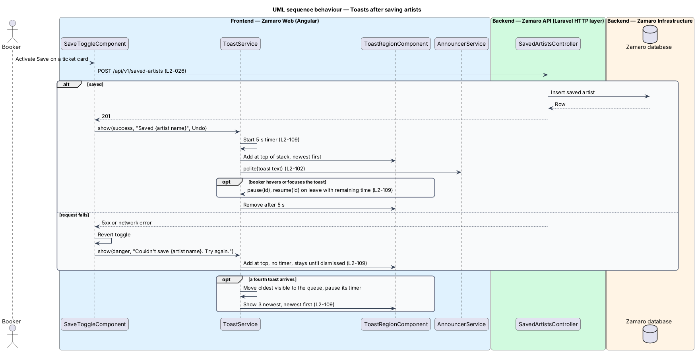

# Show loading and feedback

## Overview

A worship coordinator often books on a phone with a weak signal. L1-023 requires
Zamaro to say clearly what is happening while content loads and when something fails,
and never to lose what a person entered. This feature is the shared feedback layer
that every page uses for those moments: skeleton placeholders while content loads,
busy submit buttons that cannot send twice, retries that never create a second
booking or charge, short-lived toasts that confirm an action, and a clear notice when
the connection is lost.

The slice is cross-cutting and supplies building blocks to page features. The search
and profile pages use the skeletons (`discovery/search-available-artists` for the
lineup). The booking request (L2-028) and the deposit and balance payments (L2-037,
L2-038) use the safe submission and idempotency keys. Saving an artist (L2-026) is the
most common source of toasts. The search and profile error states (L2-106, L2-107)
belong to their page features. How toasts and results are announced to screen readers
lives in `user-experience/meet-accessibility-standards`.

Terms used in this design:

- **skeleton** — placeholder block in the shape and size of the content it stands for, shown while that content loads
- **loading threshold** — 300 ms wait before a skeleton appears, so fast responses show no placeholder at all
- **busy region** — page region with `aria-busy="true"` while its content loads
- **Cumulative Layout Shift (CLS)** — Core Web Vitals score that sums unexpected movement of visible content
- **busy state** — state of a submit button while its request is pending: `aria-busy="true"` and `aria-disabled="true"` (never native `disabled`, so focus stays on the button), ignoring further presses and showing a spinner after a progress label
- **logical submission** — one intent to submit a form, which may span several HTTP attempts after network failures
- **idempotency key** — random identifier sent with every attempt of one logical submission so that the server performs the operation at most once
- **toast** — small, temporary message in a corner of the screen that confirms an action or reports a failed background action
- **toast stack** — ordered set of visible toasts, newest first

## Description

The slice runs from shared Zamaro Web components to an idempotency middleware and
table in the Zamaro API, with the payment processor as the final guard against a
second charge.

**Frontend — loading (Zamaro Web, `shared/feedback`)**

- **`LoadState<T>`** — discriminated union used by every store: `idle`, `loading`,
  `loaded` with data, `error` with a `ProblemDetails`.
- **`delayedFlag(source, 300)`** — signal helper that turns true only after its source
  has been true for 300 ms and turns false at once when the source clears. For the
  first 300 ms the region keeps its previous content (L2-105).
- **`BusyRegionDirective` (`zmBusyRegion`)** — binds `aria-busy="true"` on the host
  while the delayed flag is set and swaps in the region's skeleton template. One
  status line names what is loading, for example "Finding who's free on Saturday 14
  November 2026…"; after 8 s it changes to "Still checking — thanks for waiting.",
  following the design system's feedback pattern. It is visible, as in the loading mock.
  Discover, the first busy region (S7), binds `aria-busy` from `SearchStore.showSkeletons`
  (the 300 ms delayed flag). The directive is extracted when the profile becomes the second
  busy region. The skeletons there are `zm-skeleton` blocks laid out in the cards' own grid
  tracks.
- **Skeleton components** — `TicketCardSkeletonComponent`,
  `HeadlinerSkeletonComponent`, `ProfileHeaderSkeletonComponent` and
  `ProfileSectionSkeletonComponent`, built from the design-system skeleton modifiers.
  Each reuses the final component's grid track, `aspect-ratio` and minimum block
  size, so content replaces it in place. Images carry `width` and `height`
  attributes. The skeleton sweep stops under reduced motion (L2-103).
- **`cls.spec.ts` (`e2e/perf`)** — Playwright test that delays the search and profile
  API responses by 1 s through route interception, records `layout-shift` entries with
  a `PerformanceObserver`, and fails when the sum after the skeleton swap exceeds
  0.05 (L2-105).

**Frontend — safe submission**

- **`SubmitButtonComponent`** — design-system primary button with `busy` and
  `busyLabel` inputs. While busy it sets `aria-busy="true"` and `aria-disabled="true"`
  (not native `disabled`, which would drop focus), ignores further presses, replaces
  the label with the busy label (for example "Sending request…") and shows a spinner
  after it (L2-108).
- **`FormSubmitter<T>`** — helper that each form page owns. It pipes submit events
  through `exhaustMap`, so a second click or Enter while a request is pending is
  dropped and never sent (L2-108). It never resets the form on failure; server errors
  go through `ProblemDetailsMapper` to the fields, and every entered value stays
  (L2-108). Card number, expiry and security code live in the payment processor's
  hosted fields and are not held by Zamaro Web.
- **`IdempotencyKeyStore`** — creates a key with `crypto.randomUUID()` at the start of
  a logical submission for the booking request and payment forms. Every attempt sends
  it in the `Idempotency-Key` header. The key is discarded on a final answer (any 2xx,
  or any 4xx other than 409 and 429) and kept after a network failure, timeout, 409,
  429 or 5xx, so the person's retry reuses it (L2-108).

**Frontend — toasts**

- **`ToastService`** — root service with `show(toast: ToastInput)`, `dismiss(id)`,
  `pause(id)` and `resume(id)`. A success toast starts a 5-second timer that pauses
  while the toast is hovered or holds focus and resumes with the remaining time. A
  danger toast has no timer and stays until dismissed (L2-109). Each toast's text goes
  to `AnnouncerService` (L2-102). Info and warning toasts, and toasts with an action
  such as Undo, use the same 5-second timer as success toasts (L2-109).
- **`ToastRegionComponent`** — fixed region in `AppShellComponent` at
  `--z-toast`. It shows at most 3 toasts, newest at the top (L2-109). A fourth toast
  moves the oldest visible one to a queue; a queued toast's timer is paused and it
  returns when a slot frees, so an error toast is never lost.
- **`ToastComponent`** — design-system toast with accent stripe, icon, title, optional
  body, optional action (for example Undo) and a close button named
  "Dismiss: {title}".

**Frontend — banners and connection loss**

- **`SystemBannerComponent`** — design-system banner directly under the top bar, one
  at a time, in the info, success, warning and danger tones. A dismissible banner
  hides for the session; a persistent one has no close button. Its owners raise it:
  the planned-maintenance notice (info, from 48 hours before the window), "Verify your
  email" (persistent, `accounts/register-booker`), "Email verified" (success, once),
  and the undeliverable-address notice (persistent,
  `notifications/send-transactional-emails`).
- **`ConnectivityService`** — watches the browser's `online` and `offline` events and
  failed requests with no response. While offline it raises the danger banner
  "You're offline" with `role="alert"`: saving artists and sending requests need a
  connection, and nothing is queued, so a save tried meanwhile reverts with its error
  toast (L2-026, L2-114). The banner clears itself when the connection returns
  (L2-114).
- **`OfflinePage`** — route `/offline`, the navigation fallback of the Angular service
  worker when a page is opened without a connection. It shows the persistent
  "You're offline" banner, "No signal" and Try again (L2-114). The service worker
  caches only the app shell and static assets, never an API response, so nothing
  personal is kept on the device (L2-089, L2-114); Try again reopens the page that
  was asked for. Draft values stay on the page that was left (L2-108).

**Mocks**

- Loading: [`discover/loading`](../../../mocks/pages/discover/loading.html),
  [`artist/loading`](../../../mocks/pages/artist/loading.html) and the `loading` state of
  every list and detail page, for example [`bookings/loading`](../../../mocks/pages/bookings/loading.html)
  and [`booking-detail/loading`](../../../mocks/pages/booking-detail/loading.html): skeletons
  shaped like the final layout, `aria-busy="true"` and a status line (L2-105).
- Busy submit: [`book/submitting`](../../../mocks/pages/book/submitting.html),
  [`sign-in/submitting`](../../../mocks/pages/sign-in/submitting.html) and the `busy` state of
  every dialog, for example [`pay-deposit/busy`](../../../mocks/dialogs/pay-deposit/busy.html);
  failed states such as [`book/error`](../../../mocks/pages/book/error.html) keep every value (L2-108).
- Toasts: [`saved-toast`](../../../mocks/notifications/saved-toast/success.html),
  [`booking-toast`](../../../mocks/notifications/booking-toast/success.html) with its
  [`stacked`](../../../mocks/notifications/booking-toast/stacked.html) state,
  [`request-toast`](../../../mocks/notifications/request-toast/success.html) and
  [`availability-toast`](../../../mocks/notifications/availability-toast/success.html) (L2-109).
- Banners and connection loss: [`system-banner`](../../../mocks/notifications/system-banner/info.html)
  in states info (maintenance), success, warning, danger (offline), persistent and
  undeliverable, and [`pages/offline`](../../../mocks/pages/offline/default.html).
- Design system: [Skeleton](../../../design-system/components/skeleton.html),
  [Toast](../../../design-system/components/toast.html),
  [Button](../../../design-system/components/button.html) (busy state) and the
  [Feedback & loading](../../../design-system/patterns/feedback-and-loading.html) and
  [Notifications](../../../design-system/patterns/notifications.html) patterns.

**Backend (Zamaro API)**

- **`EnsureIdempotency`** — route middleware on `POST /api/v1/bookings` and on the
  payment submission endpoints. It requires the `Idempotency-Key` header and rejects a
  missing or malformed key with 422 problem details. It takes a Redis lock on the user
  and key for the duration of the request; a concurrent attempt with the same key
  receives 409. It looks up `IdempotencyRecord` by user and key:
  - a completed record with the same request fingerprint replays the stored status and
    body with an `Idempotent-Replayed: true` header;
  - a record with a different fingerprint returns 422 with problem type
    `idempotency-key-reused`;
  - no record lets the request run and stores its response unless the status is 5xx.
- **`IdempotencyRecord`** — Eloquent model on table `idempotency_keys` with
  `user_id`, `key` (uuid), `request_fingerprint` (SHA-256 of method, path and body),
  `response_status`, `response_body` (jsonb) and `created_at`. A unique index on
  (`user_id`, `key`) enforces one record per key. The retention period is
  `<TO SUPPLY>`; the scheduled command `idempotency:prune` deletes expired rows.
- **Database guard** — `bookings.idempotency_key` carries a unique index, so a race
  that slipped past the lock still creates at most one booking (L2-108).
- **`PaymentGateway`** — passes the same key to the payment processor's idempotency
  mechanism, so the processor itself charges at most once (L2-108).

## Requirements

This feature realises the following level-2 (L2) requirements.

| L2 ID | Refines (L1) | Requirement |
|-------|--------------|-------------|
| `L2-105` | `L1-023` | **Loading states.** Acceptance criteria: 1. Given a search or profile load takes longer than 300 ms, when it is waiting, then skeleton placeholders matching the final layout are shown and the region has `aria-busy="true"`. 2. Given loading finishes, when content replaces the skeletons, then Cumulative Layout Shift from the swap is 0.05 or less. |
| `L2-108` | `L1-023` | **Form submission safety.** Acceptance criteria: 1. Given any form is submitted, when the request is pending, then the submit button shows a busy state, is disabled, and a second submission is not sent. 2. Given a booking request or payment submission, when it is retried after a network failure, then the same idempotency key is sent and at most one booking or charge results. 3. Given a submission fails, when the error renders, then every value entered is kept, except card details held by the processor's fields. |
| `L2-109` | `L1-023` | **Toasts.** Acceptance criteria: 1. Given a success toast, when it appears, then it dismisses after 5 seconds, pausing while hovered or focused. 2. Given an error toast, when it appears, then it stays until dismissed. 3. Given several toasts, when they appear together, then at most 3 are visible and they stack newest first. 4. Given an info or warning toast, or a toast with an action such as Undo, when it appears, then it dismisses after 5 seconds like a success toast, pausing while hovered or focused. The one exception is the idle-session warning of L2-066, which stays until the person acts or the session ends. |
| `L2-114` | `L1-023` | **Working offline.** Zamaro tells people when their connection is lost and never stores personal data on the device to cover for it. Actions that need the server are not queued for later. Acceptance criteria: 1. Given a person opens or navigates to a page without a connection, when the page cannot be loaded, then the offline page is shown with the persistent "You're offline" banner, the heading "No signal", the text "We can't reach Zamaro right now. Check your connection and try again." and a Try again button. 2. Given the offline page, when Try again is activated and the connection is back, then the page that was asked for opens. 3. Given a page is open, when the connection drops, then a danger banner under the top bar reads "You're offline" with "You can keep reading what's loaded. Saving artists and sending requests need a connection.", is announced to assistive technology, and clears itself when the connection returns. 4. Given the service worker caches files for offline use, when it stores them, then only the app shell and static assets are stored; no API response and no personal data is kept on the device (L2-089). 5. Given a person saves an artist or submits a form while offline, when the request fails, then nothing is queued to send later: the save toggle reverts with the error toast of L2-026, and a form keeps every value entered (L2-108). |

## Diagrams

### System context

Bookers, artists and administrators see loading, busy and toast feedback. A booker's
retried payment reaches the payment processor with the same idempotency key.

### Containers

Zamaro Web renders skeletons, busy buttons and toasts. The Zamaro API stores
idempotency records in the Zamaro database and holds per-key locks in Redis.

### Components

`BusyRegionDirective`, `FormSubmitter`, `IdempotencyKeyStore` and `ToastService` are the
shared frontend parts. `EnsureIdempotency` and `IdempotencyRecord` guard the booking
and payment endpoints.

### Class structure

`ToastService` owns the visible stack and the queue. `FormSubmitter` uses
`IdempotencyKeyStore`, and the middleware reads and writes `IdempotencyRecord`.

### Behaviour — skeletons while a profile loads

Nothing changes for the first 300 ms. After that the region is marked busy and
skeletons in the final layout appear, then content replaces them without shifting the
page.

### Behaviour — booking request retried after a network failure

The busy button blocks a double submit. After a network failure the form keeps every
value, and the retry carries the same idempotency key, so the server creates one
booking and replays its response.

### Behaviour — toasts after saving artists

A success toast leaves after 5 seconds unless hovered or focused. An error toast stays
until dismissed. At most 3 toasts show, newest first.

