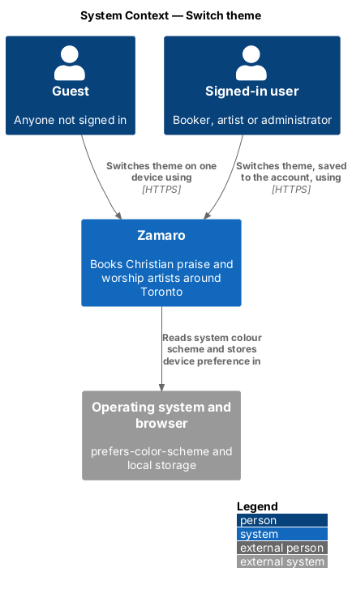
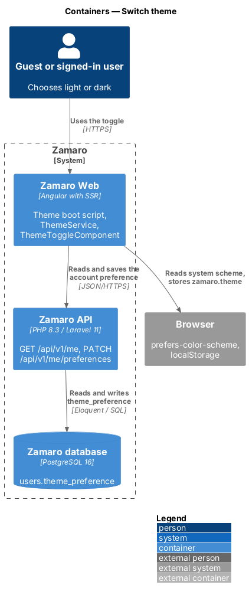
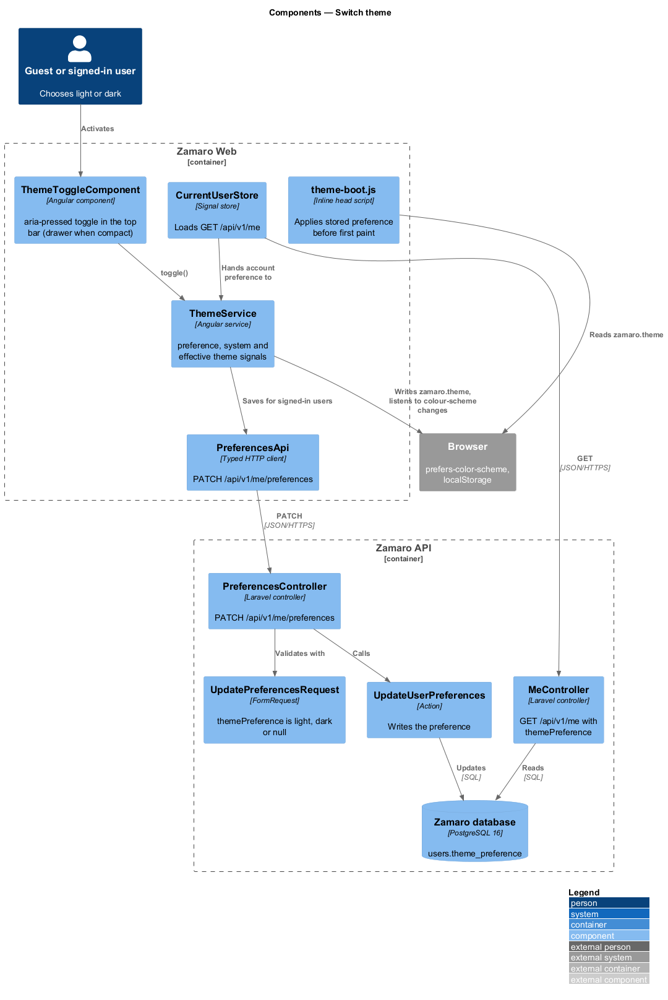
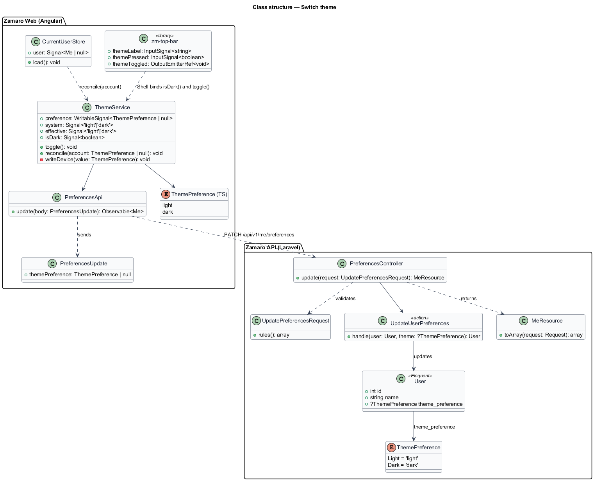
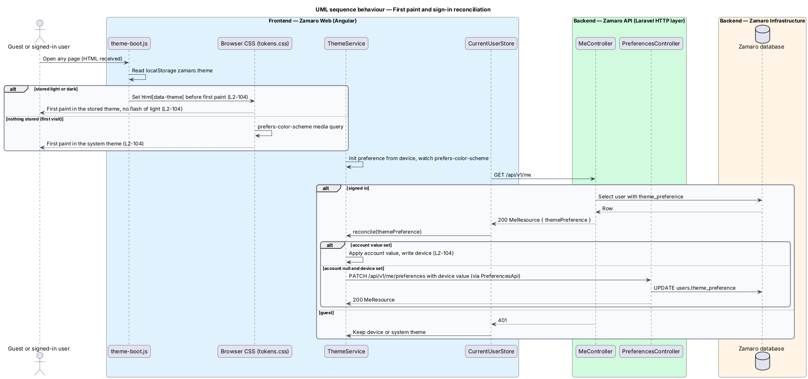
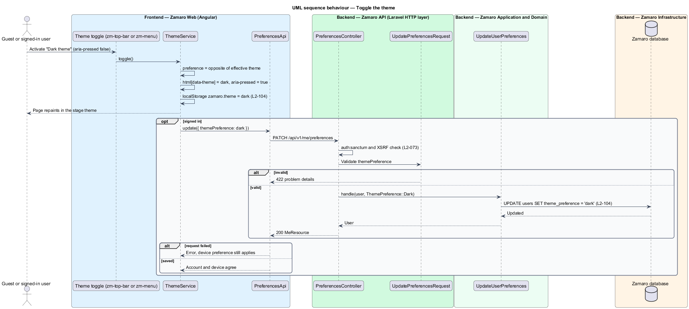

# Switch theme

## Overview

Zamaro has two visual themes drawn from its gig-poster language: *newsprint*, charcoal
ink on warm paper, and *stage*, light type on charcoal. Both meet the contrast levels
in L2-103. This feature decides which theme a page shows, lets a person switch with a
toggle in the top bar, remembers the choice on the device and, for signed-in users,
on the account, and paints the chosen theme from the first frame.

The slice touches every page through the application shell and adds one preference to
the user account. The token sets for both themes come from the design system
(`docs/design-system/tokens/tokens.css`). The accessibility checks that run in both
themes live in `user-experience/meet-accessibility-standards`; the top bar that hosts
the toggle lives in `user-experience/adapt-layout-to-screens`.

Terms used in this design:

- **theme** — set of semantic colour and shadow token values applied to the whole page, either `light` (newsprint) or `dark` (stage)
- **system theme** — theme implied by the operating system's `prefers-color-scheme` media feature
- **theme preference** — explicit choice of `light` or `dark` made with the toggle; absent until the first toggle
- **effective theme** — theme a page shows: the theme preference when one exists, otherwise the system theme
- **device preference** — theme preference stored in the browser of one device
- **account preference** — theme preference stored on the user record, applied on each device the user signs in on
- **flash of light theme** — brief paint of the light theme before a stored dark preference applies
- **theme boot script** — small inline script in the document head that applies a stored preference before the first paint

## Description

The slice runs from the theme boot script and `ThemeService` in Zamaro Web to the
preferences endpoint and the `users` table in the Zamaro API.

**How a theme applies**

`tokens.css` declares light values on `:root` and `[data-theme="light"]`, and dark
values on `[data-theme="dark"]` and inside `@media (prefers-color-scheme: dark)` for
`:root:not([data-theme="light"])`. With no `data-theme` on `<html>`, the browser
therefore paints the system theme from the first frame with no script (L2-104). An
explicit preference sets `data-theme` on `<html>`. The stage and paper islands of the
design system keep their own surfaces in either theme.

**Frontend (Zamaro Web, `app/shell`, ADR-0007)**

- **Theme boot script** — a few lines inlined in the `<head>` of `index.html` before any
  stylesheet. It reads `localStorage['zamaro.theme']` and, when the value is `light` or
  `dark`, sets `document.documentElement.dataset.theme`; `tokens.css` sets
  `color-scheme` for each theme, so no meta tag is needed. The page then paints dark from the first frame when
  dark is stored (L2-104). The script runs on cached server-rendered HTML as well,
  because it reads only the device. The Content-Security-Policy allows it by its
  SHA-256 hash, not by `unsafe-inline` (L2-071). Any storage error leaves the system
  theme in place.
- **`ThemeService`** — root signal service. `preference: Signal<ThemePreference |
  null>` holds the explicit choice; `system: Signal<'light' | 'dark'>` follows
  `matchMedia('(prefers-color-scheme: dark)')` and its change events;
  `effective: Signal<'light' | 'dark'>` is computed from the two. An `effect` writes the
  preference to `data-theme` on `<html>`, or removes the attribute when there is none, so
  `tokens.css` keeps following the system. The `theme-color` meta tag arrives with the
  installable app (M9). `toggle()` sets the
  preference to the opposite of the effective theme, writes the device preference and,
  when a user is signed in, calls `PreferencesApi` (L2-104). During server-side
  rendering the service does nothing, leaving the boot script in charge.
- **Theme toggle** — the design system's `.topbar__theme` icon button, rendered by
  `zm-top-bar` from its `themeLabel`/`themePressed` inputs and shown in the full header
  (from LG). In the compact header there is no room beside the menu button, Saved and
  the account initials at 320 px, so the toggle is the "Dark theme" item (a `toggle`
  item of `zm-menu`) in the navigation drawer. There is no separate toggle component;
  both forms follow `ThemeService.isDark()`. Both are a
  `button` with `aria-pressed="true"` while the effective theme is dark and a constant
  accessible name from the catalogue, "Dark theme", so screen readers announce the
  state rather than a changing label. Both meet the 44 px target size.
- **`PreferencesApi`** — typed client for `PATCH /api/v1/me/preferences` with body
  `{ "themePreference": "light" | "dark" | null }`.
- **Sign-in reconciliation** — when `CurrentUserStore` loads `GET /api/v1/me` after
  sign-in or on start-up, a non-null `themePreference` on the account replaces the
  device preference and is written back to the device. When the account value is null
  and the device holds a preference, `ThemeService` saves the device value to the
  account. The account value applies on every load, so the most recent toggle on any
  signed-in device reaches the other devices at their next load.
- **Save failure** — when the `PATCH` fails, the device preference still applies and
  the toggle reflects it; the next successful toggle or sign-in reconciles the
  account. Whether to show an error toast is `<TO SUPPLY>`.

**Mocks and design system**

- Every mock's top bar carries the toggle (hidden below LG), for example
  [`discover/default`](../../../mocks/pages/discover/default.html) and
  [`dashboard/default`](../../../mocks/pages/dashboard/default.html); the compact header
  puts it in the navigation drawer, [`dialogs/menu`](../../../mocks/dialogs/menu/default.html)
  ([`artist`](../../../mocks/dialogs/menu/artist.html), [`admin`](../../../mocks/dialogs/menu/admin.html)). Append `?theme=dark` to any mock
  to see the stage theme.
- Design system: [`tokens.css`](../../../design-system/tokens/tokens.css), the
  [Theming](../../../design-system/foundations/theming.html) and
  [Color](../../../design-system/foundations/color.html) foundations, and the
  [Top bar](../../../design-system/components/top-bar.html) and
  [Menu](../../../design-system/components/menu.html) components.

**Backend (Zamaro API)**

- **Migration `add_theme_preference_to_users_table`** — adds nullable
  `users.theme_preference` (`varchar(5)`, check constraint `light` or `dark`). Null
  means the user follows the system theme.
- **`ThemePreference`** — PHP backed enum with cases `Light = 'light'` and
  `Dark = 'dark'`, cast on `User::$casts`.
- **`PreferencesController`** — `update` action for `PATCH /api/v1/me/preferences`,
  behind the `auth:sanctum` middleware and the XSRF check (L2-073).
- **`UpdatePreferencesRequest`** — FormRequest with
  `themePreference => ['nullable', Rule::enum(ThemePreference::class)]`; invalid input
  returns 422 problem details.
- **`UpdateUserPreferences`** — action that writes the column inside a transaction and
  returns the user.
- **`MeResource`** — includes `themePreference` so every device learns the account
  value through `GET /api/v1/me`. Responses carry `Cache-Control: private, no-store`
  because they hold personal data (L2-089).

**Data**

Only `users.theme_preference` is added. The device preference never leaves the
browser.

## Requirements

This feature realises the following level-2 (L2) requirement.

| L2 ID | Refines (L1) | Requirement |
|-------|--------------|-------------|
| `L2-104` | `L1-022` | **Light and dark themes.** Acceptance criteria: 1. Given a first visit, when the page renders, then the theme follows the operating system's `prefers-color-scheme`. 2. Given a person uses the theme toggle, when they reload or return, then their choice is kept on that device, and for signed-in users it is also saved to their account. 3. Given a stored dark preference, when a page loads, then it renders dark from the first paint with no flash of the light theme. |

## Diagrams

### System context

Any person can switch themes. Zamaro reads the operating system's colour-scheme
setting through the browser and stores an explicit choice for signed-in users.

### Containers

Zamaro Web applies the theme and stores the device preference. The Zamaro API saves
the account preference in the Zamaro database and returns it through
`GET /api/v1/me`.

### Components

The boot script and `ThemeService` share one storage key. `ThemeToggleComponent`
calls `ThemeService`, which calls `PreferencesApi`; in the API,
`PreferencesController` validates with `UpdatePreferencesRequest` and runs
`UpdateUserPreferences`.

### Class structure

`ThemeService` derives the effective theme from the preference and the system theme.
The backend models the same choice as the nullable `ThemePreference` enum on `User`.

### Behaviour — first paint and sign-in

The boot script applies a stored preference before the first paint; without one, the
CSS media query shows the system theme. After start-up, a signed-in user's account
preference replaces or receives the device value.

### Behaviour — toggle the theme

The toggle flips the effective theme at once, stores it on the device and, for a
signed-in user, saves it to the account.

